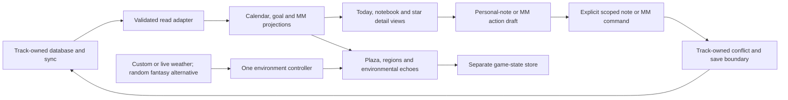

# Track World — proposed workflow and tool plan

**These are PROPOSALS, not decisions.** Nothing here is authorized by being written down.
The confirmed direction is recorded in
[TRACK-WORLD-CONCEPT-DRAFT.md](TRACK-WORLD-CONCEPT-DRAFT.md), which remains the concept of
record; [AGENTS.md](AGENTS.md) owns what still needs asking for, and [NOTES.md](NOTES.md)
owns what to do next.

This was Section 25 of the concept draft and was split out on 2026-09-12 because it had
grown larger than the concept itself — 86KB against 91KB — so every read of the draft for a
concept question carried the whole delivery plan with it. **The `25.N` numbering is kept
deliberately**, so every existing reference to "Section 25.6" or "Section 25.13" still
resolves by name.

Read a section, not the file: use `Read` with `offset` and `limit`.

| Read | For |
| --- | --- |
| 25.1 | Scope and planning assumptions |
| 25.2 | Engine and delivery comparison — Babylon.js is chosen; this is the reasoning |
| 25.3-25.4 | Tool shortlist, and skills assessed |
| 25.5 | Product workflows to implement |
| 25.6 | **Data architecture and ownership** — the read adapter, cited from NOTES |
| 25.7 | Calendar, identity, reminders, truthful history |
| 25.8 | Notebook and MM write-safety workflow |
| 25.9 | World, movement and content production |
| 25.10 | One coherent environment system |
| 25.11 | Interface and accessibility production |
| 25.12 | **Delivery phases P0-P10** — the phase table NOTES names a current phase from |
| 25.13 | **Verification and performance gates** — the hardware procedure, cited from NOTES |
| 25.14 | Release, privacy, cost and maintenance |
| 25.15 | Suggestions to revisit after this plan |

---

## 25. Proposed workflow and tool plan

**Initial research:** 2026-09-05. **Capability and clarity review:** 2026-09-06.
**Status:** Babylon.js browser delivery is selected for the first demo (2026-09-06).
Other tool adoption and production delivery commitments remain proposals.
Concept decisions subsequently confirmed in Sections 5–6 and 10–11 are identified below.

This plan uses the full concept, including Section 24's feasibility findings, and checks
integration claims against the current Track code. The concept moved from
`docs/TRACK-WORLD-CONCEPT-DRAFT.md` into `World/` during this planning session. This is its
current location; all future game work belongs here under [World's rules](AGENTS.md).

The tooling recommendation is a **Babylon.js browser prototype and a Blender-to-GLB asset
pipeline**. The confirmed world direction is **one world per slot, natural landscape paths,
and regional/landmark gateways**. Separately loading landscape sections remains an
implementation proposal to test within that geography. Test this on the existing
Ryzen 5 5500U Linux computer before committing to production. Keep native
Godot as the strongest alternative if measured browser limitations or the preference for
a scene editor outweigh the integration advantage. Babylon.js browser delivery is now
selected for the first demo; the Blender production pipeline is still proposed.

Two proofs should proceed independently: **the experience is worth inhabiting**, and
**the Track connection preserves data**. A visual success cannot substitute for the second.
The first playable proof uses synthetic data and an isolated browser profile. Safe real
notebook and MM editing are later release gates, not promises made by the first scene.

### 25.1 Scope and planning assumptions

The following table distinguishes confirmed concept direction from proposed implementation
defaults. Unmarked defaults remain proposals and do not close Section 21's decisions:

| Area | Confirmed direction or proposed default | Why it fits this concept |
| --- | --- | --- |
| Initial delivery | Desktop browser on Linux, WebGL 2 baseline | Direct reuse of Track's JavaScript and accessible HTML information surfaces |
| Target | Existing Ryzen 5 5500U, integrated Radeon, about 14 GiB usable RAM | Hardware already identified; no upgrade justified without a benchmark |
| Performance | Start at 1280×720 internal rendering, target sustained 30 fps; scale upward only with headroom | A test target, not a measured result or final specification |
| World organization | **Confirmed:** one separate world per Track slot, with a garden home, separate sanctuaries, Clockgarden, goal regions, and per-world history. Reusable art and save architecture remain implementation proposals | Keeps each slot's identity and information distinct |
| Geography and travel | **Confirmed:** natural paths across mountains, plains, or waters, with regional/landmark gateways for fast travel; detailed layout and loading remain open | Gives journeys a place in the landscape while providing travel shortcuts |
| SIR and KS03 | **Confirmed:** grounded Memory Grove view projects KS03 layout with glowing MM colors and larger higher-level parents; matched grove/star SIR cues; always-readable overlay and full MM interaction including MGs | Gives review and knowledge structure a shared botanical/celestial place with recognizable geography and complete MM access |
| Task/to-learn markers | **Tentative user choice:** related marker family, distinct shapes, region-adapted materials; exact symbols remain open | Supports recognition across regions without separate object systems for every kind of item |
| Data access | **Confirmed:** personal-note editing and full MM interaction; activate each write family only after its shared Track command and recovery checks pass | Matches Sections 9–10 |
| Climate | **Confirmed conditional direction:** real weather with custom control; completely random fantasy weather is authorized if the live connection is too complicated | Location/provider questions apply only to the live branch; fantasy events need no weather feed but still need coherent rendering |
| Time | Device-local calendar/time first, explicitly visible in settings | Matches the current application; home-timezone support needs a separate date contract |
| Cost | US$0 mandatory additional monthly subscriptions | Free tools first; optional purchases need a specific demonstrated gap |
| Content | Reusable authored terrain and traversal modules, adapted to stable goal identities | Arbitrary goal trees do not generate enjoyable level design on their own |
| Progress feedback | **Confirmed:** no extra reward system; retain task responses, milestone landmarks, and completed-region transformations. Reversible current-status overlays remain a proposed treatment | Preserves meaningful world feedback and history without currency, XP, or reward unlocks |

Computer play, third-person movement, the carried notebook, simplified anime rendering,
Living Botanical UI, whole-world environmental response, and no punishment stay in scope.
Phone/iPad gameplay, multiplayer, combat, survival, structural goal editing, Track writes
outside personal notes and the confirmed MM features, and a runtime AI service remain
outside the initial release.

### 25.2 Engine and delivery comparison

These are project-fit judgments inferred from the documented capabilities, not benchmark
results. Data compatibility, movement tooling, achievable art, Linux support, maintenance,
and total production effort matter more here than feature count.

| Candidate | Strength for Track World | Main cost or uncertainty | Recommendation |
| --- | --- | --- | --- |
| **Babylon.js + HTML/CSS UI** | Scene graph, cameras, collisions, animation, audio, picking, particles, glTF and WebGL/WebGPU support in one JavaScript engine | Traversal feel, cel shading, level authoring and streaming need their proof gates; browser GPU behavior must be measured | **Selected for the first demo, 2026-09-06**; WebGL 2 initially. [Capabilities](https://www.babylonjs.com/specifications/), [Apache-2.0 source](https://github.com/BabylonJS/Babylon.js) |
| **Godot native + GDScript** | Integrated scene/animation editor and game workflow; native delivery avoids a browser render loop | Native code cannot simply read browser localStorage or reuse `window.TrackCalendar`; needs a defined bridge and additional testing | **Primary alternative**. Compare Compatibility and Mobile renderers on the laptop; do not assume Forward+ is needed. [Renderer comparison](https://docs.godotengine.org/en/stable/tutorials/rendering/renderers.html), [MIT license](https://godotengine.org/license/) |
| **Godot web export** | Keeps the Godot editor while delivering through a browser | Web export uses Compatibility; JavaScript bridging, canvas text entry and asset loading still need proof | Secondary option if editor workflow wins. It does not automatically combine all native and browser advantages. [Renderer constraints](https://docs.godotengine.org/en/stable/tutorials/rendering/renderers.html) |
| **Three.js + optional React Three Fiber/Drei** | Flexible custom visual work and a strong React-oriented ecosystem | Three.js is a rendering library; more game systems must be assembled. Fiber introduces version coupling with React | Alternative for a team already fluent in this stack, not an automatic choice because Track uses React. [Three.js game guide](https://threejs.org/manual/en/game.html), [Fiber compatibility](https://r3f.docs.pmnd.rs/getting-started/introduction) |
| **Unity** | Established full game-editor option with documented Linux support | Additional editor/toolchain and Track-bridge work; no project-specific advantage established over the shortlisted options | Reserve for demonstrated team expertise or an essential compatible asset/tool. Check the chosen version's support requirements. [Unity Linux requirements](https://docs.unity3d.com/6000.0/Documentation/Manual/system-requirements.html) |
| **Unreal Engine** | Full native game-development option with Linux support | Epic flags Linux Vulkan's sensitivity to low VRAM; this integrated-GPU target needs conservative renderer choices | Not the initial recommendation for this small stylized world; this is a fit judgment, not a claim that Unreal cannot run. [Linux development guidance](https://dev.epicgames.com/documentation/unreal-engine/linux-development-quickstart-for-unreal-engine) |

Babylon's integrated systems support the selected demo workflow; they do not prove it will
run faster than Godot. Measure the representative scene on the actual laptop. If it misses
the agreed target, profile it, simplify expensive effects, and run the same scene/route/data
load in Godot only if the remaining problem appears platform-specific. Do not build two full
games in parallel or switch engines to avoid fixing an oversized scene.

For native Godot, begin the data experiment with a **read-only synthetic snapshot**. Before
live integration, specify a Track-owned authenticated bridge with protocol versioning,
explicit slot IDs, request validation, scoped note/MM commands, connection status and recovery.
A loopback bridge must bind locally and validate origin/session access; no unauthenticated
localhost write endpoint. Porting calendar rules into GDScript is not the default: retain
Track as their authority through a tested projection interface.

For a browser build, sharing data requires the **same scheme, host, port, browser profile,
and storage context**. A different development port, `localhost` versus `127.0.0.1`, another
host, or a native package does not share the existing local database. Keep synthetic
development isolated; select and test the real Track origin before a live connection.
`file:` storage behavior is not a reliable integration contract. [MDN localStorage](https://developer.mozilla.org/en-US/docs/Web/API/Window/localStorage).

### 25.3 Tool shortlist, by job and adoption point

“Best” means capability fit for each job: required task coverage, output quality,
compatibility, a usable feedback/verification loop, and project constraints. Installation
count and popularity do not establish those qualities. Prefer lower maintenance and fewer
moving parts when candidates cover the job equally well, not at the cost of a missing
capability. All tools below are recommendations or trial candidates unless marked already
present or installed. A skill supplies instructions; an MCP server supplies callable tools;
an editor/add-on supplies an authoring workflow. None proves production quality by being
installed, and installing a skill does not approve engines, accounts or dependencies.

| Job | Preferred tool | When and how to use it | Cost / constraint |
| --- | --- | --- | --- |
| Game runtime | Babylon.js, matching-version glTF loaders when needed | Engine 9.25.0 is already selected and vendored for the demo; additional loaders remain a separate dependency choice and must match | Apache-2.0; no engine subscription; link in §25.2 |
| Movement/collision | Babylon's collision facilities first; evaluate its Havok character-controller path if capsule/slope behavior requires it | P1 movement spike; compare slopes, steps, landing and moving-platform behavior before choosing | Do not add a second physics backend speculatively. Audit the exact optional Havok distribution/license before adoption. [Engine features](https://www.babylonjs.com/specifications/), [Havok package source](https://github.com/BabylonJS/havok) |
| Native alternative | Godot and its built-in scene, animation and profiling tools | Only after delivery choice or a failed browser feasibility gate | No required subscription; bridge effort remains |
| 3D authoring | **Blender** | Blockout, modular terrain, avatar, rig, animations, simple collision meshes, texture baking, GLB export | Free/open source; authored output and third-party asset licenses remain distinct. [License](https://www.blender.org/about/license/), [glTF export](https://docs.blender.org/manual/en/5.1/addons/import_export/scene_gltf2.html) |
| Engine-side scene assembly | **Babylon.js Editor**, conditional alternative to code-authored scenes | Compare placement, scene iteration and exported-project requirements on one blockout after Babylon direction; complements Blender asset authoring | Community-managed editor with Linux support; its project tooling/export dependencies need separate approval. [Source](https://github.com/BabylonJS/Editor) |
| Runtime material and particle authoring | **Babylon Node Material/Particle Editors**, with official MCP servers as conditional agent tools | First assess NME for the material proof and NPE for rain/spray/petals; assess NGE only for a specific procedural-module job | Pin compatible engine/tool versions and verify graph export in the prototype. The GUI server is not a reason to replace the planned live HTML reading UI. [Official MCP documentation](https://github.com/BabylonJS/Documentation/blob/master/content/toolsAndResources/mcpServers.md) |
| Agent-assisted Blender iteration | **Blender MCP**, conditional trial alongside ordinary Blender scripting | Compare scene inspection, object/material edits and one GLB export against a repeatable scripted workflow | Third-party Python server/add-on; audit version, code-execution scope, default telemetry and optional external services before any installation. [Source and configuration](https://github.com/ahujasid/blender-mcp) |
| Painted art | **Krita** | Paintovers, palette/value studies, stylized texture atlases and approved reference sheets | Free/open source. [Official site](https://krita.org/en/) |
| Botanical UI assets | **Inkscape + native SVG/CSS** | Scalable leaves, bud control, category icons and panel edges; keep text as live HTML | Free/open source; no paid design account needed. [License](https://inkscape.org/en/about/license/) |
| Character animation shortcut | **Mixamo**, optional | Try one non-personal placeholder rig/clip, then retarget and clean in Blender | Adobe ID required; Adobe states free access without a Creative Cloud subscription and royalty-free project use. Not a complete custom avatar or notebook animation solution. [FAQ](https://helpx.adobe.com/creative-cloud/faq/mixamo-faq.html) |
| Early environment assets | **Kenney** | Synthetic prototype props and placeholders; replace or restyle assets that miss the anime brief | Asset-page packs are CC0; retain each pack's license. [Support/license](https://kenney.nl/support) |
| Lighting/material reference | **Poly Haven**, optional | A small reference HDRI or texture when useful; reduce resolution and restyle | CC0 assets; its photorealistic content is not the selected world style. [License](https://polyhaven.com/license) |
| GLB quality control | **Khronos glTF Validator** | Validate every exported runtime asset and treat warnings deliberately | Official format tooling; validate locally for private assets. [Source/tool](https://github.com/KhronosGroup/glTF-Validator) |
| Asset optimization | **glTF Transform** | After measuring raw assets: deduplicate, prune, resize, simplify and compare compressed variants | Open-source CLI; optional installation. KTX2 requires its encoder/decoder tooling; compression savings do not prove lower runtime cost. [CLI](https://gltf-transform.dev/cli) |
| Runtime inspection | **Chrome DevTools + Babylon Inspector**; experimental **Inspector CLI** for agent access | P1 onward: frame time, loading, scene objects, materials, allocations and failures; trial CLI scene queries when useful | Development tools only; CLI was introduced as experimental and is not a proven replacement for profiling. [Chrome performance](https://developer.chrome.com/docs/devtools/performance/reference), [Inspector](https://doc.babylonjs.com/toolsAndResources/inspector), [CLI announcement](https://forum.babylonjs.com/t/inspector-cli-for-ai-agents/63243) |
| GPU diagnosis | **Spector.js**, optional; MCP wrapper only for demonstrated capture automation | When WebGL profiling points at draw calls, shader passes or texture bindings | Development-only WebGL capture. Its MCP wrapper uses Playwright/headless Chromium, requiring a separate dependency decision; it cannot establish target-laptop performance. [Official source](https://github.com/BabylonJS/Spector.js), [MCP implementation guide](https://github.com/BabylonJS/Spector.js/blob/master/mcp/README.md) |
| Audio editing | **Audacity + engine/Web Audio playback** | Trim, loop, normalize and mix wind/water/rain, footsteps, notebook and reminder sounds | Free/open source editor; separate ambience and reminder volume. [Audacity](https://www.audacityteam.org/download/?lang=en) |
| Build/reproducibility | Plain modules for a small spike; **Vite** if a maintained browser build is selected | Explicit World-only dependency decision; lock versions, produce static output, avoid migrating Track simultaneously | No current root package system. A proposed build is not an installed one. [Vite build](https://vite.dev/guide/build) |
| Tests | Existing **Node `node:test` and Chrome CDP** conventions | Synthetic pure-function cases and real-browser flows; World tests live in `World/` | Already available project approach. Do not add Playwright/Jest just to use a skill |
| Data reads | Existing **TrackSchema, TrackStorage, TrackCalendar** | Reuse through one adapter; do not copy calendar semantics into scene code | Already present; shared API additions are separate Track changes |
| Game-only saves | Browser **IndexedDB**, proposed | Versioned world-state/draft store, bounded checkpoints and explicit export/import | Separate from `track_db`; a local save is not cloud sync. [IndexedDB](https://developer.mozilla.org/en-US/docs/Web/API/IndexedDB_API) |
| Cross-tab mutation coordination | Browser **Web Locks**, proposed Track prerequisite | All participating writers acquire the same lock before fresh read/compare/write | Secure-context, same-origin coordination only; not a cross-device lock. [API](https://developer.mozilla.org/en-US/docs/Web/API/Web_Locks_API) |
| Existing optional synchronization | **Firebase Auth + Firestore** | Reuse after the conflict protocol is strengthened; no second world writer to the current manifest | Existing integration; live rules and real devices still need verification. [Pricing](https://firebase.google.com/pricing) |
| Sync/rules verification | **Firebase Local Emulator Suite**, conditional | Before a changed cloud protocol/rules release, after approving CLI/runtime dependencies | Synthetic emulator project, never a production test target. [Rules testing](https://firebase.google.com/docs/firestore/security/test-rules-emulator) |
| Real weather, if pursued | **Open-Meteo**, candidate provider; provider choice remains open | Assess only for the live-weather branch; the authorized fantasy alternative needs no provider | Historical service finding, to recheck before use: free endpoint is noncommercial and limited, with attribution and no uptime guarantee. [Terms](https://open-meteo.com/en/terms), [Pricing](https://open-meteo.com/en/pricing) |
| Planning/reference development | This Markdown draft, existing imagegen and UI/UX skills | Reference variations and interactive proofs when specifically useful; no runtime dependency | Existing tool access does not imply unlimited generation or approve new spending |
| Game accessibility review | **Microsoft Xbox Accessibility Guidelines** alongside WCAG and local UI/UX guidance | P1 camera comfort and P2/P3 reading/motion reviews; use relevant guidance without changing the confirmed third-person concept | Reference material, not an installed plug-in or a compliance claim. [Guidelines](https://learn.microsoft.com/en-us/gaming/accessibility/xbox-accessibility-guidelines/117) |

**Do not add by default:** a multiplayer/backend service, an AI NPC service, paid terrain or
weather suites, a second sync database, a CRDT library, an ORM, a large state-management
framework, or a production telemetry service. None resolves a demonstrated first-slice need.
If independent text collaboration later justifies a CRDT, evaluate it as a whole note-storage
contract across Track and every writer, not as a plug-in inside the game's editor.

VRoid Studio is a possible later avatar source, but its published desktop requirements list
Windows/macOS rather than a supported Linux workflow. Do not build this laptop's pipeline
around an unverified compatibility layer. Use Blender/placeholders initially and revisit
only after avatar direction is chosen. [VRoid requirements](https://vroid.pixiv.help/hc/en-us/articles/900002217186-Operating-environment-requirements-required-specifications).

### 25.4 Skills searched, assessed, and installed

The initial search began with the [skills.sh leaderboard](https://skills.sh/), then inspected
relevant skill pages and upstream content. Popularity is a discovery signal, not a security
guarantee. The counts in the original-search table below are historical approximate
observations from 2026-09-05; they were not refreshed or used to rank the capability review.

| Skill | Evidence and fit | Result |
| --- | --- | --- |
| **find-skills** | Already installed; used for source, popularity and scope checks | Used for this research |
| **ui-ux-pro-max** | Already installed; local UX search returned focus, keyboard and reduced-motion guidance | Used for information-panel planning; generic dashboard/mobile suggestions do not override the concept |
| **frontend-design — anthropics/skills** | Official Anthropic repository; about **856K installs**, about **174K repository stars**; inspected upstream instructions, Apache-2.0 license and two-file directory | **Installed**, pinned; useful for distinctive botanical panels and design critique. [Directory evidence](https://skills.sh/anthropics/skills/frontend-design), [reviewed source](https://github.com/anthropics/skills/tree/41bbe19d1a1a7eaab5e7bb9050a417e5c6cffc8f/skills/frontend-design) |
| **web-design-guidelines — vercel-labs/agent-skills** | Official source; about **609K installs**, **31K repository stars**; small reviewer that fetches mutable remote guidelines on each use | Optional later reviewer, not installed; existing local UX guidance and W3C checks cover the immediate need. [Directory](https://skills.sh/vercel-labs/agent-skills/web-design-guidelines), [instructions](https://github.com/vercel-labs/agent-skills/blob/main/skills/web-design-guidelines/SKILL.md) |
| **platformer — gamedev-skills/awesome-gamedev-agent-skills** | About **1.9K installs**, **823 repository stars**; inspected description explicitly targets 2D platformers and composes additional skills | Not installed: poor scope match for third-person 3D. [Inspected skill](https://www.skills.sh/gamedev-skills/awesome-gamedev-agent-skills/platformer) |
| Specialist Godot / Three.js collections | Search surfaced community packages, including [threejs-skills](https://github.com/full-stack-skills/threejs-skills); no completed source/version audit sufficient for adoption in this pass | Defer until engine choice; use official engine docs as the API authority |
| Existing imagegen | Already available for optional reference development | No images generated in this planning pass; production meshes still require an asset pipeline |

**Capability review, 2026-09-06:** the original selection is strong for HTML/SVG interface
work but does not by itself cover scene authoring, camera behavior or runtime effects.
The following assessments use inspected skill content and upstream tool documentation;
new candidates were not installed or executed and are not locally tested winners.

| Job / candidate assessed | Capability fit and limitation | Recommended disposition |
| --- | --- | --- |
| Botanical information UI: installed frontend-design and ui-ux-pro-max | Distinctive visual identity, typography, forms, focus and reduced-motion guidance fit the live HTML/SVG panels. Generic web/mobile defaults remain subordinate to this computer-first concept | Keep for their specific UI jobs; do not treat them as 3D-production specialists |
| Web UI review: web-design-guidelines | Current instructions still fetch remote guidelines on use; useful code review but considerable overlap with local guidance and WCAG | Optional later reviewer, no immediate missing capability that requires installation. [Source](https://github.com/vercel-labs/agent-skills/blob/main/skills/web-design-guidelines/SKILL.md) |
| Third-person camera: camera-systems from gamedev-skills | Inspected instructions cover orbit, collision push-in, frame-independent smoothing and teleport recovery. Concrete examples lean toward Godot/Unity; Babylon APIs still need checking | Assess for the camera proof; substantially closer fit than the rejected 2D platformer skill. Read referenced material and pin before adoption. [Skill](https://github.com/gamedev-skills/awesome-gamedev-agent-skills/blob/main/skills/disciplines/camera-systems/SKILL.md) |
| Babylon coding: Curiosity-Ai-BV/Babylonjs-Skill | Explicitly targets Babylon 8, with modular API/reference guidance; inspected main file does not cover the complete third-person traversal, environment and Track-command contract | Assessed reference only; verify against the actual engine version before preferring it to official docs. [Skill](https://github.com/Curiosity-Ai-BV/Babylonjs-Skill/blob/main/BabylonJS/SKILL.md) |
| Babylon coding: freshtechbro/claudedesignskills babylonjs-engine | Broad scene, camera, material, loading and physics examples; inspected main file does not establish complete character-controller or project-specific production coverage | Assessed reference only, not a reason to install its wider web-animation bundle. [Skill](https://github.com/freshtechbro/claudedesignskills/blob/main/.claude/skills/babylonjs-engine/SKILL.md) |
| Babylon graph authoring: official MCP servers | Create/edit/validate/import/export/live-sync capabilities directly fit material and particle iteration; NGE is conditional on a procedural job | Trial NME/NPE if Babylon is chosen, then prove an export round trip; enable only needed capabilities. [Documentation](https://github.com/BabylonJS/Documentation/blob/master/content/toolsAndResources/mcpServers.md) |
| Scene assembly: Babylon.js Editor | Visual engine-side assembly on Linux fills a job distinct from Blender mesh authoring; project templates and export requirements add workflow commitments | Trial against code-authored placement on one blockout, not an engine decision by itself. [Source](https://github.com/BabylonJS/Editor) |
| Blender MCP | Open-scene inspection, object/material control and Python execution may improve interactive iteration. Documented telemetry defaults on; optional asset/generation services introduce separate permissions | Conditional trial against ordinary Blender scripting; disable telemetry/external services for the private trial and audit execution/configuration before installation. No claim that the bridge produces production-ready meshes or rigs. [Source](https://github.com/ahujasid/blender-mcp) |
| Agent debugging: Inspector CLI and Spector MCP | CLI exposes scene queries/statistics; Spector exposes WebGL draw calls, shaders, textures and state. Experimental status and headless/Playwright constraints differ | Use the §25.3 adoption points; keep behavioral automation separate from actual GPU performance evidence |
| Godot alternative: Coding-Solo/godot-mcp | Launch/run/debug output and scene-management tools supply concrete feedback; they do not provide Track's native bridge or safe commands | Conditional on choosing Godot. Audit exact package/version; retain official engine docs as authority. [Source](https://github.com/Coding-Solo/godot-mcp) |
| Production QA: glTF Validator/Transform and game accessibility references | Format checking, optimization and camera/motion review are concrete capabilities; additional generic skills do not replace their output checks | Retain the direct tools and add relevant Xbox Accessibility Guidelines to the review workflow (§25.11) |

Before adopting a candidate, record the job, reviewed version/content, exact dependencies
and permissions, expected output, and one representative trial's evidence. Compare quality,
correctness and iteration effort; record rejection or deferral when the tool does not help.
This content/documentation review is not a completed execution or security audit. No new
engine, plug-in, MCP server, browser extension, package or account was added by this review.

Installation receipt:

```text
Repository: anthropics/skills
Commit:     41bbe19d1a1a7eaab5e7bb9050a417e5c6cffc8f
Source:     skills/frontend-design
Destination: ~/.codex/skills/frontend-design
Files:      SKILL.md, LICENSE.txt
SKILL.md SHA-256:
d91970639e9f5c37682ac7ab60094d35f1c7c1f38d731bd56396563aee10c1d3
```

The built-in skill-installer downloaded the pinned package in the initial planning pass;
no package scripts, engine, browser extension or MCP server were installed. The installed
SKILL.md was re-hashed on 2026-09-06 and matches the receipt above. Its guidance remains
subordinate to the user's existing art direction and project rules. For discovery/reinstallation,
the public CLI form is
`npx skills add anthropics/skills --skill frontend-design`; that floating-source form was
**not** the installation method used here. Future updates should repeat the content audit.

### 25.5 Product workflows to implement

| Workflow | Intended sequence | Required failure/recovery behavior |
| --- | --- | --- |
| Enter the world | Open → choose/confirm the displayed slot → see data freshness → spawn at a safe saved point | Missing/deleted/blocked slot produces a readable explanation and no automatic slot creation |
| Check today | Press the bud/button or key → see all today's categories → inspect full details → close | Exact text remains available if a 3D asset, audio, weather request or render feature fails |
| Visit the Clock Plaza | Walk naturally from the sanctuary → see current-time ring and activity spans → inspect a marker | Overlaps are selectable and readable; decoration never creates an extra item |
| Explore a goal | Follow a natural path or use a regional/landmark gateway → enter the goal region → explore branching routes and inspect its markers | Hierarchy is navigation, not a prerequisite chain; no compulsory jump to access information |
| See the knowledge sky | Enter the Memory Grove → activate grounded stargazing → pan/zoom the star overlay → select a star for its full MM features, including MGs → close to restore the ordinary camera | Viewing changes no Track data; named editing actions use the separate save flow; no cross-slot mixing or omitted MMs based on review status; overlay remains readable in current time/weather |
| Create the first MM / leave a deleted selection | Proposed: overlay Create MM → draft → explicit Track command → select only after acknowledgment; accepted deletion returns to the overlay | Empty slots require no star or dummy MM first; failed/remote deletion never permits writes against a missing identity |
| Travel between places | Follow natural landscape paths, or reach a regional/landmark gateway and choose a destination | Gateway routing and unlock rules remain open; information access never depends on reaching one |
| Return to history | Enter a completed region → see retained landmarks and truthful current status | Reopened/corrected state is visible; missing records do not fabricate completion or erase a visit automatically |
| Read the notebook | Open anywhere → focus the full information panel → select notes, schedule, reviews or goals while the game keeps running | Escape closes predictably; typing cannot steer the character; opening never waits for a protective landing or pauses the world |
| Edit a personal note | Open Track-style note list → select explicit slot/note → edit topic/body → automatic scoped save → local acknowledgment and separate cloud status | No manual Keep/Save step; conflicts preserve both versions; quota refusal preserves recoverable text; no false “synced” label |
| Open an empty notebook | Show empty list → + Add note → edit topic/body automatically, using Track's existing flow | Creation follows explicit Add note; no placeholder or cross-slot assignment; failed commands preserve recoverable text |
| Use an MM feature | Select the star → choose its existing MM/MG/Kolb/+Lin/SIR/comment/source action → draft or review the effect → save/confirm → show Track's accepted result | Preserve type rules and related-record effects; conflicts keep recoverable alternatives; cancellation writes nothing; no generic interaction or camera event commits |
| Act on Track information outside confirmed writes | Inspect → use an explicit “Open in Track” navigation where a supported target exists | No generic interaction, collection or traversal event completes a real item |
| Receive reminders | Visual cues + gentle sounds; exact grouping and any additional brief message remain proposals | Muted audio, camera direction, quiet mode and weather cannot hide the persistent readable list |
| Cross 20:00 | Keep today's view → add a clearly labeled approaching-tomorrow section when its trigger is met | Tomorrow never becomes today; previews cause no storage writes |
| Cross midnight / resume play | Recompute the local day → show dated unfinished actionable items and history → summarize missed signals | No date movement, no burst of replayed sounds, no false overdue status on information-only notes |
| Switch slot | Preserve/resolve current note or MM drafts → save game checkpoint → explicitly adopt the new slot | Pending callbacks remain bound to their original slot/record identities; no draft crosses subjects |
| Change weather/settings | Follow real weather with custom control, or use random fantasy occurrences if the live connection is too complicated → transition the whole environment together | Clearly identify the source/mode; no character danger, information obstruction or Track mutation; unavailable-feed policy is needed only for the live branch |
| Leave and return | Persist compact game state and pending draft → reopen → reconcile against current Track | A save failure is visible; export/recovery does not overwrite Track from a stale game snapshot |

**Confirmed panel behavior (2026-09-08):** opening a panel does not pause the game. The
character is not in danger, so information access needs no protective freeze, automatic
evacuation or wait for landing. Weather, scenery, ordinary character simulation, real local
time, data updates and reminder evaluation continue.

**Input implementation proposal within that decision:** release pointer lock, clear held
gameplay inputs and give the panel keyboard/pointer focus. Suppress new movement/camera
commands while the UI owns input; do not stop the simulation loop. A grounded character
can idle and an airborne character continues its normal non-dangerous motion. Exact passive
climbing/gliding/swimming behavior needs movement testing, not a new choice about pausing.
Closing restores appropriate focus/control without saving or discarding a draft implicitly.

The proposed keys are WASD, mouse camera, Space for jump, E for inspect, N for notebook,
T for Today, and Escape for close/release. Make them remappable; ignore gameplay shortcuts
while typing, composing IME text or navigating a dialog. Key choice remains adjustable.

**Panel/input state matrix:** unpaused play is confirmed; focus and passive movement details
below are implementation treatments to test within that decision. World simulation,
wall-clock time, accepted data refreshes and grouped reminder evaluation continue in every
row. Reminders never steal focus. Gameplay shortcuts remain disabled during text/IME input.

| Surface | Avatar / camera input | Local simulation and environment | Close / return behavior |
| --- | --- | --- | --- |
| Ordinary play | Movement and normal third-person camera active | Runs normally | Opening a reading surface captures the previous input/focus state |
| Today and ordinary item details | Clear held movement commands; release pointer lock; focus readable controls | Character simulation and environment keep running; no danger or panel-triggered relocation | Close restores the previous surface; re-enter pointer lock only through deliberate interaction |
| Notebook list/editor | Clear held movement commands; release pointer lock; text/IME and UI navigation own input | Character simulation and environment keep running, including ordinary airborne/water behavior | Preserve pending automatic saves; Escape/Close never discards text or changes note identity |
| Grounded KS03 sky | Avatar remains at the stargazing position; pan/zoom/select belong to the graph camera | Environment and character idle animation remain live at current time/weather | Close restores the ordinary camera; the transition into the grounded viewpoint still needs tuning |
| Selected-MM detail or action form | Avatar stationary; UI owns input; graph pan/zoom suspended while the detail/form has focus | Keep the grove's live environment behind a stable opaque reading surface | Return to the selected-star context, or empty overlay if its record disappeared; preserve pending work |
| Confirmation or conflict dialog | Only the top dialog receives input; no camera/movement commands | Game continues as behind the underlying panel | Escape cancels the pending action or closes the resolution view without discarding alternatives; restore focus to its invoker or a valid fallback |

Test nested dialogs and repeated open/close paths, not only each panel in isolation. A
remote region/terrain update still cannot remove the surface supporting the player; that
world-stability rule is independent of opening a panel. The R6 interface and recovery
sheets should show continuous world motion alongside these input and draft transitions.

### 25.6 Data architecture and ownership

The intended browser separation is:



There is deliberately no movement-to-Track-write connection.

| State | Owner and proposed persistence | Rules |
| --- | --- | --- |
| Goals, milestones, tasks, dates, deadlines, MMs, MGs, Kolbs, SIR, sources, personal notes | Track, in its existing data contract | The world reads projections and submits the scoped note/MM commands confirmed in Section 10 |
| Projected calendar rows, badges and world signals | Recomputable in-memory view | One canonical item/occurrence identity can have several representations |
| Position, region visits, template assignment, cosmetic preference, safe checkpoint | Separate versioned game store, keyed by account/profile + slot ID | Save at meaningful checkpoints with a bounded debounce, never each frame; export separately |
| Pending note/MM draft or operation, base version, local/recovered alternatives | Durable recovery journal with explicit privacy/export treatment | Remains recoverable until acknowledged/resolved; is not a second authoritative Track database |
| Weather mode, occurrence state and any live-feed cache | Game-only state/settings | Distinguish fictional events from fetched weather; cache age and location precision apply only to the live branch; no per-frame Track writes |
| Models, textures, sounds, shaders | Versioned application assets | Never embedded in Track JSON or uploaded by Track's whole-database sync |

IndexedDB is a candidate for game-only persistence because it supports structured storage
and transactions; local browser data still needs an export/recovery policy. It does not
make the game save portable or automatically synchronized. [MDN IndexedDB](https://developer.mozilla.org/en-US/docs/Web/API/IndexedDB_API).

The proposed adapter contract has separate operations for `readSnapshot(slotId)`,
`subscribe(slotId)`, `readDay(slotId, localDate)`, `readGoalStatus(slotId, goalId)` and
`saveNote({slotId, noteId, baseRevision, changes, operationId})`, plus named MM command
families covering Section 10. Their exact signatures and affected-record preconditions
remain to be designed; this is not a generic arbitrary-JSON write endpoint. These are
design names, not APIs that exist today. Data handlers have no renderer dependency. The
renderer receives validated projections and never rebuilds a slot object to save it.

World's selected slot is a game-local preference, not permission to write Track's
`activeSlotId`. Observe changes in Track without silently moving an open note or MM draft;
adopt another slot only through the explicit switch flow. Preserve unknown root fields as
well as unknown slot and record fields in the future Track mutation boundary.

Current source findings that constrain this interface:

- [`TrackStorage.loadDB/saveDB`](../scripts/storage-guard.js) already validates reads and
  refuses damaged/quota-blocked writes. A game reader must distinguish empty from blocked,
  and must not normalize already-stored slots merely to make rendering easier.
- [`notes-widget.js`](../scripts/notes-widget.js) fresh-reads the database but replaces the
  notes list; editing is not revision-aware. Its delayed callbacks also need explicit
  slot/note identity in the future shared editor contract.
- [`firebase-sync.js`](../scripts/firebase-sync.js) atomically batches manifest/chunks,
  uses client-generated generations/timestamps, and freezes uploads during a detected
  pending-edit conflict. Its current choice replaces one whole version with another;
  it does not provide a text merge or automatic preservation of both choices.
- [`TrackCalendar.buildDaySchedule`](../scripts/calendar-core.js) supplies the canonical
  schedule, but its SIR projection currently contains a label and `done`, without a stable
  session ID. MG projections also use names. Do not reverse-map identity from display text.
- The same reader emits Supporting action entries from `saEntries`/`saActions` and MM
  sessions from `mmEntries`/`mms`, with the entry ID and `!!entry.done`. Both use 09:00 when
  an entry lacks a time. The adapter must retain authored-time provenance for reminders
  instead of mistaking this display fallback for a chosen time. MM sessions are not SIR sessions.
- [`progress.html`](../progress.html) has `isComplete`, `countProgress`, link resolution,
  unique-leaf views and mind-map target auto-completion. `TrackCalendar.goalDone` is a
  schedule calculation, not a blanket definition of region completion. Select the intended
  Track status and expose it through a shared, parity-tested read contract before completion
  feedback.
- [`MultiverseCanvas`](../sir-ks02.html) renders the slot's `mms`, with links from
  `parentIds` and automatic positions overridden by saved manual positions. The shared
  [`graph layout`](../scripts/graph-layout.js) handles disconnected components, multiple
  parents, and cycles. The Memory Grove sky must preserve those record identities and
  relationships; camera navigation and derived celestial layout must not write back to the
  existing canvas positions. A deliberate MM layout-edit action is a separate command.
  Projecting the displayed KS03 arrangement is confirmed: combine automatic positions with
  saved manual overrides as that canvas does. Its node color uses `customColor` first,
  then the anchor/T1 fallback or `mmColor`; reuse that resolved color for star glow. The
  canvas's radii are type-based (T2 26, anchor 14, T1 20), so the chosen larger-parent star
  hierarchy is a separate World display rule, not an existing Track size calculation.
- [`MMDetail`](../sir-ks02.html) supplies KS02/SIR, connections, comments/links, MG and
  Kolb information, and S&C with inherited/aggregated content and storage tags. The same
  page's +Lin log holds MM-linked change records, including multi-MM entries and the legacy
  single-MM shape; its MG schedule view resolves current/carried focus from `mgSchedule`.
  The star detail therefore needs a combined MM projection across these existing views,
  not merely a copy of the name/connection view. Match by explicit MM identity, preserve
  source ownership and ordering, and keep record reads separate from any future commands.

Add missing projection identity/status only as a separately scoped Track change. Reuse the
same result in the existing Track surface and World; do not introduce a third calendar or
completion algorithm. Whole-slot import's remaining nested-ID work also matters: world
identity must be namespaced by slot, not assume IDs are globally unique across imports.

Possible later folder organization, not the current demo layout or a required refactor.
The runnable demo already uses `scripts/`, `styles/`, `tests/`, `tools/` and `vendor/`, as
documented in [README](README.md). Introduce these additional boundaries only when the
implementation needs them:

```text
World/
  TRACK-WORLD-CONCEPT-DRAFT.md   concept and proposed decisions
  README.md                    existing current behavior and commands
  NOTES.md                     existing unfinished work and proof gates
  src/
    adapter/                   Track read interface and scoped note/MM commands
    domain/                    identity, presentation policy, world-state validation
    world/                     regions, environment, traversal, audio
    ui/                        Today, notebook, settings, recovery
  assets/source/               approved Blender/Krita/vector masters
  assets/runtime/              optimized GLB, textures and audio
  tests/                       synthetic unit, integration and browser cases
  tools/                       approved export/validation helpers
```

No root build migration is needed to investigate the game. If Vite is selected, its package
and lockfile stay inside `World/`; bundling and output placement must preserve the chosen
Track origin for live integration. Existing Track assets keep their required `?v=N` update
discipline. An engine file/loader change is versioned as a coherent set.

### 25.7 Calendar, identity, reminders and truthful history

Use `TrackCalendar.buildDaySchedule`, `buildMilestoneLanes`, `noteTimed`, `dlCautionDays`,
block/part helpers, and reference-timetable readers. `opts.hidden` must not accidentally
inherit a user's Home visualization filters and hide the game's complete Today view.

| Data case | World rule |
| --- | --- |
| Untimed calendar note | All-day/central information; its default 08:00 block is scheduling geometry, never an authored reminder time |
| Timed calendar note | Preserve authored time and exact title; note chip and block remain related views |
| Deadline | Separate due moment, chosen caution days, completion and preparation; prep may occupy another allowed day |
| Caution list | Preserve gaps and the meaning of `[]`; use the legacy-compatible resolver, never a guessed continuous span |
| Completed deadline | Keep due history; suppress warnings through the canonical predicate without changing chosen days |
| Parts | Preserve each part's own placement/status and parent identity; do not count a parent's multiple displays as multiple due items |
| SIR | Respect skipped state and `finishDate` display rules; use stable session/occurrence identity, never labels |
| Routine | Completion belongs to an occurrence/day, not one permanent global checkbox |
| Supporting-action entry | Include the dated entry and its linked action in complete Today reads; use its own ID and done state. A fallback 09:00 placement is not an authored reminder time |
| Scheduled MM session | Include the dated `mmEntries` entry and related MM identity; preserve entry done state, distinguish it from SIR, and do not infer an authored reminder from fallback 09:00 geometry |
| Reference timetable | A separate, optional background layer; never a task, overdue item, reward, workload total or reminder by default |
| MG focus | Preserve the canonical carried-focus behavior and its carried label; do not count a carry as newly authored work |
| Linked goal/milestone | Resolve the canonical record and deduplicate shared identities before status, counts or world feedback |

A proposed identity consists of **slot ID + domain + record ID + occurrence date where
applicable**. Presentation role is separate: `due`, `caution`, `prep`, `part`, `chip`, or
`regional echo`. Counts use the semantic item/occurrence; reminder deduplication also includes
the signal type and relevant authored time/revision. An edit can invalidate a pending
signal without creating a duplicate item. Ambiguous/missing IDs disable individual actions
and raise a readable data issue rather than minting hidden identities into Track.

Reminder evaluation uses a wall-clock interval and rechecks on focus, visibility change,
clock/date change and accepted data updates. Do not assume `setTimeout` fires exactly on
time or that frame updates continue in a background tab. Proposed grouping: one toast for
simultaneous events, one short chime, accessible persistent details, and a quiet/rest mode
that suppresses transient cues without changing dates. No system notification permission,
email, or push service is necessary for the current “during play” scope.

Before coding, settle category-specific lateness rules. Calendar notes, reference entries,
and descriptive goal markers are not automatically overdue. Untimed actionable items can
be unfinished by date without inventing an hour. Keep original dates visible in history.
For Supporting action/MM session entries, the proposed initial treatment is dated unfinished
history until a category-specific overdue rule is chosen; time-based reminders require an
authored time and the adopted reminder policy. Neither category gains completion/editing
permission from being added to the complete read projection.
At 20:00 retain the draft's current trigger—tomorrow's day note, caution warning or deadline;
whether SIR/tasks alone should also trigger it remains an explicit optional decision.

For local dates, reuse Track's helpers, test Bangkok near midnight, date arithmetic across
month/year boundaries, and the existing five-timezone sweep. Add a DST-observing timezone
for reminder clocks, including missing/repeated hours and a resumed tab. Suggested policy:
keep the authored wall time visible, notify once on the first evaluation after a skipped
time, and deduplicate repeated-hour occurrences. Timezone changes must rebuild future
signals, never rewrite stored dates.

World history is not an invented event log. Initialize existing completed goals as
“completed when first observed” if no trustworthy completion timestamp exists. Store
observations as game observations, not canonical completion dates. On untick/correction,
keep visited architecture while current labels and active completion effects update.
Deleted or archived records require a chosen retention policy; until then retain the
game-side association as unavailable, prevent writes and do not silently erase history.

### 25.8 Notebook and MM write-safety workflow

This is the critical path for the **full** first release. A read-only or synthetic
demonstration is useful, but does not satisfy the confirmed notebook and full MM interaction
requirements. The following note workflow establishes the shared foundation; each MM command
also needs the operation-specific proof below before it can write real data.
Coordinate this work with [Track's revision/conflict proposal](../NOTES.md#proposal-4-add-revision-and-conflict-handling).

1. **Define the command and base.** Capture the slot ID, note ID, base content/revision,
   proposed field changes and an operation ID when editing begins. Preserve unknown note
   and slot fields. Do not let `activeSlotId` at callback time retarget the draft.
2. **Keep the draft recoverable.** Persist it to the recovery journal, acknowledge the
   actual storage result, and show “draft” until the Track save succeeds. Support Thai,
   combining marks, emoji, long notes and IME composition. Export must remain possible
   when normal storage is full.
3. **Serialize all local whole-database writers.** Obtain one shared mutation lock,
   re-read inside it, compare the expected base, merge only the intended fields, validate,
   write and verify. Note edits to independent fields may merge only under a tested
   deterministic rule; otherwise preserve alternatives. A revision check before an
   unlocked write cannot prevent two tabs from racing.
4. **Include every participant.** The existing widget, every Track page that rewrites
   `track_db`, imports, slot deletion/switch behavior, migrations, and remote application
   must honor the repository contract. A lock used only by the new World page protects
   nothing against old writers. Unsupported locking means read-only plus draft/export,
   not an undocumented unsafe fallback. Web Locks only coordinates participating scripts
   on the same origin. [Web Locks](https://developer.mozilla.org/en-US/docs/Web/API/Web_Locks_API).
5. **Separate local success from cloud success.** Proposed UI states are Draft, Saving,
   Saved on this device, Waiting to sync, Synced, Conflict, and Save failed. Use existing
   `TrackSync.subscribe/getStatus` where applicable; require operation/generation-aware
   acknowledgment before claiming that a particular note revision reached the cloud.
6. **Add a real cloud revision boundary.** An atomic manifest/chunk batch prevents torn
   payloads, but not concurrent whole-database replacement. Introduce a server-checked
   expected revision/transaction and a recoverable base/local/remote comparison under a
   separate Track design. Transactions may retry and fail offline; durable pending work
   must remain recoverable until an online attempt succeeds. [Firestore transactions](https://firebase.google.com/docs/firestore/manage-data/transactions).
7. **Handle old devices and cached clients.** A new writer cannot claim safe concurrency
   while old clients can bypass its precondition. Define protocol capability/version
   enforcement and matching rules before rollout; unsupported writers must upgrade or
   remain read-only with export. Coordinate any stored metadata change with Track's
   migration plan instead of adding an incidental `schemaVersion` in World.
8. **Preserve both sides before resolution.** A conflict view shows local and current
   versions, permits manual combination or an explicit chosen version, and provides
   export of both. Do not use last-writer-wins timestamps or a hidden text merge. Keep
   recoverable alternatives through failed uploads and repeat retries idempotently.

   <a id="ref-save-recovery"></a>

   > **Planned reference R6c — Save, conflict and slot-switch recovery.** Place the note/MM
   > recovery storyboard here: draft, local acknowledgment, cloud state, conflict alternatives,
   > failed save/export, and switching slots with pending work. See the [reference package](TRACK-WORLD-CONCEPT-DRAFT.md#picture-reference-package).

9. **Prove destructive and identity boundaries.** Remote note/slot deletion during edit
   must not resurrect or redirect the record. Cancelling deletion leaves Track bytes unchanged.
   Expose Track's confirmed Add/edit/Delete actions through scoped commands, with the
   existing deletion confirmation rules and no added manual Save workflow.
   Failed-save recovery text is unlinked game-side recovery data; assigning it
   to an existing note requires explicit identity selection and the same save/conflict flow.

**MM command extension, required by the confirmed interaction scope:**

- Inventory the existing handlers by action, applicable MM type/state, affected records,
  validation, confirmation, and recovery. Reuse Track's behavior through the shared mutation
  boundary; do not copy the page's independent state setters into the game.
- Include the proposed empty-overlay Create MM entry and accepted/failed/remote deletion
  transitions from Section 10. Creation cannot require an already-existing star, and closing
  an empty view must not bootstrap a Track record.
- Bind each draft/command to its slot, MM, related-record identities, expected versions,
  and operation ID. Commands such as +Lin/SIR, Kolb/MG updates, type changes, deletion, or
  source transfers can affect multiple arrays; compare and apply the whole intended change
  together. A retried command must not duplicate an entry or shift review dates twice.
- Preserve MM-type restrictions, source ownership/inheritance/order, unknown fields, and
  unrelated records. Explain shared-source or multi-record effects before destructive or
  meaningful confirmation. Do not silently broaden a selected-MM action to unrelated data.
- Give pending MM work the same draft recovery, local/cloud acknowledgment, quota failure,
  stale-client, and conflict treatment as notes. A safe note save does not prove an MM
  command safe, especially after remote deletion, type change, or relationship edits.
- Prove each action family on synthetic data against Track's canonical result, including
  cancel, retry, failure, and competing edits. Viewing/panning/zooming remain byte-identical;
  only the explicit command can write. Any missing safety implementation is unfinished
  feature work, not grounds to silently reduce full MM interaction to read-only access.

This is a focused prerequisite, not authorization to implement all of Track's roadmap.
Cloud semantic splitting, wholesale build migration and broad UI refactors can remain
separate unless measurement proves one necessary to make this protocol safe.

### 25.9 World, movement and content-production workflow

**Build traversal before detailed terrain.** Start with a capsule and camera, then tune
acceleration/deceleration, turning, jump arc, air steering, jump buffering, a small coyote
window, slope limits and camera obstruction. Measure frame-independent movement with a
fixed simulation step and capped catch-up after stalls. Falls return to a safe place with
no data change, currency loss or failure debt.

First prove walking/running/jumping, stairs/slopes, camera collision and safe notebook
entry. Then add the concept's climbing, vaulting, swimming, gliding and slingshot launch
as separate complete features:
entry detection → animation → collision state → exit/recovery → book stow/return. The first
slice may omit those advanced actions only if labeled incomplete; they must not silently
disappear from the full concept's delivery backlog.

<a id="ref-traversal-motion"></a>

> **Planned reference R8 — Traversal motion.** Place attributed short clips and annotated
> keyframes here for acceleration/braking, jumps, camera obstruction, landings and notebook
> transitions. Prototype captures should later repeat one route. See the [reference package](TRACK-WORLD-CONCEPT-DRAFT.md#picture-reference-package).

**Make regions from authored modules.** Define a small vocabulary of terrain chunks,
path junctions, terrace transitions, water edges, bridges and landmark sockets. A seeded
layout maps stable IDs onto those sockets. Store a layout/template version and assignments;
renaming or reordering a goal does not reseed geography. A new goal gets an unused region
assignment; a changed hierarchy updates links/labels and schedules a safe region refresh.
Do not regenerate collisions beneath the player or treat nesting as a work dependency.

Fit regional/landmark gateways into the natural routes. A searchable destination list at a
gateway is a proposed way to handle a growing world; its interaction and unlock rules are
still open. Keep completed regions as loadable saved destinations rather than keeping every
mesh active. Loading one landscape section at a time is an initial technical proposal:
validate natural-path crossings and gateway travel before adopting it. Preserve a safe
spawn, unload inactive audio/particles and GPU resources, and retain a compact last-known
mapping if an asset fails to load.

**One reusable asset loop:**

```text
Brief and scale reference
→ simple Blender blockout
→ traversal/collision check in engine
→ silhouette and palette review
→ mesh/UV/rig/animation work
→ GLB export
→ format validation
→ engine material/shader setup
→ profile and optimize a derived copy
→ daylight/night/rain/readability review
→ record license, version, budget and approved use
```

Keep source masters and optimized exports separate. Standardize units, up axis, origins,
pivots, attachment names, animation names, collision proxies and LOD naming in the first
asset proof. The notebook needs a right-hand attachment and a stowed attachment; use
animation events/state changes rather than a guessed timer to swap them.

The first art kit should contain one placeholder avatar, one notebook, a plaza ring,
three terrain/path pieces, a stair/terrace module, a rock set, three foliage shapes,
a water strip, one landmark and one gateway. This is enough to test the selected style
without commissioning several biomes first. Each later region needs an identity card:
palette, silhouette, terrain vocabulary, traversal character, landmark family, ambience,
and the same familiar information controls.

Cel shading belongs in the **runtime shader**, with a tested light response and restrained
outline strategy. Blender's arbitrary node graphs do not transfer directly through glTF;
export geometry, supported material inputs and baked textures, then recreate the intended
toon response in-engine. Validate one asset end-to-end before producing many. [Blender glTF materials](https://docs.blender.org/manual/en/5.1/addons/import_export/scene_gltf2.html).

AI-generated pictures may guide style, value and composition. They are not rigged assets,
topology, collision, camera coverage, a consistent animation set, or performance evidence.
Do not upload personal Track content to asset, image or audio services.

### 25.10 One coherent environment system

Use one environment state with local time, sun phase, wind direction/strength, gust phase,
cloudiness, precipitation, humidity, surface wetness, haze and climate profile. For the
fantasy alternative, extend it with the active occurrence, transition phase and any snow
coverage or flood level needed by that occurrence. These are proposed game-only fields,
not additions to Track's schema. Every scene system samples the shared state; individual
effects do not fetch their own weather or run unrelated random transitions. Wetness has
memory, so rain stopping does not instantly dry the world.

| System | First coherent implementation | Lower-cost fallback |
| --- | --- | --- |
| Sky and light | Blended sky/cloud color with coordinated sun direction, warmth and ambient light | Simple sky gradient/cloud layers; retain coordinated color changes |
| Shadows/interiors | One principal shadowed light; limited shadow distance; interiors respond to ambient/sun state | Shorter shadow distance/resolution, not an unchanged midday interior at night |
| Vegetation | Shared wind vector/gust field; per-instance phase and stiffness; distant impostors share motion cues | Fewer animated instances and simpler displacement |
| Hair/clothing | A few controlled bones or shader offsets using the same wind | Small readable secondary motion; no full cloth simulation requirement |
| Rain/spray | Bounded camera-near particles, ground impacts and waterfall spray driven by intensity/wind | Lower particle count while keeping wet surfaces, sound and rainfall cues |
| Wet surfaces | Material wetness masks, gradual darkening/specular response and drying | Simple masks and roughness change; no mandatory screen-space reflections |
| Water | Flowing texture/normal motion, rain ripples and coordinated color/reflection approximation | One simple water shader; no full fluid simulation |
| Haze/distance | Fog and distant palette follow rain/humidity/time | Distance fog; no mandatory volumetric effect |
| Audio | Crossfade rain/wind/water/ambient layers from the same state | Fewer voices; preserve mute and separate notification volume |
| Interface edges | Subtle edge light/droplets/motion | Static botanical outline; reading surface always stable |
| Climate/season | Real-weather/custom mapping, or the authorized random fantasy branch with snow, heavenly skies, downpours, floods and other occurrences | A local event selector needs no weather service; retain coherent response at lower effect density |

Start with **clear afternoon → windy rain → wet evening → gradual drying**, plus a
night/day test. The transition must be visible across all relevant systems in the same
scene. Reduce density or fidelity together when needed; keeping only an animated sky
does not pass the concept's environmental requirement.

**Source branch:** the user authorizes random fantasy weather if connecting real weather
is too complicated (Section 14). Record which branch the implementation takes and why;
the current clear/rain controls alone do not fulfill either a live feed or the requested
fantasy variety. No external provider is necessary for the fantasy branch.

**Fantasy implementation proposal:** one local event selector chooses an occurrence and
its development from the Section 14 palette. Keep a seed/override available to synthetic
tests so a reported snowfall, flood or transition can be replayed. The world looks random
to the player while checks can reproduce it. Event progression continues with panels open.
Use bounded particles, material snow masks, shared lighting and controlled water levels
before considering expensive simulation. A flood can change the visible waterline without
requiring a fluid solver or a drowning/damage system. Test traversal and access where water
crosses a path; a visually simple flood still needs that check.

**Only if the live branch is pursued:** polling at most once per 30 minutes while active,
shared caching, request timeout/backoff, and a user-selected broad location remain proposals.
Settle location disclosure and fallback before connecting a provider. The existing
[Open-Meteo terms reference](https://open-meteo.com/en/terms) must be rechecked before use;
no live-service assumption is needed to implement fictional occurrences.

### 25.11 Interface and accessibility production workflow

Keep the existing image as the visual anchor: pale stone, restrained metal, clear plaza,
layered botanical edges and opaque cream reading surfaces. It is not a literal screen
layout: three large example rows do not demonstrate the complete Today view at real volume.

1. Wireframe closed bud, expanded Today, item detail, notebook list/editor, settings,
   loading, offline, conflict and blocked-data states with synthetic realistic text.
2. Test narrow and wide computer windows, long English/Thai titles, emoji, multiline
   content, 0/1/50/200 entries and keyboard-only operation before decorating the panels.
3. Define tokens for text/background, category icon/shape, spacing, focus, motion and
   panel opacity. Palette suggestions remain drawn from the selected reference, not an
   unrelated generated dashboard theme.
4. Build live HTML text, buttons and textarea overlays over the 3D canvas. Use SVG/CSS for
   botanical silhouettes; keep clipping and veins away from text and scrollbars.
5. Review screenshots against bright sky, dense foliage, rain and night. Keep the avatar
   and enough world context visible; deliberate detail reading can use more space.
6. Verify focus return, Escape priority, pointer-lock release, text selection, IME,
   input conflicts, browser zoom and reduced motion. No hover-only essential actions.

Use WCAG 2.2 as a measurable baseline for the information UI: normal-text contrast 4.5:1,
large text 3:1, visible keyboard focus, non-color category signals, and minimum target-size
requirements. Prefer roughly 40–44 CSS-pixel controls where space permits; that is a design
preference, not a claim that WCAG AA universally requires 44px. Test actual rendered panels,
not just palette swatches. [WCAG 2.2](https://www.w3.org/TR/WCAG22/), [target-size explanation](https://www.w3.org/WAI/WCAG22/Understanding/target-size-minimum).

Offer separate controls for camera shake/bob, camera sensitivity/inversion, UI unfolding,
environmental motion, notification pulses and sound. Reduced motion may keep coherent static
weather/lighting changes while minimizing moving foliage and particles. Use one polite
accessible announcement for a grouped reminder, not an announcement on each clock tick.

Supplement the web-information checks with relevant [Xbox Accessibility Guidelines on
visual distractions and motion](https://learn.microsoft.com/en-us/gaming/accessibility/xbox-accessibility-guidelines/117):
review camera distance/field of view, automatic camera changes and moving backgrounds behind
text during the actual movement/reading proof. These are design references, not a new
platform target or a claim of certification. Apply them within the confirmed third-person
experience and the proposed panel/input matrix in Section 25.5.

### 25.12 Delivery phases, dependencies and completion evidence

The phase IDs below are the proposed work order. They are not a committed schedule. Each
phase produces evidence that makes the next decision reviewable.

| Phase | Work and tools | Deliverable / exit check | Depends on |
| --- | --- | --- | --- |
| **P0 — Define the next increment** | Retain selected Babylon.js delivery and approved dependency; resolve only the next increment's open scope, reference behavior and provisional performance target | Updated brief distinguishing existing behavior, requested corrections, pending choices and observable exit checks; an art-production choice is needed only when that work begins | Recorded decisions and user direction for remaining commitments under World/AGENTS |
| **P1 — Movement and render proof** | Selected engine, capsule/avatar placeholder, camera, terrain blockout, one light/water/foliage sample; DevTools or native profiler | Reproducible 20-minute route on target laptop; comfortable controls, no stuck camera, saved traces and measured target assessment | P0 and approved tools |
| **P2 — Information and knowledge-sky proof** | Synthetic adapter, canonical calendar reuse, Track-shaped panels, notebook drafts, grounded KS03 sky projection and selected-MM views/action drafts; include Quest only under its adopted presentation scope | All semantic fixtures visible; correct 20:00/midnight behavior; direct panel switching and keyboard/IME safety; recognizable sky layout in daylight/rain with restored camera; full information/action coverage tracked by MM family; no real Track writes | A usable P1 scene/input boundary; full P1 benchmarking need not block synthetic UI/sky iteration |
| **P3 — Coherent atmosphere and art proof** | Blender asset loop, runtime cel shader, shared environment state, audio layers | Same scene passes clear/rain/wet-evening/night checks at the chosen quality target; one validated GLB round trip | P1; UI contrast reviewed with P2 |
| **P4 — Stable journey proof** | Natural route connecting distinct places + regional/landmark gateway + one branching goal region and completed-region variant; deterministic assignment, load/unload and checkpoint recovery | Add/rename/reorder/complete/reopen synthetic goals without losing places or moving terrain under player; natural crossings and gateway travel both work | P1–P3 and detailed layout/gateway policy within the confirmed separate-world direction |
| **P5 — Track safety prerequisite** | Separate Track change: shared identity/completion/MM reads, mutation repository, scoped note/MM commands, revision/conflict recovery, all writer participation | Root suite plus per-command parity, retry, cancellation and concurrency cases pass; cloud protocol/rules tested in an approved emulator; explicit rollout plan prepared | Can run alongside P1–P4 after its own Track authorization |
| **P6 — Real read-only integration** | Approved same-origin connection or explicit native bridge; data status and supported Track navigation | Read-only acceptance against current app, user-owned backup/recovery path, no mount-time database write, slot-safe refresh | P2 and separately verified identity/read isolation; P4 is needed for live goal geography, not for a panel-only read proof; no requirement to finish write commands before safe reads |
| **P7 — Real notebook and MM interaction** | Shared note/MM commands and journal, explicit-action forms, operation acknowledgment, conflict UI, offline/reconnect and device handling | Notes editable anywhere; every confirmed MM action family works through the star detail controls; local/remote races, retry, cancel, reload, quota and deletion checks preserve recoverable work | P5 + P6; synthetic star-detail controls; live-cloud validation explicitly authorized |
| **P8 — Complete the first world** | Finish and integrate earlier traversal, sky and MM proofs; book animation, garden home and separate sanctuaries, matched grove/star SIR cues, related markers, region kits, history, quiet/rest controls | All confirmed requirements covered, including recognizable projected layout, matched cues, star-to-MM editing and daylight/weather readability; no extra reward system; incomplete action families remain reported work | P3/P4/P7 and remaining presentation/experience/art choices |
| **P9 — Private release and recovery** | Optimize assets, verify offline loading and origin, access rules, license inventory, package/cache behavior, export/restore | Release candidate tested on target laptop, access assumptions verified, recovery rehearsal passes, deployment/package effects reviewable | P8 plus explicit release approval |
| **P10 — Maintain and expand** | Small improvements driven by playtest findings; profile each new region; periodically review dependencies and quotas | Each increment preserves the data contract and measured baseline; open backlog stays forward-looking | A stable first release |

The experience path is `P0 → usable P1 → P2/P3 → P4`, with P1's sustained performance
evidence required before world expansion. Safe reads need P2 plus the isolated read/identity
contract; real writes need **both P5 and P6 before P7**. This avoids coupling a panel-only
read experiment to completed terrain or to a finished write protocol. The full initial
release still needs both paths, followed by P8–P9. If P5 takes longer, continue synthetic
experience work and report the limitations; never substitute an unsafe writer.

The sky view and advanced traversal must be tested before P8, because they define how the
world is used. P8 integrates and completes those features; it must not be their first
usability or feasibility test. The near-term order between sky/information, movement and
appearance remains a user choice in Section 25.15. None of these dependency revisions
authorizes live reads, Track runtime changes or new dependencies.

For each implementation task: name its owner, files, input contract, output artifact,
acceptance case, dependency and rollback/recovery behavior. Divide independent work into
traversal, UI, assets/environment, data safety and verification; integrate through the shared
contracts. Keep concurrent workers out of the same files, and have one integrator review
the combined behavior. No new agent-orchestration package is required for this workflow.

**Sizing proposal:** timebox the initial engine/movement investigation to roughly 3–5
focused working days before reviewing evidence. Re-estimate P2–P9 after the first scene and
the conflict design; art skill, animation scope and sync changes dominate uncertainty.
Budget for a sustained project, not a weekend build. No honest full-delivery date or total
cost can be inferred from the concept alone, and these are not promises of autonomous
agent wall-clock completion.

### 25.13 Verification and performance gates

**Performance procedure:** record hardware/driver/browser or engine version, viewport,
internal resolution, power mode, quality settings and fixture size. Run the same route
in clear weather, heavy rain and night, with Today and notebook open. Include cold load,
warm load, three warmed measurements, region swapping and a sustained 20-minute session.
Measure frame-time distribution, CPU/GPU contribution where available, draw calls,
triangles, textures, loading and memory growth. Headless Chrome under software rendering
is useful for behavior tests; it is not the laptop's graphical-performance result.

Provisional budgets to tune after P1: sustained 30 fps at 720p internal resolution,
95th-percentile frame time near or below 40 ms, UI acknowledgment under 200 ms, and no
monotonic memory growth after repeated region load/unload. Try one shadowed sun, restrained
shadow distance, shared materials, instanced foliage and mostly 512–1024px textures first.
Start with about 100–150 draw calls and 200k visible triangles as investigation ceilings,
not hardware guarantees. UI remains at display resolution when world resolution falls.

If a target fails: capture evidence → identify the dominant cost → reduce the relevant
pass/density/asset size → rerun the same case. Do not quietly remove the coherent-weather
requirement. Only compare another renderer/engine when the remaining limitation justifies it.

| Verification group | Required representative cases |
| --- | --- |
| Data validity | Empty and legacy slot, blocked JSON, warning fields, unknown fields, missing/duplicate IDs, deleted active slot; no repair-on-read |
| Calendar parity | Timed/untimed notes, block off/on, moved/split prep, gapped caution days, legacy startDate, done deadline, routine occurrence, skipped/completed SIR, carried MG, reference timetable |
| Time | 19:59/20:00, 23:59/midnight, month/year/leap boundary, Bangkok and existing timezone sweep, DST repeated/missing hours, manual clock/timezone change, suspend/resume |
| Identity | Same titles with different IDs; linked tasks; imported slot with reused nested IDs; one item drawn in plaza/panel/region counted once |
| Memory Grove / KS03 sky | Empty/large multiverse, disconnected components, multiple parents and cycles; all MMs represented regardless of review status; grounded pan/zoom and restored normal camera; overlay legible in daylight/rain/night without changing time/weather; full MM view across types, MG/Kolb/SIR/+Lin records and source origins; no cross-slot mixing or writes from viewing |
| Star identity and review cues | Displayed KS03 positions projected with manual overrides; custom/default MM colors preserved; bounded hierarchy sizes independent of MG/rating/review state; multi-parent/cycle handling; matched grove/star due cues counted once; multiple reviews grouped under one MM; steady reduced-motion cue |
| Full MM interaction | Each existing action family matches Track's applicable type/state and complete write set; explicit intent and confirmations; cancel byte-identical; idempotent retries; shared-source/type-change/SIR-date consequences; conflicts after remote edit/deletion preserve recoverable work |
| Empty entry states | Create the first MM without selecting a star; accepted/failed/remote deletion of the selected or last MM; empty notebook Add note, declined/accepted deletion and failed-command recovery without cross-slot assignment |
| Read-only safety | Hash Track bytes before/after movement, collision, weather, region transition, panel opening, midnight and rendering failure; all unchanged |
| Local concurrency | Barrier-controlled simultaneous writes, different notes, same note/field, overlapping MM command write sets, different slot fields, slot switching/deletion during pending callbacks, missing Web Locks |
| Cloud concurrency | Pending local vs remote update, two devices with same base, clock skew, stale client, reconnect/retry, permission failure, corrupt chunks, conflict resolution interrupted |
| Draft recovery | Quota refusal, tab close during debounce, browser restart, conflict/remote deletion, export both, Cancel byte-identical, IME text preserved |
| Accessibility | Full information without a summary gate; keyboard-only information use, visible/restored focus, 200% zoom, long Thai/English content, reduced motion, muted audio, bright/night/rain contrast; nested dialogs and Escape, pointer-lock re-entry, reminders without focus theft; world keeps advancing during reading/typing while gameplay keys remain captured |
| Fantasy weather, if adopted | Replayable random occurrence/transition cases for snowfall, heavenly sky, downpour and flood; coherent snow/wetness/water/light changes, unpaused progression with panels open, no character damage or landmark loss, readable information and distinguishable MM stars |
| World stability | Add/reorder/rename/complete/reopen goals, missing record, stable template version, respawn and region update while notebook open |
| Lifecycle | Context loss/asset failure, repeated load/unload, no extra event listeners/audio voices, offline start after assets are available, outdated asset/cache version |

Use synthetic data only in automated testing. World-only tests live under `World/tests/`;
the existing [README](README.md#verification) documents their actual commands and evidence
limits. For any separate Track
runtime edit, follow the root workflow: relevant fail-first regression cases, shared-script
syntax checks, **`node tests/run.js`**, browser smoke checks and cache-query updates. Do not
replace or weaken the dependency-free root suite. Live Firebase and real multi-device checks
are separate evidence; an emulator success must not be reported as a live-device success.

### 25.14 Release, privacy, cost and maintenance workflow

**Local first release proposal:** run the game on the same approved Track origin or use a
deliberately designed native bridge. Bundle runtime assets for predictable loading. A
local-only data mode does not mean existing CDN-dependent Track pages load without a
network; verify and describe network-free rendering separately.

If browser offline caching is added, scope the service worker to World assets. It must not
intercept, cache or upgrade unrelated Track pages or Firebase traffic. Version assets,
handle interrupted updates and test that a new game build still reads old world saves.
A new origin requires explicit data-transfer/recovery steps; never present its empty
localStorage as proof that old data vanished.

**Privacy needs a concrete definition before deployment.** A local loopback server limits
network exposure but does not isolate the owner's browser profile from other local users.
A public static URL with Google sign-in protects data only if authorization rules do;
it does not automatically make the game shell privately accessible. Decide whether privacy
means private data, access-controlled game delivery, or both. No personal data is baked into
assets, URLs, screenshots, logs, error telemetry or synthetic fixtures. Never place Admin
SDK credentials/service-account keys in the client. Use per-user authorization for any
future cloud world-state path and verify access from an unauthorized identity.

Firebase remains the existing optional sync service. Its no-cost tiers are bounded, and
the repository's live configuration was not inspected in this planning pass.
**Cloud Storage for Firebase requires Blaze billing**, unlike merely using Firestore or
static Hosting within their applicable no-cost limits. Hosting budget alerts are not a
spending cap. Do not enable billing just to host a few models. [Firebase pricing](https://firebase.google.com/pricing),
[Storage billing requirement](https://firebase.google.com/docs/storage/faqs-storage-changes-announced-sept-2024),
[Hosting usage and budgets](https://firebase.google.com/docs/hosting/usage-quotas-pricing).

| Budget category | Proposed treatment |
| --- | --- |
| Mandatory subscriptions | US$0 target; no new engine, AI, design, multiplayer or hosting subscription required by the proof |
| Existing paid tools | Use only within available access; do not count them as universally free |
| Assets/animation | Start with placeholders/free licensed assets; consider a specific one-time purchase only after style and movement are validated |
| Cloud/weather | Cache, batch and measure; record requests/bytes per ordinary session, keep manual/local fallback |
| Custom production | Art, rigging, animation and testing take real effort; estimate after one complete asset/feature loop |
| Hardware | Reconsider only if repeatable performance evidence shows the required experience cannot fit the laptop |

Before release: verify license/attribution inventory, exact dependency versions, recoverable
backups, world-save export/import and old-format reading; preserve pending note drafts;
verify user access, quotas and a tested downgrade/read-only path. Prepare the concrete release
artifact and rollout steps before requesting deployment approval. Commits, branches,
runtime changes, installs, accounts and cloud mutations follow their existing gates; this
plan grants none of them by itself.

After release, record actual behavior/commands in `World/README.md`, keep only unfinished
work in `World/NOTES.md`, and update the concept wherever the user makes a decision. Review
new dependencies and skill updates before installing; profile each new content kit against
the same route. A new biome should add variety without introducing new meanings for Save,
Close, warning, completion or overdue state.

### 25.15 Suggestions and decisions to revisit after this plan

These are follow-up suggestions, not unanswered questions blocking the completed research.
Only the choices needed for the next phase should be presented together; do not require
all twenty concept decisions before testing movement.

