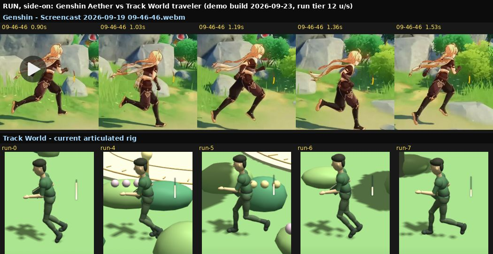
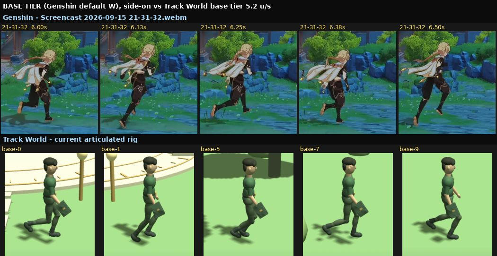
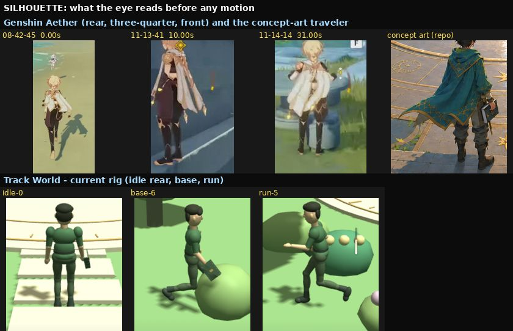
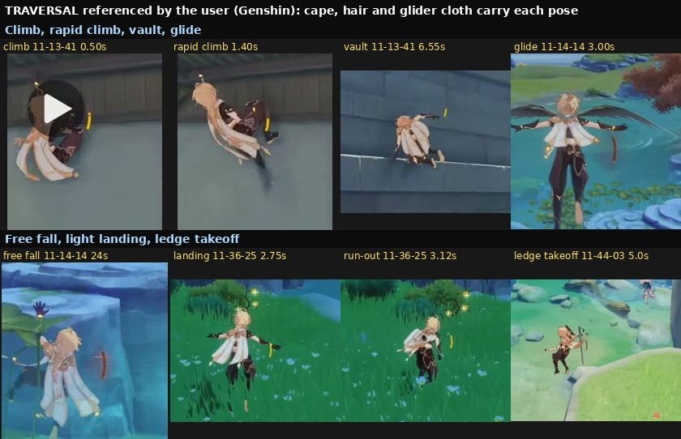

# Retrospective: why the traveler never looked like Genshin (2026-09-23)

> **What this file is.** An analysis written by Claude on 2026-09-23, at the user's request,
> after reading every Codex and Claude transcript about the character (2026-09-12 → 09-20)
> and re-watching all sixteen recordings in `~/Videos/Screencasts/`. It explains what went
> wrong and **proposes** ways forward. **It decides nothing.** Decisions stay in
> [the concept draft](TRACK-WORLD-CONCEPT-DRAFT.md#4-player-perspective-and-movement). The
> 2026-09-20 stop on body-animation work recorded there still stands until the user reopens it.
>
> Transcript times are **UTC**; the user's clock is UTC+7.

## 1. The answer in one paragraph

The character was built as **55 separate rigid pieces**: stretched spheres, cylinders and
boxes, flat-coloured, hinged at points, and moved by hand-written code
([`scripts/character-rig.js`](scripts/character-rig.js)). Aether is a single smooth model
that bends at the joints, has toon ("anime") shading, streaming hair and a scarf, and is
driven by animations made by professional animators. **No tuning of angles, timing or
scale can turn the first into the second.** Codex said so on 09-13 and recommended a
proper skinned model three times. Instead, the rigid body was locked in, twice. The
first time was by a decision question that left out that warning and made the
alternative look like it cost money. The second time was by an old prompt re-sent on
09-20. After that the agents spent six days perfecting the things they could measure
(cycle rates, stride ratios, 102 passing tests) while the only real test, the user's
eye, failed every round.

## 2. Look first

These images are here so a future agent can **see** the gap without re-decoding the videos.
They are visual-development reference, not production assets. The Genshin frames come from
the user's screen recordings of YouTube videos, and the traveler frames from the current
demo build (headless Chrome, 2026-09-23).

**Run, side-on.** Aether leans forward. His arms swing bent through large arcs. His rear
leg fully extends and his hips ride high. Hair and scarf stream behind him. The traveler
stays upright and its knees stay bent (the "sit running" the user named on 09-15). One
forearm points forward, locked in place, in every frame.



**Base tier (Genshin's default `W`), side-on.** Same story at the slower speed. The
traveler's notebook arm hangs straight down and its free arm barely moves.



**Silhouette.** This is what the eye reads before any motion. The traveler's bulges at
the shoulder, elbow, hip and knee are the rigid pieces overlapping, and they show at
every angle.



**Traversal the user supplied footage for.** In every one of these poses the scarf, hair
or glider cloth carries part of the motion. The current rig has none of them.



## 3. What went wrong, most important first

### 3.1 The body could never reach the target (structural)

- **What it is:** 55 rigid meshes with `StandardMaterial` diffuse colours. No skinning, so
  no surface bends. No toon shader. No hair, scarf or cape. Motion is procedural curves in
  `character-animation.js`.
- **What that forbids**, whatever the tuning: continuous skin across a joint; a scarf and
  hair that trail and settle; an anime face and silhouette; the timing detail animators
  put into authored clips (anticipation, overlap, follow-through).
- **Everyone who looked said so.** Claude's 09-12 explanation to the user rated option 1
  "No — that's its ceiling" for "is it fluid like BotW/Genshin?". Codex on 09-13 09:54:
  "changing animation timing cannot make rigid body pieces deform naturally." Draft §4
  ruling 1 (09-19): the body "reads as mechanical **at every joint angle**".

### 3.2 The moment to change approach was missed

- On **09-12** the user said they could not judge fluidity from a placeholder shape. The
  quick jointed rig (option 1) was a reasonable way to answer *that*. The user answered
  `A1` at 12:07, two minutes after Claude recommended option 1.
- By **09-13 01:46** that purpose was met. The user said: "the fluidity of movement is
  good but the problem is the model fluidity which is terrible". From then on the target
  was **how the body looks**, which was exactly option 1's stated ceiling.
- Codex recognised this and asked the user to choose a skinned model plus authored clips
  three times (09-13 09:54, 14:07, 14:49). Its 14:51 summary ended "skinned/authored is
  my recommendation". None of the three got an answer in the Codex thread.

### 3.3 The question that closed it was lopsided (09-14)

The next Codex session was written by Claude with `/prompt-refine`
(session `95cbceec`, 09-14 13:39 UTC). It asked the user to choose, and the user **did**
choose "Local procedural rebuild". But the options as shown:

- presented procedural as "No purchases, no new tools, fully reversible";
- presented the skinned route as "e.g. Quaternius base + animation library, **~$35**",
  although free versions of both existed (§7);
- **dropped Codex's diagnosis** that procedural cannot fix the look;
- ignored the user's recorded constraints (memory `decision-constraints`, 09-12):
  one-off purchases are fine, and learning a tool is fine if the payoff is stated.

The user's only other instruction in that session was: "note that when ever my
expectations bar can only be done using paid sefvice the make me decide later". A skinned
model did not need
a paid service, so that sentence was never really about the choice being made. The
refined prompt then opened with **"Decision already made (do not re-open the gate)"**,
and Codex obeyed it for six days.

### 3.4 The reopened decision was closed again (09-19 → 09-20)

- **09-19:** the user ruled (draft §4 ruling 1) to research skinned models read-only. The
  Codex prompt Claude wrote that day put that research **third**, as "Task 3 — QUEUED",
  behind a character **scale** change.
- **Scale first was wasted effort.** That prompt said to "rescale the scene with the
  character". Scaling everything together is invisible by construction. The user's
  verdict (09-20 02:37): "now nothing has changed so far".
- **09-20 06:17:** the **identical 09-14 prompt**, "Decision already made" block
  included, was sent into Codex again. Codex's history file shows it was entered from the
  TUI, most likely re-pasted to continue. Codex wrote "Your latest instruction also closes
  the production-path question again" and recorded it in the draft as superseding ruling 1.
  It did not ask which of the two contradicting instructions the user meant.
- Task 3 never ran. At 12:23 Codex handed back "All 12 suites pass — 102 tests … no paid
  option is parked." At 12:26 the user stopped the work.

### 3.5 Measurable proxies replaced the real goal

The user's complaint was always visual. The work went into what automation could check:
cycle rates in Hz, step length as a multiple of leg length, per-frame hip continuity,
planted-foot contact, clip-speed classification, gateway pier widths. Each passed. None
measured "does this look like the reference". Codex took the side-by-side screenshots it
needed to see the gap. On 09-20 it noted that they "still show rigid knee, elbow and
clothing seams" and handed back anyway. The user rejected the body **nine times**:

| When (UTC) | The user's words |
| --- | --- |
| 09-13 01:46 | "the problem is the model fluidity which is terrible" |
| 09-13 09:51 | "the walk and run is not the same set of movements. and the run is WAY faster" |
| 09-13 14:46 | "it wals like a robot and run like a fast walk, there's no jogging or actual running momentum" |
| 09-13/14 (Claude) | "the animation is still very weird and unrealistic" (with the `20-00-22` recording) |
| 09-14 14:49 | "the current model's leg go further than the body … the lymphs movements is very rapid" |
| 09-15 13:47 | "the model itself looked terrible … it looked like the character's sit walking/running" |
| 09-15 14:32 | "the proble is the model model model" |
| 09-20 02:37 | "now nothing has changed so far" |
| 09-20 12:26 | "1 is as bad as always and I'm tired of you never getting it right so just note it No plan of fixing" |

### 3.6 The references cannot support "copy every angle"

Every clip is a screen recording of a YouTube video. They are 216–637 px wide, their
speed is unknown or sped up, and some carry captions or combat. They show pose and
silhouette well. They cannot yield 3D joint angles, and Codex said so on 09-15. Hours
went into classifying clip speeds and measuring cadences. That work changed nothing,
because the user had already accepted the rhythm on 09-15. The practical source of
correct human motion is animation data someone already made (§7), not frame-reading.

### 3.7 Process weight made each mistake harder to see

- **Size.** About 80 MB of Codex transcript across two threads. About 418 KB of `World/`
  documents: draft 143 KB, PLAN 88 KB, verification log 76 KB, comparison 50 KB,
  README 44 KB. The key fact (the body cannot do this) was buried in them.
- **Codex saw only part of its instructions.** It truncated `AGENTS.md` at 32 KB until
  09-23, so it never saw most of the root safety and workflow rules.
- **Two agents at once.** Claude and Codex edited `World/` in parallel on 09-13, and
  hand-off prompts from one reached the other as though the user had written them.
- **Questions the user could not answer.** Several structured questions were ones the
  user said they did not understand ("I don't understand 2 and 5"; "EXPLAIN THESE
  SIMPLY").

## 4. Timeline

| Date (UTC) | User | Agent | Outcome |
| --- | --- | --- | --- |
| 09-06 / 09-07 | Movement "exact copy of Zelda", then BotW | Controller built | Controller later accepted |
| 09-09 | Speed "exactly like Genshin" | Speeds tuned by feel | No numeric parity ever measured |
| 09-12 11:25 | "I need a real character with at least human like body" | Codex asks appearance + production | — |
| 09-12 12:05–12:07 | Asks Claude to explain; answers `A1` | Claude recommends option 1 and calls Genshin fluidity "its ceiling" | Rigid jointed rig built |
| 09-13 01:46 | Controller good, **model** terrible; supplies `08-42-45` | Codex raises the Ultra gate, rewrites the gait | Rejected |
| 09-13 09:51–14:49 | Walk ≠ run, run WAY faster, "robot" | Codex recommends skinned + authored ×3 | **No answer given in Codex** |
| 09-14 13:39 | Picks "Local procedural rebuild" in Claude's question | Question omits the diagnosis, prices skinned at ~$35 | "Decision already made" prompt |
| 09-14 → 09-17 | Legs too far forward, limbs too rapid, "model model model" | Four sets, push-off, posture bounds, tests | Rhythm accepted, look rejected |
| 09-19 | Four rulings: research skinned read-only; 9 clips supplied | Claude's prompt queues the research as Task 3 behind scale | Scale build: "nothing has changed" |
| 09-20 06:17 | Same 09-14 prompt re-sent | Codex records procedural as reaffirmed | Research never runs |
| 09-20 12:26 | "No plan of fixing" | Stop recorded in draft §4 | Current state |

## 5. Re-analysis of the Genshin reference

What makes the movement read as Aether, and whether the current rig could show it at all.
"Structural" means no amount of tuning can produce it on this rig.

| Feature | What the clips show | Current rig | Fixable here? |
| --- | --- | --- | --- |
| Proportions | Long legs, hips high, narrow waist, anime head with spiky hair and braid (`09-46-46` 0.9–1.7 s) | Stacked ovals, short legs relative to torso, cap-like hair | Structural |
| Secondary motion | Hair, braid and scarf stream horizontally when running and hang down when climbing. The scarf lifts in free fall (`11-14-14` 21–29 s) | None exists | Structural (needs cloth/hair bones) |
| Joints | Continuous surfaces through hip, knee and elbow | Visible bulges where pieces overlap | Structural (needs skinning) |
| Shading | Toon shading with hard light/shadow bands | Smooth flat-lit diffuse | Structural (needs a toon material) |
| Arms | Elbows bent about 90°, forearms near horizontal, strong alternating swing (`09-46-46`) | Run: one forearm locked pointing forward. Base: notebook arm hangs | Tunable |
| Torso | Leans forward about 10–15° while running, chest leading | Upright | Tunable |
| Legs | Rear leg straight with the foot pointed at push-off; swing heel folds up behind; foot lands under the body (`21-31-32` 6.0–6.5 s) | Both knees bent at once, pelvis low | Partly tunable; the look is still limited by the pieces |
| Rhythm | About 1.5 recorded cycles/s in `09-46-46` and `21-31-32` (Codex measured the same) | 1.70 / 1.88 / 2.05 / 2.20 Hz | **Not the problem.** The user accepted it on 09-15 |
| Climb | Pressed to the wall, knee raised high, alternating reach; the rapid climb extends the whole body upward (`11-13-41` 0–2.4 s, pose only) | Rigid reach poses, no hanging cloth | Mostly structural |
| Vault | Hands on the ledge, body swings up with knees tucked, lands straight into a run (`11-13-41` 6.4–6.7 s) | Not built | Needs authored motion |
| Glide | Arms out holding a wing glider, legs hanging with feet pointed, cloth trailing (`11-14-14` 0–15 s) | Canopy cone over an arm pose | Structural |
| Light landing | Glider dismissed, shallow crouch, running again in about 0.4 s (`11-36-25` 2.6–3.1 s) | Generic compression | Needs authored motion |

**The clips that matter most:** `09-46-46` and `21-31-32` for side-on locomotion, and
`11-13-41` (pose only, sped up) for climbing and the vault. The combat parts of
`08-42-45` (after ~16 s) and all of `09-51-20` are out of scope, as already recorded.

## 6. Corrections to existing records (applied to the draft on 2026-09-23)

- **Draft §4 ruling 1** says the 09-14 instruction closed the gate "without the user ever
  ruling on it". The user **did** rule, at 09-14 13:39 UTC in Claude session `95cbceec`.
  The accurate statement is that they ruled on a question that left out Codex's diagnosis
  and made the alternative look paid.
- **Draft §4 "local production reaffirmed (2026-09-20)"** treats the re-sent 09-14 text as
  a fresh choice that supersedes ruling 1. It was the same prompt, sent a day after ruling
  1, and nobody asked which of the two the user meant.
- The user approved both corrections, and they are now marked *Corrected* / *Correction
  (2026-09-23)* in draft §4. They fix the record only. The 2026-09-20 stop on
  body-animation work is unchanged.

## 7. Options: PROPOSALS, nothing chosen

**What decides it:** the stated target is a body that looks and moves like Aether,
restyled to the botanical theme, with the book instead of the sword. An option that cannot
produce a smoothly bending, toon-shaded body with moving hair and cloth cannot reach that
target, however cheap it is.

Web facts were checked on 2026-09-23. **Recheck them before anything depends on them.**
Laptop performance is **unknown** for every option below and must be measured (PLAN §25.13).

### A. A free anime-style model with ready-made animations (recommended, as a small trial first)

- **What it is.** Design a botanical Aether-like traveler in **VRoid Studio**: hair,
  braid, scarf and outfit in its editors, a book prop added later. Free, and its models
  may be used commercially ([VRoid Studio](https://vroid.com/en/studio),
  [guidelines](https://vroid.com/en/studio/guidelines)). It exports **VRM**, which is
  based on glTF 2.0 ([export FAQ](https://vroid.pixiv.help/hc/en-us/articles/38726063278233-How-do-I-export-a-model-as-VRM)).
- **This laptop runs Ubuntu, and VRoid Studio is Windows/macOS only.** On Linux it runs
  only through Steam's Proton compatibility layer. Some users report it working; others
  report a black screen on Ubuntu or a camera that will not move
  ([Steam discussion](https://steamcommunity.com/app/1486350/discussions/0/4355621251095328988/),
  [camera issue](https://steamcommunity.com/app/1486350/discussions/0/694247195298263162/)).
  As checked on 2026-09-23, neither Steam nor Wine nor Blender is installed, and the GPU is
  an integrated AMD Lucienne. **The first step is therefore a free, reversible test:**
  install Steam, then open VRoid Studio under Proton. If it fails, the fallback is a
  ready-made anime base model edited in Blender, which runs natively on Linux.
- **Animations.**
  - **Mixamo:** free with an Adobe ID and royalty-free in games. Raw files may not be
    redistributed ([Mixamo FAQ](https://helpx.adobe.com/creative-cloud/faq/mixamo-faq.html)),
    so check whether this repository is public before committing raw clips.
  - **Quaternius Universal Animation Library 2:** 130+ clips, CC0. Standard is free and
    has about 60–70% of the kit; Source is a one-off **$20**
    ([itch.io](https://quaternius.itch.io/universal-animation-library-2)).
- **Into Babylon.** Use the engine's own glTF loader, which is MIT and would be vendored
  like the engine. The ready-made VRM loader
  ([babylon-vrm-loader](https://github.com/virtual-cast/babylon-vrm-loader)) supports
  Babylon ^6 and VRM 0.x only and installs through npm. That does not fit this project's
  vendored Babylon 9.25 with no package manager, so converting VRM → GLB (for example in
  free Blender) is the likelier path. The toon look needs a toon material: the MToon port
  ([babylon-mtoon-material](https://github.com/virtual-cast/babylon-mtoon-material), npm)
  or a small custom one.
- **What it gives you.** Real skin bending, an anime silhouette, and human-correct motion
  someone already made. The controller, speeds, stamina, Space rules and camera stay
  untouched, because animation only observes them.
- **What it can't do.** Stock clips are not Genshin's clips, so they will need picking and
  some adjusting. Hair and scarf motion ("spring bones") does not come free without the
  VRM loader; it needs its own code, and that is **the biggest unknown**.
- **Gates it needs, each asked separately:** installing Steam and VRoid, and probably Blender;
  downloading the glTF loader and clips; an Adobe account; and choosing this as the art
  production approach.
- **Try it small first.** One milestone: the new character standing and running with one
  clip on the existing route, shown side by side with Aether like §2. If the user looks
  at that and says "still not it", stop there. Very little has been spent at that point.

### B. Buy a one-off anime-style base character

For when VRoid cannot reach the look. One-off purchases are within the user's
constraints. **Not researched in this pass.** It needs named candidates with licence,
price, triangle count and a glTF export before it is a real option.

### C. Keep the rigid rig and change the target

Restyle the traveler as something where visible joints **are** the look, such as a
wooden or paper doll or a small toy figure, and stop comparing it with Genshin. Cheap, and
needs no downloads. It can never give Aether, which is what the user asked for.

### D. Leave it stopped

This is the recorded state today. The controller works. The body stays a placeholder until
the rest of the demo needs it.

### Not recommended: the official HoYoverse MMD Aether model

The official MMD models are distributed for fan use, but their terms forbid editing, and
the character is HoYoverse's property
([summary of terms](https://www.deviantart.com/bunglescrungle/art/Genshin-Impact-MMD-OFFICIAL-model-download-links-1036315856)).
"Twist him to fit the theme, book instead of sword" is exactly an edit.

**Recommendation: A, as the small trial only.** Switch to B if the trial shows VRoid's
look is the limit. Switch to D if the trial shows the laptop cannot carry a skinned model.

## 8. Rules that would have prevented this

1. **After two rejections of the same visual complaint, stop tuning.** Ask whether the
   approach can reach the bar at all, and name what it cannot do.
2. **Every decision question carries the "can't" line and the true price.** Include the
   earlier agent's diagnosis. Show free and one-off routes. Never present "costs money"
   as one lump.
3. **Never write "decision already made" in a hand-off without the date and the place
   the user said it.** When a prompt contradicts a newer ruling in the draft, the agent
   asks rather than picking the prompt.
4. **Don't re-send old prompts** that contain decision blocks. Write a fresh one from the
   current records.
5. **Judge looks by looking.** Before handing back visual work, put a same-phase
   screenshot beside the reference, as in §2. The agent can do this itself.
6. **Tests prove behaviour, not appearance.** Test counts are not progress on a visual
   complaint and should not lead a hand-back about one.
7. **One agent per area at a time**, and keep the records short enough that the
   deciding fact is findable.

## 9. For the next agent

- **Read:** this file, then the first bullets of draft §4, then the four images above.
- **Do not:** retune angles, cadence or scale on the rigid rig; re-classify clip speeds;
  ask for another playtest of the rigid body; treat any "decision already made" text as a
  ruling without checking its source.
- **Still standing:** the 2026-09-20 body-animation stop (until the user reopens it);
  every download, install, account and purchase gate; the art-production-approach gate;
  and no reading or writing of Track data.
- **Regenerating a sheet.** There is no ffmpeg on this machine; GStreamer decodes the
  clips. Frame `f-K.jpg` is at `K/24` seconds:

  ```bash
  gst-launch-1.0 -q filesrc location="Screencast from 2026-09-19 09-46-46.webm" ! matroskademux \
    ! decodebin ! videoconvert ! videorate ! video/x-raw,framerate=24/1 ! jpegenc quality=88 \
    ! multifilesink location="<dir>/f-%05d.jpg"
  ```

  The traveler frames came from a headless run that used `../tests/lib/cdp.js` and
  `tools/serve.js`. It ran at a 1920×1280 viewport, projected `traveler-pelvis` to the
  screen, and clipped around it. The app renders below CSS resolution, so convert render
  pixels to CSS pixels before clipping.
