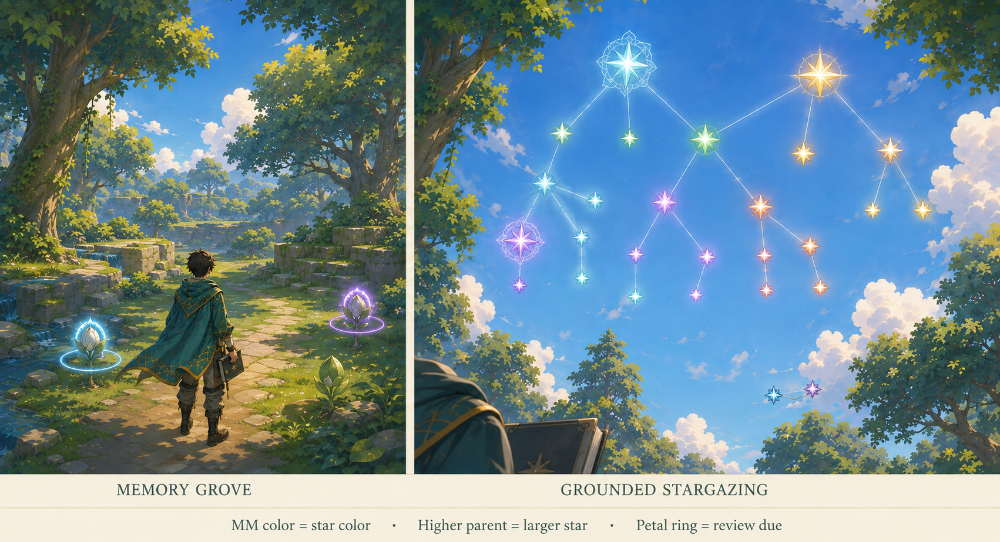
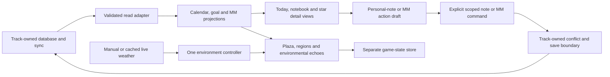

# Track World — Concept Draft

**Status:** Working draft; implementation authorized, nothing built yet; the concept decisions below are not finalized\
**Concept date:** 2026-09-05\
**Initial platform:** The user's current computer; phone and iPad versions deferred\
**Relationship to Track:** Proposed private game experience linked to the existing Track application

**Planning companion within this draft:** [Section 25 — workflow, tool research, delivery gates, and remaining decisions](#25-proposed-workflow-and-tool-plan).

**Next work:** [Three-step sequence](#next-work-sequence) · [Picture placements and briefs](#picture-reference-package).


> This image is a visual-development reference, not a final production asset or an exact
> screen specification. It establishes the preferred simplified anime rendering, the
> Verdant Astral Clock Plaza, and the Living Botanical interface identity.

## 1. Concept in one sentence

Track World is a private, synchronized, third-person fantasy world that turns the user's
real Track information into explorable places, journeys, landmarks, environmental signals,
and gentle daily rituals while remaining relaxing, convenient, and safe for the underlying
data.

## 2. Product intent

The game is intended to make Track feel alive. It is not meant to be a detached game that
occasionally grants points for productivity, and it is not meant to disguise the current
website behind arbitrary fantasy decoration.

The experience should let the user:

- See important schedules, day notes, deadlines, warnings, and SIR reviews conveniently.
- Experience major goals as journeys rather than rows in a list.
- Experience milestones as meaningful destinations and permanent landmarks.
- Move through a beautiful personal world for enjoyment and relaxation.
- Open and edit personal notes anywhere through a carried notebook.
- Return to completed journeys and see the history of prior progress.
- Explore the world on the user's current computer while keeping its information connected
  to Track. Phone and iPad gameplay can be reconsidered later.

The world should strengthen the relationship with real goals without making the user feel
punished for resting, falling behind, or having a difficult period.

## 3. Experience principles

### 3.1 Track made alive

Real Track information is the substance of the world. Goals shape geography, milestones
shape landmarks, schedule data shapes the Clock Plaza, and reminders create world signals.
The world must not invent progress or pretend that familiar user-authored information is a
mystery waiting to be discovered.

### 3.2 Relaxing before demanding

The game should be enjoyable to inhabit even when the user does not want to complete
anything. Overdue work may be visible, but it must not damage the world, drain resources,
create guilt-driven failure states, or remove past achievements.

### 3.3 Convenient before diegetically pure

Physical locations give information meaning, but essential information must also be
available through the notification control and the carried notebook. The user should never
have to cross the world or complete a platforming sequence merely to discover that a
deadline exists.

### 3.4 Deliberate writes, effortless reads

Reading information should be immediate. Any action that changes real Track data should be
explicit and difficult to trigger accidentally. Ordinary movement, collisions, proximity,
weather, and platforming must never modify Track data.

### 3.5 One coherent world system

The sky must not change above an otherwise static environment. Time and climate should
propagate through the whole world: illumination, clouds, water, plants, surfaces, particles,
distant scenery, clothing, and atmosphere should feel governed by the same conditions.

## 4. Player perspective and movement

- The world is explored from a third-person perspective.
- The initial controls use keyboard and mouse on the user's computer.
- The Memory Grove has a dedicated sky-view camera for seeing the KS03 multiverse as
  stars. Grounded stargazing keeps the character safely still while the user pans and
  zooms overhead; closing restores the ordinary camera (Section 5.7).
- Movement should feel flexible, fluid, and satisfying in its own right.
- Platforming is a core pleasure and should blend naturally into the landscape.
- Routes should not be labeled or visibly segregated into an artificial easy path and hard
  path.
- Alternate paths should also feel like natural parts of the geography rather than detached
  challenge courses.
- Important information must remain accessible even when the surrounding terrain contains
  demanding movement.
- The notebook is normally visible in the character's right hand.
- The notebook stows automatically during climbing, vaulting, swimming, or any movement
  that naturally needs both hands, then returns without requiring inventory management.

<a id="ref-avatar-notebook"></a>

> **Planned reference R5 — Avatar and notebook poses.** Place the provisional front/side/back
> and carry/stow/movement sheet here. Avatar identity remains open; a neutral placeholder
> can establish attachment and rig needs. See the [reference package](#picture-reference-package).

Combat and survival systems are not part of the current concept. They were considered
potential overload. The concept should retain enough flexibility to revisit them later, but
they must not be assumed, designed around, or allowed to dominate the relaxing purpose.

## 5. World structure

**Confirmed slot mapping:** each Track workspace slot has a separate world, with its own
sanctuary, Clockgarden, goal regions, and history. The user explicitly switches worlds;
slots do not become territories inside one shared world. The detailed switching interface
and draft-handling flow remain to be designed.

### 5.1 Personal sanctuary

The sanctuary is the user's calm personal home. It should feel private, restorative, and
distinct from productivity infrastructure. It is not the schedule location.

The sanctuary may provide convenient access to important information and world travel, but
its identity should remain personal rather than becoming a calendar lobby.

### 5.2 Schedule location

The schedule has its own physical and thematic location. The current preferred direction is
the **Verdant Astral Clockgarden**, centered on a walkable **Clock Plaza**.

The Clockgarden must be clearly separate from the sanctuary even if the two are close enough
for convenient travel. It represents time, recurrence, planning, and the movement of the day
rather than rest or personal identity.

### 5.3 Goal regions

- Each major goal becomes a separately themed region or major area.
- Nested goals become branching paths inside that region.
- Milestones become destinations, structures, crossings, overlooks, or other memorable
  landmarks along the journey.
- Goal-related schedule information can appear as a smaller regional echo while retaining
  an authoritative representation in the schedule system.
- Goal regions may use distinct art direction, terrain, traversal character, and interface
  materials.
- Updated information may grow, redirect, or transform paths, but familiar landmarks should
  not move unpredictably.

### 5.4 Completed regions

Completed goal regions remain explorable. Completion transforms them rather than deleting
or closing them. They become part of the world's history and allow the user to revisit prior
journeys.

The treatment of archived goals and deliberately deleted goals is still undecided. They
must not be treated as automatically equivalent to completed goals.

### 5.5 Natural geography and long-term scale

**Confirmed direction:** places connect through natural paths in the landscape. Those
routes may cross mountains, plains, or waters, according to the character of each region.
The journey between places is part of the world experience.

This choice establishes the feel of the geography, without fixing the overall landmass
shape, world size, or technical loading boundaries. A compact gateway hub is no longer the
assumed world layout. Persistent completed regions must still fit into the growing world
without making daily navigation exhausting or the landscape overcrowded.

### 5.6 Regional and landmark gateways

**Confirmed travel direction:** fast travel is accessed through gateways at regions or
landmarks. Natural traversal remains available between connected places, with these
physical destinations providing travel shortcuts. The notebook and Today view remain
accessible everywhere, independently of travel.

Gateway appearance, destination selection, whether a first visit is required, and any
separate emergency-return behavior remain open. This decision does not grant travel from
anywhere through the notebook or map.

<a id="ref-landscape-routes"></a>

> **Planned reference R3 — Connected landscape and routes.** Place the top-down blockout and
> matching third-person viewpoints here. Mark unchosen layout/loading/gateway assumptions as
> proposals. See the [reference package](#picture-reference-package).

### 5.7 Memory Grove and the KS03 sky

**Confirmed direction (2026-09-06):** SIR's physical home uses a **Memory Grove** theme.
Inside that specific location, a dedicated look camera reveals the entire current slot's
**KS03 multiverse as stars in the sky**. The grove and the celestial view form one place;
this does not add a separate observatory location.

- The grove gives spaced reviews a botanical setting, with due information also available
  through Today and the notebook from anywhere.
- The special sky represents the full KS03 multiverse belonging to this slot's world,
  including mind maps without a review due. It does not combine other slots' knowledge.
- Stars represent the existing mind maps and preserve their identity and relationships.
  They are representations of knowledge, not earned collectibles or one star per review.
- Looking, moving the camera, and inspecting a star must not rearrange KS03, change its
  saved positions, or complete a review. Full MM editing is available through deliberate
  actions in the selected star's detail view, under Section 10's interaction contract.
- Overdue reviews never make the grove wither or destroy stars. The sky's knowledge
  structure and a review's current due state are distinct meanings.

**Confirmed camera:** grounded stargazing. The character stays safely still in the grove
while the user pans and zooms around the overhead multiverse. Closing the view restores
the normal third-person camera. The exact keybind, transition, zoom limits, and handling of
an activation requested while moving or airborne remain to be designed.

**Confirmed sky treatment:** an always-readable overlay. The special camera reveals the
stars over the current sky, including daylight and cloudy or rainy conditions. The grove
keeps its actual time and weather, and real time continues during inspection. Clear nights
are not a prerequisite for accessing the star network.

**Confirmed constellation design:** project the existing KS03 layout into the sky. Preserve
the recognizable arrangement of its displayed nodes and connections, including saved manual
positions, while fitting the network to the sky-view camera. Viewing does not re-layout the
Track canvas or create a second independently arranged multiverse.

Each star glows beautifully in its MM's resolved color, honoring custom colors and Track's
existing color fallbacks. **Higher-level parents have larger stars; descendants become
smaller down the hierarchy.** This is a World presentation rule, not the KS03 canvas's
current type-based node-size rule. Size communicates hierarchy, not MG rating, completion,
review urgency, or a reward. Keep a clear luminous center and a bounded colored halo so
nearby stars remain distinguishable. A cycle cannot satisfy a strictly larger parent on
every edge, so its visual exception needs an explicit rule, not just protection against
unbounded growth. No sizing rule may duplicate an MM into separate identities.

**Hierarchy exception proposal:** treat mutually reachable nodes as one group for size
calculation only, with equal-sized stars inside that group. Rank the resulting acyclic
groups by their longest parent path from a root; a shared child gets one size below its
parent groups. Use a decreasing, bounded size curve. This does not collapse visible stars,
remove connections, change their colors, or rearrange the projected KS03 positions. Exact
ratios and dense-network readability remain to be tested before adopting this treatment.

**Confirmed SIR signal direction: grove and stars.** Botanical review markers on the ground
and matching signals on the corresponding MM stars reflect the same review state. The user
delegated the visual treatment; the adopted design is a restrained bud/leaf marker in the
grove with a small petal-shaped light ring, echoed by a petal-shaped outer ring on its star.
The ring adds a recognizable review cue without replacing the MM's color or hierarchy size.
Ordinary stars keep their beautiful base glow even when no review is due.

Use few calm ground markers and group multiple due reviews for one MM into a readable
detail list, keeping one star for that MM. Exact counts and session dates remain available
in the UI; two physical representations never count as two reviews. The matched signal
may use a gentle pulse, with a steady reduced-motion alternative. It creates no additional
reminder event, required collection action, or punishment. The concept illustration uses
synthetic colors and records to demonstrate this treatment; its plant shapes and framing
remain visual-development references.



> Built-in imagegen reference, 2026-09-06: ordinary grove view on the left, special grounded
> sky view on the right. Colors and graph records are synthetic; the diagram-like star
> arrangement illustrates the direction rather than reproducing a personal KS03 canvas.
> This is not a production asset, exact UI specification, or runtime performance evidence.
> [Generation prompt and reference notes](assets/images/memory-grove-ks03-concept.prompt.md).

**Confirmed information scope:** selecting a star opens the specific MM's full information
and associated feature views, including MGs. This includes what has been recorded for that
MM across Track, rather than limiting the view to a title, connections, or due SIR sessions.
The coverage inventory is:

| Area | Information available for the selected MM, where applicable |
| --- | --- |
| Identity and connections | Name, anchor/T1/T2 type, explanation, color, parent/child relationships, and navigation to connected MMs |
| Learning progression | KS02 stage, SIR sessions and their stored status/dates, and associated +Lin history |
| Marginal Gains | Current MG, rating/level, dated MG progression including old/new MG and experiments, and scheduled/carried MG focus information |
| Kolb | Linked Kolb records with their full stored reflection, experiment, and MG content |
| Comments and links | MM comments and their stored checked state, unclear status, and direct links |
| Source and collection | Source-dump references, text blocks, URL links, source activation state, inherited/aggregated content with its origin, saved ordering, and storage tags |

Applicability follows Track's existing MM-type and relationship rules: an anchor or T1 MM
does not acquire T2 MG behavior from its star. Use stored relationships to assemble the
information; similarly named records are not a link. Existing records and current status
do not constitute a complete audit history of every past edit.

**Confirmed action scope (2026-09-06): full MM interaction.** Selecting a star gives access
to the MM's existing Track features and editing actions, including MGs, Kolb, +Lin/SIR,
structure, comments, links, and sources. Section 10 defines this expanded write scope.
The concept decision is settled; the command implementation and recovery flows are still
to be built and verified.

The organization of the full MM detail view, projection/size tuning, and dense-network
readability remain open. The full network must remain representable at realistic volume;
label density and navigation need their own design rather than assuming every title fits
on screen at once.

<a id="ref-memory-grove-detail"></a>

> **Planned reference R4 — Complete MM detail and dense KS03 projection.** The ground and
> daylight sky reference already appears above. Place only its missing detail wireframes
> and synthetic layout/density comparison here, including empty and post-deletion states.
> See the [reference package](#picture-reference-package).

## 6. Mapping Track concepts into the world

| Track concept | Current world interpretation | Interaction status |
| --- | --- | --- |
| Major goal | Separately themed region or major journey | View representation confirmed; structural editing excluded |
| Nested goal | Branching path within its parent region | Representation confirmed |
| Milestone | Meaningful destination or permanent landmark | Representation confirmed |
| Task / to-do | Small marker from a shared family, with a task-specific shape | Working visual choice; exact artwork open; write access deferred |
| To-learn item | Related marker with a distinct learning shape along its goal path | Working visual choice; exact artwork open; write access deferred |
| Schedule | Clock Plaza plus notification and notebook views | Read access confirmed; write access deferred |
| Supporting-action entry | Dated schedule span and inspectable action details in the Plaza/Today/notebook | Include in complete schedule reads; this clarification adds no completion or scheduling writes |
| Scheduled MM session | Dated schedule span linked to its MM; distinct from a SIR review occurrence | Include in complete schedule reads; MM feature access does not itself authorize ticking or rescheduling this entry |
| Calendar note | Timed or untimed schedule signal | Read access confirmed |
| Deadline | Distinct due signal with separate warning language | Read access confirmed; completion/editing deferred |
| SIR review | Matched botanical ground markers and petal-ring cues on MM stars; readable due information available everywhere | Grove-and-star signals and MM-specific SIR management through the selected star confirmed |
| KS03 multiverse | Projected KS03 arrangement; stars glow in MM colors with higher-level parents larger; grounded pan/zoom and always-readable overlay; select for all MM features including MGs | Layout, visual hierarchy, full viewing and MM interaction confirmed under Sections 5.7 and 10 |
| Notes widget | Notebook carried in the right hand | View and edit anywhere confirmed |
| Completed goal | Transformed region that remains explorable | Confirmed |

This mapping is conceptual. It does not replace the existing meanings, dates, ownership, or
relationships stored by Track.

**Working marker choice (2026-09-06):** tasks and to-learn items use related, recognizable
markers with distinct shapes for each kind. Materials may adapt to a region while exact
titles and status remain inspectable. The user selected this tentatively; the precise
symbols and artwork remain open. This visual choice does not enable completion writes.

<a id="ref-marker-legend"></a>

> **Planned reference R6a — Marker legend.** Place the task/to-learn and warning/due/SIR
> shape legend here, with the same meanings shown in two regional materials. This is part
> of the interface package, not an additional art direction. See the [reference package](#picture-reference-package).

## 7. Clock Plaza schedule experience

### 7.1 Physical representation

The Clock Plaza uses a circular, ground-level representation of the current day:

- A clear ring or set of rings establishes the day's time structure.
- An unmistakable marker shows the current local time.
- Scheduled activities occupy meaningful positions or spans around the ring.
- Timed notes appear at the relevant time.
- Untimed day notes have a separate central or all-day location; the world must not assign
  them a false time for visual convenience.
- Deadlines have a visually distinct due state.
- Deadline warnings remain distinct from the due moment.
- Exact titles, times, and details are available through the interface rather than relying
  entirely on environmental symbolism.
- The center provides a readable day-ledger or focal point without blocking free movement.

The Plaza is not the only way to learn what is happening. Its purpose is to embody time and
make visiting the schedule enjoyable; it must not become a mandatory obstacle to awareness.

**Geometry proposal for the first information proof:** use a clockwise 24-hour ring, with
00:00 at a fixed labeled origin and parallel lanes for overlapping spans. Keep the due
moment distinct from a deadline's preparation span; preparation on another day belongs to
that day's geometry. Caution is a dated warning, not an invented duration around the ring.
An untimed note retains its all-day location even if its automatic block is shown at 08:00;
label that placement as a default block, never as an authored note or reminder time. Related
markers open the same item detail and count once. Confirm scale, lane density and selection
with the annotated reference and synthetic proof before adopting the geometry.

<a id="ref-clock-plaza-semantics"></a>

> **Planned reference R9 — Clock Plaza semantic schematic.** Place a ring/date-strip/Today
> crosswalk here, using matching synthetic identities for overlaps, untimed notes, gapped
> caution days, moved preparation and due/completed states. This is an annotated behavior
> proposal, not a beauty render. See the [reference package](#picture-reference-package).

### 7.2 Regional echoes

When an item belongs to a goal, its region may show a smaller echo through light, sound,
movement, a marker, or a local object. The Clock Plaza remains the complete schedule view,
while the echo connects the item to its journey.

An echo must not create a second conflicting truth. It reflects the same underlying item.

### 7.3 Complete Today view

The full contents of today are available from a compact notification button or bar. It
should not occupy substantial gameplay space while closed.

When opened:

- It provides an adaptive complete view rather than showing only an unexplained count.
- The computer layout prioritizes readable titles and enough visible rows, with scrolling
  when needed and full details immediately available.
- The world remains visible behind or beside the panel.
- Exact information is prioritized over decorative animation.

The open panel may take more space because opening it is deliberate; the closed state must
remain unobtrusive.

### 7.4 Evening transition

After **20:00 local time**:

- Unfinished items from today remain visible.
- The interface begins featuring tomorrow when tomorrow contains a day note, warning, or
  deadline.
- Tomorrow's information is presented as approaching, not as if it already belongs to today.
- The environment may gently signal the transition without forcing the panel open.

### 7.5 Midnight and overdue items

At midnight:

- Every item remains attached to its original date; midnight alone writes nothing.
- Actionable occurrences retain their canonical completion state. Unfinished ones appear
  as dated unfinished history; use an overdue label only under the category's defined
  lateness rule, never merely because a generic checkbox is absent.
- Informational calendar notes, reference timetables and descriptive goal markers become
  dated information/history, not overdue work. Automatic block-placement times do not
  create reminder times or completion obligations.
- The game never silently carries it forward, changes its date, or implies that Track was
  rescheduled.
- Any completion, edit or dismissal uses an explicitly authorized Track action. Viewing
  history does not require dismissal. Category-specific policy is recorded in Section 25.7.

## 8. Reminder behavior

When a scheduled time or important deadline arrives during play, the game uses three gentle
signals:

1. The compact notification control pulses.
2. A brief readable message appears and fades.
3. The Clock Plaza or relevant regional echo produces a recognizable visual and audible
   signal.

These signals reinforce each other. Environmental signals are never the only notification
channel, because weather, camera direction, distance, visual ability, or muted audio could
make them easy to miss.

Ordinary reminders should not pause the game or demand dismissal. The exact escalation rule
for genuinely urgent or overdue information remains open, but it must stay compatible with
the no-punishment principle.

## 9. Personal notebook

The notebook is both a world object and a convenience tool.

Confirmed behavior:

- It is carried in the character's right hand during ordinary movement.
- It can be opened anywhere using a dedicated button or keybind.
- Opening it places the character in a safe reading/writing state.
- Personal notes can be viewed and edited from anywhere.
- Notebook note changes synchronize with the Track notes widget, including Track edits
  made on other authorized devices.
- Schedule, deadline, SIR, and goal information can be viewed through the notebook.
- The notebook's non-note sections remain view-only. Full MM editing is accessed through
  the selected star in the Memory Grove (Section 10).
- It stows automatically for movement requiring both hands and returns fluidly afterward.

The notebook must not require travel to the sanctuary or Clock Plaza before the user can
edit an existing personal note. Creating a new canonical note is a separate capture decision;
the existing-note editing promise must not be mistaken for an implemented creation flow.

**Empty-notebook proposal:** allow a recoverable game-side scratch draft and export when
there is no existing note. Label it as an unlinked draft, not a note saved to Track, and
offer supported navigation to Track's note creation. Do not silently create a placeholder
note or assign the draft to a different slot. Creating/deleting notes directly in World,
and promoting this scratch draft to a new Track note, remain open before the full notebook
release; the first synthetic proof can test capture without enabling those writes.

## 10. Two-way connection and action safety

The two-way link covers personal notebook notes and full MM interaction from the Memory
Grove's selected-star view. Track continues to own the records and the meaning of every
action.

### Confirmed write capabilities

- View and edit personal notebook notes in synchronization with Track.
- **Full MM interaction from a selected star (2026-09-06).** Provide the applicable existing
  Track actions for that MM, including its related learning records and source content:

| MM feature family | Confirmed interaction scope |
| --- | --- |
| MM identity and structure | Existing MM creation/duplication/deletion, rename, type, explanation, color, and parent/child connection actions; deliberate layout editing where applicable |
| MG | Current-MG changes through Track's existing Kolb/MG workflow, rating/level changes, and MM-specific focus scheduling |
| Kolb | Existing creation, editing, duplication/reuse, and MM-link actions for learning records |
| +Lin and SIR | Existing stage changes and review completion, skip, postpone, finish, and revert actions, with their canonical effects on sessions and dates |
| Comments and links | Existing add/remove, checked-state, unclear-status, and direct-link actions |
| Source and collection | Existing source attachments/content actions, text and URL blocks, activation, ordering, transfers, and storage tags; shared content retains its real owner |

Actions keep their existing applicability: an MM's type and current state determine what
Track allows. The star view does not introduce a free-form replacement for Track's MG,
SIR, or source rules. Changes that affect other records must identify those effects before
confirmation where required, including shared-source edits, type changes, review-date
cascades, and deletion.

The interaction sequence is **select the star → choose a named action → edit or review its
effect → explicitly save/confirm → show the accepted result**. Ordinary inspection and
camera controls never write. Destructive actions retain confirmation, and completion or
review-management actions must not trigger from a general interaction key or a stray click.
Cancellation and failed saves preserve recoverable work; visible success follows Track's
acknowledgment, with cloud status shown separately. Exact forms, command shapes, and
recovery behavior remain implementation work.

**Entry-state proposal for the confirmed MM creation scope:** expose a named Create MM
action in the Memory Grove overlay even when no star exists or is selected. It uses the
same scoped Track command, type rules, draft recovery and acknowledgment as other MM actions;
it never creates a synthetic placeholder in Track. After accepted creation, select the new
MM. After accepted deletion of the selected MM, clear selection and return to the overlay,
showing its empty state if necessary. A failed deletion keeps its recoverable context;
remote deletion disables actions on the missing record. Ordinary viewing still writes nothing.

This is authorization for the concept's feature scope. It does not itself perform a live
edit, authorize a runtime/cloud change in this documentation task, or bypass the separate
Track implementation and verification workflow.

### Explicitly excluded

- Structural goal editing inside the game. Creating, renaming, moving, nesting, or
  reorganizing the goal hierarchy remains in Track unless this decision is deliberately
  revisited later.

### Deferred capabilities

- Completing tasks or to-learn items.
- General calendar-note, deadline, and task-schedule editing or rescheduling. MM-specific
  MG focus scheduling and SIR management are included above.
- Creating quick reminders or other Track items.

MM actions may change a linked goal's computed progress through Track's existing rules.
That consequence does not grant separate goal-tree editing or direct task/to-learn ticks.

If task or to-learn completion is enabled later, its interaction contract is already
defined:

```text
Inspect the item → intentionally tick it → explicitly confirm
```

Completion cannot be caused by walking into an object, collecting something, finishing a
jump, pressing a general interaction button once, or accidentally clicking a small control.
A clear final result and a reasonable recovery/undo path should be considered before
completion writes are allowed.

## 11. Progress feedback

World change follows layered significance:

- An individual task may produce a small sign of life or local response.
- A milestone produces a memorable landmark or meaningful regional change.
- A completed major goal transforms its region.
- The transformed region remains explorable.

This hierarchy prevents every tiny completion from permanently cluttering the world while
still ensuring that small actions feel acknowledged.

**Confirmed reward decision (2026-09-06): no extra reward system.** The local responses,
milestone landmarks, regional transformations, and retained history are the feedback.
There is no additional currency, XP, collectible reward track, or reward-based cosmetic
unlock system. Future customization remains a separate design question.

The exact visual effects and their truthful response to corrected completion state remain
open. The world must not encourage meaningless Track activity, fake entries, or excessive
fragmentation of tasks to produce more effects.

<a id="ref-progress-history"></a>

> **Planned reference R7 — Active, completed and reopened region.** Place the same-camera
> comparison here. Distinguish retained landmarks from truthful current-status effects;
> the correction treatment remains a proposal. See the [reference package](#picture-reference-package).

## 12. No-punishment model

Overdue and neglected items create **concern without punishment**:

- Clear reminders may appear.
- Environmental signals may communicate urgency.
- No region permanently decays.
- No earned landmark is removed.
- No resource is confiscated.
- No threatening encounter is created merely because the user fell behind.
- Unticking or correcting an item should restore its truthful state, not reconstruct a
  guessed state.

A temporary visual decline was discussed and rejected as unnecessarily complex and too
close to punishment.

## 13. Variety and exploration

The user already knows the information because it comes from their own application.
Exploration therefore means discovering different experiences and perspectives, not fake
informational surprises.

Confirmed sources of variety:

- Different goal regions with their own themes and traversal character.
- Real local time, climate, weather, and seasonal changes.
- Temporary world events that alter atmosphere or experience without punishment.
- Naturally varied platforming and routes.

Possible relaxing activities such as gardening, photography, gliding, climbing trials, or
other calm interactions remain a feasibility and value question. They should be considered
only if they make the world more enjoyable without creating a second obligation system or
distracting from Track.

## 14. Whole-world environmental fluidity

“Fluid environment” is a load-bearing creative requirement, not shorthand for changing the
skybox.

### Time of day

The movement of local time should affect:

- Sky color and cloud illumination.
- Direction, length, softness, and warmth of shadows.
- Light entering ruins, trees, shelters, and interiors.
- Water reflections and visibility.
- The behavior and appearance of glowing plants or celestial materials.
- Regional ambience and distant visibility.

### Wind

One coherent wind state should be perceptible across:

- Treetops, shrubs, grass, flowers, and vines.
- Hanging decorations and environmental objects.
- Waterfall spray, mist, leaves, petals, and particles.
- The character's hair, cape, clothing, and carried objects where appropriate.
- Distant foliage, so the foreground does not move against a frozen horizon.

### Rain and humidity

Rain and recent rain should influence:

- Wetness and drying patterns on stone, wood, soil, and plants.
- Water channels, pools, waterfalls, ripples, and runoff.
- Reflections and diffuse light.
- Mist, haze, spray, and distant visibility.
- Plant posture, color, and motion.
- Exterior interface edges, without compromising reading surfaces.

### Seasons and local climate

The world should reflect the user's local climate rather than automatically imposing a
generic four-season model. Seasonal character may affect vegetation, rainfall, water levels,
light, atmosphere, and regional materials.

The source of location/climate information, privacy treatment, manual overrides, and the
behavior when climate information is unavailable remain undecided.

### Gradual transitions

Environmental states should flow into one another. The user should not see a new sky placed
above unchanged lighting, dry surfaces, frozen foliage, or incompatible water. A transition
is successful only when the whole scene feels like it has entered the new condition.

Weather may alter the atmosphere and optional traversal experience, but it must not make
essential information inaccessible.

<a id="ref-environment-states"></a>

> **Planned reference R2 — Coherent environment states.** Place the same-camera clear/rain/
> wet-evening/night comparison here, including stable reading surfaces and reduced-motion
> annotations. Later engine captures and motion evidence must test the target; reference
> images cannot prove transitions or performance. See the [reference package](#picture-reference-package).

## 15. Art direction

### Confirmed rendering direction

- Stylized anime-inspired third-person 3D.
- Clean cel shading and readable silhouettes.
- Bright, expressive color with controlled contrast.
- Simplified materials and broader shapes.
- Medium-low environmental detail: alive and rich, but not hyperrealistic or covered in
  micro-ornament.
- Enough depth and material response to make the world feel inhabitable.
- No gritty photorealism.

The initial hyperrealistic concepts were rejected. A later anime pass was still judged a
little too detailed, so the preferred level was reduced modestly rather than flattened into
minimalism.

### Current Clockgarden direction

The schedule area's visual identity combines:

- Lush local vegetation.
- Pale simplified stone.
- Warm restrained gold or bronze time rings.
- Water channels and rain response.
- Celestial instruments and motifs used sparingly.
- A clear circular plaza with calm negative space.
- Surrounding terraces and geography that suggest fluid traversal.

### Other locations

The Memory Grove's botanical setting and its special KS03 star sky are confirmed in
Section 5.7. Other goal regions and functional places are expected to have varied identities.
The exact fantasy world, lore, cultures, and remaining regional aesthetics will be decided
later.

Visual variety must not make the information system incoherent. Locations may change
materials, silhouettes, animation, and motifs, while retaining recognizable interaction
hierarchy, readable text, familiar controls, and consistent meanings for warnings and
completion.

<a id="ref-style-sheet"></a>

> **Planned reference R1 — Selected style sheet.** Place annotated crops of the two existing
> images here to define silhouette, cel bands, palette, detail density and ornament limits.
> Retain those images as visual-development references. See the [reference package](#picture-reference-package).

## 16. Living Botanical interface identity

The selected interface direction for the current schedule experience is the **Living
Botanical Codex**.

### Visual language

- Organic, asymmetrical silhouettes rather than a generic rectangular dashboard.
- Layered leaves or petals that unfold into information surfaces.
- Individual leaf-like cards for schedule entries.
- A compact flower-bud or unfurled-leaf notification control.
- Sage, mint, soft cream, sky blue, and restrained warm gold.
- Simple seed, sun, book, bud, or related category symbols.
- Moderate spacing and limited ornament.
- An anime-fantasy character rather than realistic botanical illustration.

### Readability contract

- Text-bearing surfaces remain calm, opaque enough, and high contrast.
- Decorative vines, veins, droplets, and glow stay away from the text.
- Information is distinguished by shape and icon as well as color.
- The interface adapts to bright sky, night, rain, and complex scenery without becoming
  camouflaged.
- Weather and light may affect outer leaves, edges, reflections, or unfolding motion, while
  the reading surface stays stable.
- Computer interaction must support keyboard navigation and clear click targets. Essential
  controls and information must remain accessible without hover.

### Normal and expanded states

- The normal gameplay state is a small, unobtrusive botanical notification button/bar.
- The expanded Today state may occupy part of the screen because the user opened it
  deliberately.
- The expanded state should leave the character and important world context visible.
- A close action must be obvious.
- Presentation can adapt to computer window sizes without changing its botanical identity.

<a id="ref-interface-states"></a>

> **Planned reference R6b — Interface states.** Place closed-bud, dense Today, notebook and
> item-detail wireframes here, with synthetic Thai/English text, scrolling, focus and empty
> states. The three example rows in the cover image do not specify a complete Today view.
> See the [reference package](#picture-reference-package).

### Explored but not selected

An Astral Glass-and-Vellum interface was explored first. It used teal-and-gold celestial
filigree around a warm paper surface and offered strong separation from the environment.
The Living Botanical identity was selected because it felt more distinctive, organic, and
connected to the Verdant Clockgarden.

## 17. Privacy, synchronization, and devices

### Privacy

- The world is private and personal.
- Only the user should play it.
- Access is limited to authorized devices or the user's private identity.
- Public viewing and shared multiplayer are not part of the current concept.

### Synchronization

- The initial computer world reflects the user's current Track data. Track itself may
  still synchronize with other authorized devices, so mobile gameplay being deferred does
  not remove the need to handle competing Track edits safely.
- If game support expands to additional devices, the same personal world should remain
  consistent across them.
- Personal notebook notes must stay synchronized with the Track notes widget.
- Accepted MM edits from the star view must be reflected in Track and other World views
  through the same canonical records, including related MG, Kolb, SIR, and source changes.
- Game presentation must never imply a successful data change before Track has safely
  accepted it.
- Conflict, offline, and recovery behavior are not yet designed and must be treated as a
  core data-safety problem rather than visual polish.

### Initial device target: the current computer

- Develop and test the first version on the user's existing Linux computer, using keyboard
  and mouse.
- The current reference hardware is an AMD Ryzen 5 5500U with integrated Radeon graphics
  and approximately 14 GiB of usable RAM reported by Linux. This is the initial test target,
  not a published minimum specification or a guarantee of frame rate.
- Fit visual density, rendering resolution, and effects to this computer. Measure a
  representative playable scene before committing to graphics quality or performance.
- The engine and browser-versus-native delivery remain open decisions.

### Deferred device work

- Phone and iPad versions are outside the initial scope and have no feature-parity
  commitment.
- Touch movement and camera controls, mobile notebook layouts and text entry, safe areas,
  mobile performance and battery tuning, and native mobile packaging are deferred.
- If these devices are revisited, the desired direction is the same world, history, and
  Track data with controls and information density adapted to each device.
- Mobile feasibility is not an acceptance gate for the first computer version.

## 18. Data and product safety guardrails

These rules should survive every later design revision:

1. Track remains the truthful source for goals, dates, notes, deadlines, reviews, and
   completion state.
2. The game never silently reschedules an item.
3. Evening previews never change tomorrow into today.
4. Midnight never moves an unfinished item to the new date.
5. Ordinary movement never changes Track data.
6. Platforming success or failure never completes, deletes, or delays a real item.
7. Destructive or meaningful writes require clear intent and confirmation appropriate to
   their risk.
8. Weather and world events never make critical information unreachable.
9. A block, signal, echo, notebook page, and Clock Plaza marker must not become conflicting
   copies of the same item.
10. Unknown, unavailable, or failed synchronization must be visible rather than disguised as
    success.
11. The game must not reward fake entries, meaningless repetitions, or excessive task
    fragmentation.
12. Completed history is preserved unless the user explicitly chooses deletion under a
    future deletion policy.
13. A beautiful interface is not successful if its information cannot be read quickly.
14. A functioning world is not successful if it makes existing Track data unreachable or
    ambiguous.

## 19. Key design challenges

### 19.1 Fun versus productive avoidance

The world should make returning to Track enjoyable without becoming a more attractive way
to avoid the learning or work represented by Track. Optional activities need a clear
relationship to rest, reflection, or meaningful progress. There is no extra reward system
to maintain alongside Track.

### 19.2 Stable geography versus live data

Goals can be added, nested, reordered, completed, archived, or removed. The world must react
without turning familiar geography into an unpredictable filing system.

### 19.3 Small world versus permanent history

Keeping every completed journey explorable can make the world unbounded. The topology must
allow long-term growth while keeping the sanctuary and daily schedule convenient.

### 19.4 Regional variety versus interaction consistency

Different regions and interfaces should feel unique, but recurring actions must remain
recognizable. Style cannot force the user to relearn how to inspect, close, navigate, or
understand an urgent item in every biome.

### 19.5 Immersion versus information clarity

Environmental signals are atmospheric but can be missed. Precise interface information is
reliable but can feel pasted onto the game. The three-layer approach—world location,
environmental echo, and readable interface—must remain balanced.

### 19.6 Whole-world fluidity versus scope

Coherent local weather across sky, light, water, vegetation, particles, surfaces, audio, and
distant scenery is a defining feature, but it is also broader than a cosmetic day/night
cycle. The concept must not promise a static world with a changing backdrop.

### 19.7 Computer performance and future device support

The immediate challenge is a comfortable third-person experience and readable information
on the user's existing computer. Rendering choices must be checked on that hardware.
Phone and iPad controls, performance, and feature parity can be reconsidered later.

### 19.8 Data ownership and derived world state

The boundary between canonical Track data and game-specific state—position, discovered
routes, visual transformations, customization, and world history—is not yet defined. It must
be defined before implementation so synchronization cannot overwrite either side.

## 20. Explicitly rejected or deferred directions

### Rejected for the current concept

- Hyperrealistic graphics.
- Excessive environmental and interface micro-detail.
- A generic plain productivity dashboard pasted over the game.
- Artificially separated easy and hard routes.
- Platforming that blocks awareness of important information.
- Pretending the user's own Track data is unknown discoverable lore.
- Structural goal-tree editing inside the game.
- Automatically carrying unfinished items into a new date.
- Punitive decay, lost resources, or permanent damage caused by overdue work.
- Requiring a visit to a fixed location before personal notes can be edited.
- Combat or survival as the initial defining gameplay loop.
- An extra currency, XP, collectible reward track, or reward-based cosmetic unlock system.

### Deferred rather than rejected

- Direct task/to-learn completion and general calendar-note, deadline, and task-schedule
  writes from inside the world. MM-specific SIR and MG actions are confirmed in Section 10.
- Creating/deleting personal notes in World, including promotion of an empty-notebook
  scratch draft, and quick capture into other Track domains. Existing-note editing remains confirmed.
- Optional relaxing side activities.
- Combat or survival as a later optional layer.
- Exact fantasy setting and lore.
- Player avatar identity and customization.
- Phone and iPad versions, including touch controls, mobile layouts, and feature parity.
- Detailed landmass layout, gateway routing and unlock rules, and emergency-return behavior.
- Memory Grove camera tuning, full MM detail organization, hierarchy-size/projection
  tuning, and the detailed forms/recovery flows for the confirmed MM editing
  actions. The projected KS03 arrangement and matched grove/star review signals are selected.
- Styles for other functional locations and goal regions.
- Archived and deleted goal behavior.

## 21. Open decisions, prioritized

**Settled world structure:** one separate world per Track slot; natural paths through
mountains, plains, or waters; fast travel through regional or landmark gateways. See
Section 5. The remaining questions below concern details of that direction.

**Settled experience direction (2026-09-06):** SIR uses the Memory Grove; a dedicated
look camera there shows this slot's entire KS03 multiverse as stars. Grounded stargazing
and an always-readable overlay are selected, and each star exposes the MM's full
information and full existing MM interaction, including MGs. There is no extra
reward system. Related task/to-learn markers are the user's tentative visual choice.
The sky projects the existing KS03 arrangement, uses each MM's color, and makes higher-level
parent stars larger. SIR signals appear both in the grove and on the corresponding stars;
the restrained botanical/petal-ring treatment follows the user's delegated design choice.

### Concept-critical

1. The explicit interface for switching between separate slot worlds, including handling
   an open notebook draft and returning to the prior world's saved location.
2. How canonical Track data is separated from game-only world state.
3. The detailed landmass layout and growth policy for naturally connected regions, keeping
   completed regions explorable and daily travel convenient.
4. The forms, command contracts, and recovery behavior for confirmed full MM interaction;
   its empty-overlay creation and post-deletion entry states; and the notebook's proposed
   scratch capture versus canonical note creation. Additional write scope remains deferred.
5. How conflicts, offline changes, and cross-device synchronization are communicated and
   recovered safely.

### Experience-defining

6. Grounded sky-camera tuning and activation safety, KS03 projection and hierarchy-size
   tuning including the cyclic-group exception proposed in Section 5.7, dense-network
   readability, and organization of the full MM feature views.
7. The exact symbols, regional materials, and status presentation for the provisionally
   selected related task/to-learn marker family.
8. Regional/landmark gateway appearance, destination selection, first-visit requirements,
   and any emergency-return behavior.
9. The exact task responses, milestone changes, and region transformations, including
   truthful correction/reopening behavior; no additional reward system is planned.
10. How temporary world events affect movement without creating obligation.

### Art and content

11. The wider fantasy setting, history, cultures, and tone.
12. The sanctuary identity.
13. The visual and interface identity of each additional functional place.
14. The degree of regional art-direction variation.
15. The avatar's appearance, customization, and relationship to the notebook.

### Device and accessibility

16. Computer delivery: browser or native, and a practical graphics/performance target.
17. Keyboard and mouse movement, camera, platforming assistance, and notebook text entry.
    Review the proposed panel/input state matrix in Section 25.5 before implementing forms.
18. Reduced-motion alternatives for environmental fluidity and interface unfolding.
19. Contrast and non-color signals across every weather and region.
20. Location/climate permission, privacy, fallback, and manual override behavior.

Phone and iPad support is deferred as described in Section 17.

## 22. Concept acceptance checks

The concept remains internally consistent only if future versions can answer yes to all of
the following:

- Can the first version be played comfortably with keyboard and mouse on the user's
  current computer?
- Can the user discover today's important information without traveling anywhere?
- Can the user open the notebook and edit personal notes from anywhere?
- Does the Memory Grove's dedicated sky camera represent the current slot's full KS03
  multiverse, including mind maps without due reviews, without changing Track data?
- Can the user pan/zoom while grounded, read the star overlay in daylight and bad weather,
  and return to the normal camera without changing the grove's time or weather?
- Does selecting a star provide all applicable MM information, including current MG and
  its history, Kolb, SIR, +Lin, comments, connections, and source content?
- Is the projected KS03 arrangement recognizable, with each MM's color preserved and
  larger higher-level parent stars, independent of review status and MG rating?
- Do grove and star review cues identify the same due information without double-counting,
  changing base star colors/sizes, or requiring movement to discover a review?
- Can the user perform the applicable existing MM actions through that star, with clear
  intent, truthful cross-record effects, recoverable failures, and no writes from browsing?
- Do tasks and to-learn items remain distinguishable within their related marker family?
- Does progress receive the agreed world feedback without an extra reward system?
- Can the user distinguish a schedule item, day note, SIR review, warning, and deadline
  without relying only on color?
- After 20:00, are today's unfinished items still visible while tomorrow is previewed
  truthfully?
- After midnight, has no date changed automatically?
- Can an accidental movement or single stray click never complete a real task?
- Does completing a task feel acknowledged without permanently cluttering the world?
- Does completing a milestone or goal create a proportionately meaningful change?
- Does a completed goal region remain explorable?
- Can the user ignore the game for a difficult period without returning to lost progress or
  a damaged world?
- When weather changes, does the whole environment respond coherently rather than only the
  sky?
- Can every ornate information surface remain readable against every region and weather
  state?
- Do differently themed locations preserve familiar information behavior?
- Can the world grow for years without making daily navigation exhausting?
- Does the computer world reflect Track edits, including edits from other authorized
  devices, without hiding sync uncertainty?

## 23. Draft boundary

Sections 1–22 record the concept. The document does **not** establish approved commitments for:

- An engine or framework choice.
- A production repository architecture.
- A network or synchronization implementation.
- A production database schema.
- An approved implementation backlog.
- A committed budget or delivery schedule.

Those implementation commitments remain open. Building the game **is** authorized — see
`AGENTS.md` — but that authorization settles none of the choices listed above, and does not
authorize spending, installing, or any change to Track. Section 24 records the feasibility
review, budget constraints, and suggested checks to inform the remaining concept decisions.
Section 25 adds researched recommendations and a proposed delivery workflow; it does not
turn its recommended engine, architecture, tools, or estimates into user decisions.

## 24. Feasibility review and next-session notes

**Recorded:** 2026-09-05. Review recommendations below remain proposals unless explicitly
identified as user decisions. Implementation is authorized in general; these particular
choices are not settled by that, and none of them authorizes spending.

### Settled direction and budget constraint

- **Computer first:** the user chose to build for their current computer and put phone and
  iPad use aside. Section 17 is the device contract; mobile controls, layouts, packaging,
  and feature parity must not become requirements for the initial version.
- **Limited budget, especially subscriptions:** no exact spending ceiling was specified.
  Identify a concrete need before recommending a paid service or asset. No purchase,
  subscription, hardware upgrade, or paid cloud plan was authorized.
- The proposed financial target is **US$0 in additional mandatory monthly subscriptions**,
  using existing hardware and free tools/services within their limits. This is a planning
  target, not a quote for a finished game or a promise that custom artwork is free. It
  excludes hired development, custom art/animation, new hardware, and existing paid tools.
- The inspected Ryzen 5 5500U computer with integrated Radeon graphics and approximately
  14 GiB of usable RAM looks suitable for an initial prototype. This is an assessment from
  its hardware specifications, not a performance benchmark. No need for a new computer
  has been established. A suggested 30 fps starting target remains untested and undecided.
- The selected stylized anime appearance, Clockgarden, Living Botanical interface,
  enjoyable third-person movement, coherent environment, and no-punishment principles
  remain the creative direction. The cost review did not replace them with a different
  product concept.
- Personal notebook notes and full MM interaction from the selected star are confirmed
  in-world write capabilities (Section 10, expanded 2026-09-06). Other Track editing remains
  deferred or excluded. Computer-only gameplay still needs safe handling of Track edits
  made from other tabs or devices.
- Separate worlds per slot, natural landscape paths, and regional/landmark gateways are
  now confirmed in Section 5. Detailed layout and gateway rules remain open, as do the
  engine and browser-versus-native delivery. Godot was researched as a candidate; it was
  not selected or installed.
- **Memory Grove decision (2026-09-06):** SIR has a botanical home with a special look
  camera revealing the current slot's entire KS03 multiverse as stars. Related markers
  are the tentative task/to-learn direction, and no extra reward system is planned.
  Grounded stargazing, an always-readable overlay, and full MM information including MGs
  are also confirmed, together with full MM interaction. Detailed presentation, command
  handling, and recovery remain open in Sections 5–6, 10, and 21.
- **Star presentation:** the user selected projection of the existing KS03 arrangement,
  glowing MM colors, and larger higher-level parent stars. SIR cues are mirrored between
  grove and stars, with the restrained botanical/petal-ring treatment adopted under the
  user's delegated design judgment. Exact projection/size tuning still needs validation.

### Cost findings to recheck before spending

- [Godot](https://godotengine.org/license/) has no required engine subscription.
  [Firebase](https://firebase.google.com/pricing) offers no-cost Hosting and Firestore quotas,
  and [Open-Meteo](https://open-meteo.com/en/terms) offers noncommercial weather access within
  limits and with attribution. Whether a built project stays within those limits must be
  measured. Weather needs cached/manual fallback behaviour.
- **Firestore and Cloud Storage are different products.**
  [Cloud Storage requires a billing-enabled Blaze plan](https://firebase.google.com/docs/storage/faqs-storage-changes-announced-sept-2024).
  This is usage-based billing, and
  [budget alerts do not cap charges](https://firebase.google.com/docs/hosting/usage-quotas-pricing).
  Do not assume a storage or hosting choice requires a paid subscription without checking
  the specific service and actual need.
- Native Apple mobile distribution was discussed at
  [US$99 per membership year](https://developer.apple.com/programs/enroll/), with
  [Mac/Xcode access also needed for Godot iOS builds](https://docs.godotengine.org/en/stable/tutorials/export/exporting_for_ios.html).
  It is outside the current computer scope.
- These service findings were checked during this conversation. Recheck prices and terms
  if a later implementation depends on them. No runtime AI service or multiplayer server
  has been identified as essential to the described private world.

### Important unresolved risks

1. **Notebook and MM conflicts.** Current notes writes replace the notes array, while cloud sync
   uploads the whole database. Existing conflict handling is not automatic text merging.
   Two competing note edits need a recovery path preserving both versions and distinct
   local-save, pending-sync, synced, and conflict states. Full MM interaction adds commands
   that affect several records/arrays together, so a safe note writer alone is insufficient.
   See `scripts/notes-widget.js`,
   `scripts/firebase-sync.js`, and [NOTES Proposal 4](../NOTES.md#proposal-4-add-revision-and-conflict-handling).
2. **World-state ownership.** Define compact game-only saves separately from canonical
   Track data. Do not place models, textures, or continuous movement/weather writes into
   Track's whole-database save path. Browser storage belongs to an origin; a separately
   hosted or native game needs an explicit integration rather than assumed access.
3. **Calendar truthfulness.** Preserve Section 7.5's category distinction:
   informational calendar notes and reference timetables are not automatically overdue
   tasks. An untimed note's default 08:00 block is not an authored note time. Supporting
   actions and scheduled MM sessions also need explicit occurrence/reminder treatment;
   their fallback block times are not authored reminder times. Deadline prep
   and due moments can occupy different days; caution days are individually chosen and may
   have gaps. Routine and SIR occurrence/completion rules differ. Reuse
   `scripts/calendar-core.js` rules and distinguish unique items from their multiple visual
   representations when counting or notifying. Also resolve whether tomorrow's SIR/tasks
   alone should trigger the 20:00 preview; the present wording names only notes, warnings,
   and deadlines.
4. **Stable geography and content production.** Arbitrary goal trees do not supply
   attractive terrain or enjoyable platforming. Nesting does not necessarily imply a work
   dependency or completion order. Reusable region/route modules and separately loaded
   landscape sections remain suggested budget options; they must support the confirmed
   natural-path geography and regional/landmark gateways. Places need
   stable slot/record identities, and remote edits must not move terrain beneath a player.
5. **Truthful history.** Ordinary completion toggles do not record a complete event history.
   Reopening, correcting, archiving, or deleting goals needs a rule reconciling current
   truth with persistent landmarks. Never invent a past completion date or deleted history.
6. **Weather, movement, and art effort.** Coordinated visual effects may satisfy the
   whole-world response requirement affordably; physical runoff, cloth, and plant
   simulation should not be assumed necessary. Climbing, vaulting, swimming, camera
   behaviour, and book stowing each add animation/interaction work. The concept image is
   not a usable 3D asset set or evidence of real-time performance.
7. **Reminder intensity and reading safety.** Many simultaneous gentle signals can still
   become stressful. Quiet/rest controls, grouping, and a catch-up summary are suggested.
   Background/locked-screen alerts are outside the current "during play" promise. Define
   what safely opening the notebook mid-jump or in water means without stopping real time.
8. **Other unresolved meanings.** Decide which Track calculation defines goal/milestone
   completion, which explicit relationships permit regional echoes, whether local time
   follows the device or a chosen home timezone, and what "private" promises. Live Firebase
   permissions and multi-device behaviour were not verified in this review.

### Suggested starting point when work resumes

First resolve the computer delivery choice and the smallest representative prototype.
The proposed test is one small scene on the current computer, using synthetic Track data,
to assess camera/movement, a coherent weather transition, a readable Today view, and notebook
interaction. Measure sustained performance before committing to a larger world or purchases.
Safe competing-edit recovery needs separate proof before enabling real notebook or MM
writes, including the complete write set of each MM action.

No game implementation, device benchmark, live-cloud test, installation, or deployment was
performed in this conversation. The work here was concept/source review, hardware inspection,
pricing research, and documentation. The next session should start from these open decisions
rather than treating the feasibility recommendations as approved implementation choices.

## 25. Proposed workflow and tool plan

**Initial research:** 2026-09-05. **Capability and clarity review:** 2026-09-06.
**Status:** Draft clarified; delivery choices and new tool adoption remain proposals.
Concept decisions subsequently confirmed in Sections 5–6 and 10–11 are identified below.

This plan uses the full concept, including Section 24's feasibility findings, and checks
integration claims against the current Track code. The concept moved from
`docs/TRACK-WORLD-CONCEPT-DRAFT.md` into `World/` during this planning session. This is its
current location; all future game work belongs here under [World's rules](AGENTS.md).

The tooling recommendation is a **Babylon.js browser prototype and a Blender-to-GLB asset
pipeline**. The confirmed world direction is **one world per slot, natural landscape paths,
and regional/landmark gateways**. Separately loading landscape sections remains an
implementation proposal to test within that geography. Test this on the existing
Ryzen 5 5500U Linux computer before committing to production. Keep native
Godot as the strongest alternative if measured browser limitations or the preference for
a scene editor outweigh the integration advantage. Neither engine is selected or installed.

Two proofs should proceed independently: **the experience is worth inhabiting**, and
**the Track connection preserves data**. A visual success cannot substitute for the second.
The first playable proof uses synthetic data and an isolated browser profile. Safe real
notebook and MM editing are later release gates, not promises made by the first scene.

### 25.1 Scope and planning assumptions

The following table distinguishes confirmed concept direction from proposed implementation
defaults. Unmarked defaults remain proposals and do not close Section 21's decisions:

| Area | Confirmed direction or proposed default | Why it fits this concept |
| --- | --- | --- |
| Initial delivery | Desktop browser on Linux, WebGL 2 baseline | Direct reuse of Track's JavaScript and accessible HTML information surfaces |
| Target | Existing Ryzen 5 5500U, integrated Radeon, about 14 GiB usable RAM | Hardware already identified; no upgrade justified without a benchmark |
| Performance | Start at 1280×720 internal rendering, target sustained 30 fps; scale upward only with headroom | A test target, not a measured result or final specification |
| World organization | **Confirmed:** one separate world per Track slot; separate sanctuary, Clockgarden, regions, and history. Reusable art and save architecture remain implementation proposals | Keeps each slot's identity and information distinct |
| Geography and travel | **Confirmed:** natural paths across mountains, plains, or waters, with regional/landmark gateways for fast travel; detailed layout and loading remain open | Gives journeys a place in the landscape while providing travel shortcuts |
| SIR and KS03 | **Confirmed:** grounded Memory Grove view projects KS03 layout with glowing MM colors and larger higher-level parents; matched grove/star SIR cues; always-readable overlay and full MM interaction including MGs | Gives review and knowledge structure a shared botanical/celestial place with recognizable geography and complete MM access |
| Task/to-learn markers | **Tentative user choice:** related marker family, distinct shapes, region-adapted materials; exact symbols remain open | Supports recognition across regions without separate object systems for every kind of item |
| Data access | **Confirmed:** personal-note editing and full MM interaction; activate each write family only after its shared Track command and recovery checks pass | Matches Sections 9–10 |
| Climate | Manual broad climate profile first; optional coarse-location live weather later | Works without accounts, location disclosure, or network availability |
| Time | Device-local calendar/time first, explicitly visible in settings | Matches the current application; home-timezone support needs a separate date contract |
| Cost | US$0 mandatory additional monthly subscriptions | Free tools first; optional purchases need a specific demonstrated gap |
| Content | Reusable authored terrain and traversal modules, adapted to stable goal identities | Arbitrary goal trees do not generate enjoyable level design on their own |
| Progress feedback | **Confirmed:** no extra reward system; retain task responses, milestone landmarks, and completed-region transformations. Reversible current-status overlays remain a proposed treatment | Preserves meaningful world feedback and history without currency, XP, or reward unlocks |

Computer play, third-person movement, the carried notebook, simplified anime rendering,
Living Botanical UI, whole-world environmental response, and no punishment stay in scope.
Phone/iPad gameplay, multiplayer, combat, survival, structural goal editing, Track writes
outside personal notes and the confirmed MM features, and a runtime AI service remain
outside the initial release.

### 25.2 Engine and delivery comparison

These are project-fit judgments inferred from the documented capabilities, not benchmark
results. Data compatibility, movement tooling, achievable art, Linux support, maintenance,
and total production effort matter more here than feature count.

| Candidate | Strength for Track World | Main cost or uncertainty | Recommendation |
| --- | --- | --- | --- |
| **Babylon.js + HTML/CSS UI** | Scene graph, cameras, collisions, animation, audio, picking, particles, glTF and WebGL/WebGPU support in one JavaScript engine | Traversal feel, cel shading, level authoring and streaming still need implementation; browser GPU behavior must be measured | **First prototype candidate**; use WebGL 2 initially. [Capabilities](https://www.babylonjs.com/specifications/), [Apache-2.0 source](https://github.com/BabylonJS/Babylon.js) |
| **Godot native + GDScript** | Integrated scene/animation editor and game workflow; native delivery avoids a browser render loop | Native code cannot simply read browser localStorage or reuse `window.TrackCalendar`; needs a defined bridge and additional testing | **Primary alternative**. Compare Compatibility and Mobile renderers on the laptop; do not assume Forward+ is needed. [Renderer comparison](https://docs.godotengine.org/en/stable/tutorials/rendering/renderers.html), [MIT license](https://godotengine.org/license/) |
| **Godot web export** | Keeps the Godot editor while delivering through a browser | Web export uses Compatibility; JavaScript bridging, canvas text entry and asset loading still need proof | Secondary option if editor workflow wins. It does not automatically combine all native and browser advantages. [Renderer constraints](https://docs.godotengine.org/en/stable/tutorials/rendering/renderers.html) |
| **Three.js + optional React Three Fiber/Drei** | Flexible custom visual work and a strong React-oriented ecosystem | Three.js is a rendering library; more game systems must be assembled. Fiber introduces version coupling with React | Alternative for a team already fluent in this stack, not an automatic choice because Track uses React. [Three.js game guide](https://threejs.org/manual/en/game.html), [Fiber compatibility](https://r3f.docs.pmnd.rs/getting-started/introduction) |
| **Unity** | Established full game-editor option with documented Linux support | Additional editor/toolchain and Track-bridge work; no project-specific advantage established over the shortlisted options | Reserve for demonstrated team expertise or an essential compatible asset/tool. Check the chosen version's support requirements. [Unity Linux requirements](https://docs.unity3d.com/6000.0/Documentation/Manual/system-requirements.html) |
| **Unreal Engine** | Full native game-development option with Linux support | Epic flags Linux Vulkan's sensitivity to low VRAM; this integrated-GPU target needs conservative renderer choices | Not the initial recommendation for this small stylized world; this is a fit judgment, not a claim that Unreal cannot run. [Linux development guidance](https://dev.epicgames.com/documentation/unreal-engine/linux-development-quickstart-for-unreal-engine) |

Babylon's integrated systems make it the first candidate, not proof that it will run faster
than Godot. Build one representative scene after engine direction is given. If it misses
the agreed target, profile it, simplify expensive effects, and run the same scene/route/data
load in Godot only if the remaining problem appears platform-specific. Do not build two full
games in parallel or switch engines to avoid fixing an oversized scene.

For native Godot, begin the data experiment with a **read-only synthetic snapshot**. Before
live integration, specify a Track-owned authenticated bridge with protocol versioning,
explicit slot IDs, request validation, scoped note/MM commands, connection status and recovery.
A loopback bridge must bind locally and validate origin/session access; no unauthenticated
localhost write endpoint. Porting calendar rules into GDScript is not the default: retain
Track as their authority through a tested projection interface.

For a browser build, sharing data requires the **same scheme, host, port, browser profile,
and storage context**. A different development port, `localhost` versus `127.0.0.1`, another
host, or a native package does not share the existing local database. Keep synthetic
development isolated; select and test the real Track origin before a live connection.
`file:` storage behavior is not a reliable integration contract. [MDN localStorage](https://developer.mozilla.org/en-US/docs/Web/API/Window/localStorage).

### 25.3 Tool shortlist, by job and adoption point

“Best” means capability fit for each job: required task coverage, output quality,
compatibility, a usable feedback/verification loop, and project constraints. Installation
count and popularity do not establish those qualities. Prefer lower maintenance and fewer
moving parts when candidates cover the job equally well, not at the cost of a missing
capability. All tools below are recommendations or trial candidates unless marked already
present or installed. A skill supplies instructions; an MCP server supplies callable tools;
an editor/add-on supplies an authoring workflow. None proves production quality by being
installed, and installing a skill does not approve engines, accounts or dependencies.

| Job | Preferred tool | When and how to use it | Cost / constraint |
| --- | --- | --- | --- |
| Game runtime | Babylon.js, matching-version glTF loaders | P1 onward if selected; pin exact engine/loader versions together | Apache-2.0; no engine subscription; link in §25.2 |
| Movement/collision | Babylon's collision facilities first; evaluate its Havok character-controller path if capsule/slope behavior requires it | P1 movement spike; compare slopes, steps, landing and moving-platform behavior before choosing | Do not add a second physics backend speculatively. Audit the exact optional Havok distribution/license before adoption. [Engine features](https://www.babylonjs.com/specifications/), [Havok package source](https://github.com/BabylonJS/havok) |
| Native alternative | Godot and its built-in scene, animation and profiling tools | Only after delivery choice or a failed browser feasibility gate | No required subscription; bridge effort remains |
| 3D authoring | **Blender** | Blockout, modular terrain, avatar, rig, animations, simple collision meshes, texture baking, GLB export | Free/open source; authored output and third-party asset licenses remain distinct. [License](https://www.blender.org/about/license/), [glTF export](https://docs.blender.org/manual/en/5.1/addons/import_export/scene_gltf2.html) |
| Engine-side scene assembly | **Babylon.js Editor**, conditional alternative to code-authored scenes | Compare placement, scene iteration and exported-project requirements on one blockout after Babylon direction; complements Blender asset authoring | Community-managed editor with Linux support; its project tooling/export dependencies need separate approval. [Source](https://github.com/BabylonJS/Editor) |
| Runtime material and particle authoring | **Babylon Node Material/Particle Editors**, with official MCP servers as conditional agent tools | First assess NME for the material proof and NPE for rain/spray/petals; assess NGE only for a specific procedural-module job | Pin compatible engine/tool versions and verify graph export in the prototype. The GUI server is not a reason to replace the planned live HTML reading UI. [Official MCP documentation](https://github.com/BabylonJS/Documentation/blob/master/content/toolsAndResources/mcpServers.md) |
| Agent-assisted Blender iteration | **Blender MCP**, conditional trial alongside ordinary Blender scripting | Compare scene inspection, object/material edits and one GLB export against a repeatable scripted workflow | Third-party Python server/add-on; audit version, code-execution scope, default telemetry and optional external services before any installation. [Source and configuration](https://github.com/ahujasid/blender-mcp) |
| Painted art | **Krita** | Paintovers, palette/value studies, stylized texture atlases and approved reference sheets | Free/open source. [Official site](https://krita.org/en/) |
| Botanical UI assets | **Inkscape + native SVG/CSS** | Scalable leaves, bud control, category icons and panel edges; keep text as live HTML | Free/open source; no paid design account needed. [License](https://inkscape.org/en/about/license/) |
| Character animation shortcut | **Mixamo**, optional | Try one non-personal placeholder rig/clip, then retarget and clean in Blender | Adobe ID required; Adobe states free access without a Creative Cloud subscription and royalty-free project use. Not a complete custom avatar or notebook animation solution. [FAQ](https://helpx.adobe.com/creative-cloud/faq/mixamo-faq.html) |
| Early environment assets | **Kenney** | Synthetic prototype props and placeholders; replace or restyle assets that miss the anime brief | Asset-page packs are CC0; retain each pack's license. [Support/license](https://kenney.nl/support) |
| Lighting/material reference | **Poly Haven**, optional | A small reference HDRI or texture when useful; reduce resolution and restyle | CC0 assets; its photorealistic content is not the selected world style. [License](https://polyhaven.com/license) |
| GLB quality control | **Khronos glTF Validator** | Validate every exported runtime asset and treat warnings deliberately | Official format tooling; validate locally for private assets. [Source/tool](https://github.com/KhronosGroup/glTF-Validator) |
| Asset optimization | **glTF Transform** | After measuring raw assets: deduplicate, prune, resize, simplify and compare compressed variants | Open-source CLI; optional installation. KTX2 requires its encoder/decoder tooling; compression savings do not prove lower runtime cost. [CLI](https://gltf-transform.dev/cli) |
| Runtime inspection | **Chrome DevTools + Babylon Inspector**; experimental **Inspector CLI** for agent access | P1 onward: frame time, loading, scene objects, materials, allocations and failures; trial CLI scene queries when useful | Development tools only; CLI was introduced as experimental and is not a proven replacement for profiling. [Chrome performance](https://developer.chrome.com/docs/devtools/performance/reference), [Inspector](https://doc.babylonjs.com/toolsAndResources/inspector), [CLI announcement](https://forum.babylonjs.com/t/inspector-cli-for-ai-agents/63243) |
| GPU diagnosis | **Spector.js**, optional; MCP wrapper only for demonstrated capture automation | When WebGL profiling points at draw calls, shader passes or texture bindings | Development-only WebGL capture. Its MCP wrapper uses Playwright/headless Chromium, requiring a separate dependency decision; it cannot establish target-laptop performance. [Official source](https://github.com/BabylonJS/Spector.js), [MCP implementation guide](https://github.com/BabylonJS/Spector.js/blob/master/mcp/README.md) |
| Audio editing | **Audacity + engine/Web Audio playback** | Trim, loop, normalize and mix wind/water/rain, footsteps, notebook and reminder sounds | Free/open source editor; separate ambience and reminder volume. [Audacity](https://www.audacityteam.org/download/?lang=en) |
| Build/reproducibility | Plain modules for a small spike; **Vite** if a maintained browser build is selected | Explicit World-only dependency decision; lock versions, produce static output, avoid migrating Track simultaneously | No current root package system. A proposed build is not an installed one. [Vite build](https://vite.dev/guide/build) |
| Tests | Existing **Node `node:test` and Chrome CDP** conventions | Synthetic pure-function cases and real-browser flows; World tests live in `World/` | Already available project approach. Do not add Playwright/Jest just to use a skill |
| Data reads | Existing **TrackSchema, TrackStorage, TrackCalendar** | Reuse through one adapter; do not copy calendar semantics into scene code | Already present; shared API additions are separate Track changes |
| Game-only saves | Browser **IndexedDB**, proposed | Versioned world-state/draft store, bounded checkpoints and explicit export/import | Separate from `track_db`; a local save is not cloud sync. [IndexedDB](https://developer.mozilla.org/en-US/docs/Web/API/IndexedDB_API) |
| Cross-tab mutation coordination | Browser **Web Locks**, proposed Track prerequisite | All participating writers acquire the same lock before fresh read/compare/write | Secure-context, same-origin coordination only; not a cross-device lock. [API](https://developer.mozilla.org/en-US/docs/Web/API/Web_Locks_API) |
| Existing optional synchronization | **Firebase Auth + Firestore** | Reuse after the conflict protocol is strengthened; no second world writer to the current manifest | Existing integration; live rules and real devices still need verification. [Pricing](https://firebase.google.com/pricing) |
| Sync/rules verification | **Firebase Local Emulator Suite**, conditional | Before a changed cloud protocol/rules release, after approving CLI/runtime dependencies | Synthetic emulator project, never a production test target. [Rules testing](https://firebase.google.com/docs/firestore/security/test-rules-emulator) |
| Real weather | **Open-Meteo**, optional | Cached coarse-location weather feeding the same environment controller as manual mode | Free endpoint is noncommercial and limited, with attribution and no uptime guarantee. [Terms](https://open-meteo.com/en/terms), [Pricing](https://open-meteo.com/en/pricing) |
| Planning/reference development | This Markdown draft, existing imagegen and UI/UX skills | Reference variations and interactive proofs when specifically useful; no runtime dependency | Existing tool access does not imply unlimited generation or approve new spending |
| Game accessibility review | **Microsoft Xbox Accessibility Guidelines** alongside WCAG and local UI/UX guidance | P1 camera comfort and P2/P3 reading/motion reviews; use relevant guidance without changing the confirmed third-person concept | Reference material, not an installed plug-in or a compliance claim. [Guidelines](https://learn.microsoft.com/en-us/gaming/accessibility/xbox-accessibility-guidelines/117) |

**Do not add by default:** a multiplayer/backend service, an AI NPC service, paid terrain or
weather suites, a second sync database, a CRDT library, an ORM, a large state-management
framework, or a production telemetry service. None resolves a demonstrated first-slice need.
If independent text collaboration later justifies a CRDT, evaluate it as a whole note-storage
contract across Track and every writer, not as a plug-in inside the game's editor.

VRoid Studio is a possible later avatar source, but its published desktop requirements list
Windows/macOS rather than a supported Linux workflow. Do not build this laptop's pipeline
around an unverified compatibility layer. Use Blender/placeholders initially and revisit
only after avatar direction is chosen. [VRoid requirements](https://vroid.pixiv.help/hc/en-us/articles/900002217186-Operating-environment-requirements-required-specifications).

### 25.4 Skills searched, assessed, and installed

The initial search began with the [skills.sh leaderboard](https://skills.sh/), then inspected
relevant skill pages and upstream content. Popularity is a discovery signal, not a security
guarantee. The counts in the original-search table below are historical approximate
observations from 2026-09-05; they were not refreshed or used to rank the capability review.

| Skill | Evidence and fit | Result |
| --- | --- | --- |
| **find-skills** | Already installed; used for source, popularity and scope checks | Used for this research |
| **ui-ux-pro-max** | Already installed; local UX search returned focus, keyboard and reduced-motion guidance | Used for information-panel planning; generic dashboard/mobile suggestions do not override the concept |
| **frontend-design — anthropics/skills** | Official Anthropic repository; about **856K installs**, about **174K repository stars**; inspected upstream instructions, Apache-2.0 license and two-file directory | **Installed**, pinned; useful for distinctive botanical panels and design critique. [Directory evidence](https://skills.sh/anthropics/skills/frontend-design), [reviewed source](https://github.com/anthropics/skills/tree/41bbe19d1a1a7eaab5e7bb9050a417e5c6cffc8f/skills/frontend-design) |
| **web-design-guidelines — vercel-labs/agent-skills** | Official source; about **609K installs**, **31K repository stars**; small reviewer that fetches mutable remote guidelines on each use | Optional later reviewer, not installed; existing local UX guidance and W3C checks cover the immediate need. [Directory](https://skills.sh/vercel-labs/agent-skills/web-design-guidelines), [instructions](https://github.com/vercel-labs/agent-skills/blob/main/skills/web-design-guidelines/SKILL.md) |
| **platformer — gamedev-skills/awesome-gamedev-agent-skills** | About **1.9K installs**, **823 repository stars**; inspected description explicitly targets 2D platformers and composes additional skills | Not installed: poor scope match for third-person 3D. [Inspected skill](https://www.skills.sh/gamedev-skills/awesome-gamedev-agent-skills/platformer) |
| Specialist Godot / Three.js collections | Search surfaced community packages, including [threejs-skills](https://github.com/full-stack-skills/threejs-skills); no completed source/version audit sufficient for adoption in this pass | Defer until engine choice; use official engine docs as the API authority |
| Existing imagegen | Already available for optional reference development | No images generated in this planning pass; production meshes still require an asset pipeline |

**Capability review, 2026-09-06:** the original selection is strong for HTML/SVG interface
work but does not by itself cover scene authoring, camera behavior or runtime effects.
The following assessments use inspected skill content and upstream tool documentation;
new candidates were not installed or executed and are not locally tested winners.

| Job / candidate assessed | Capability fit and limitation | Recommended disposition |
| --- | --- | --- |
| Botanical information UI: installed frontend-design and ui-ux-pro-max | Distinctive visual identity, typography, forms, focus and reduced-motion guidance fit the live HTML/SVG panels. Generic web/mobile defaults remain subordinate to this computer-first concept | Keep for their specific UI jobs; do not treat them as 3D-production specialists |
| Web UI review: web-design-guidelines | Current instructions still fetch remote guidelines on use; useful code review but considerable overlap with local guidance and WCAG | Optional later reviewer, no immediate missing capability that requires installation. [Source](https://github.com/vercel-labs/agent-skills/blob/main/skills/web-design-guidelines/SKILL.md) |
| Third-person camera: camera-systems from gamedev-skills | Inspected instructions cover orbit, collision push-in, frame-independent smoothing and teleport recovery. Concrete examples lean toward Godot/Unity; Babylon APIs still need checking | Assess for the camera proof; substantially closer fit than the rejected 2D platformer skill. Read referenced material and pin before adoption. [Skill](https://github.com/gamedev-skills/awesome-gamedev-agent-skills/blob/main/skills/disciplines/camera-systems/SKILL.md) |
| Babylon coding: Curiosity-Ai-BV/Babylonjs-Skill | Explicitly targets Babylon 8, with modular API/reference guidance; inspected main file does not cover the complete third-person traversal, environment and Track-command contract | Assessed reference only; verify against the actual engine version before preferring it to official docs. [Skill](https://github.com/Curiosity-Ai-BV/Babylonjs-Skill/blob/main/BabylonJS/SKILL.md) |
| Babylon coding: freshtechbro/claudedesignskills babylonjs-engine | Broad scene, camera, material, loading and physics examples; inspected main file does not establish complete character-controller or project-specific production coverage | Assessed reference only, not a reason to install its wider web-animation bundle. [Skill](https://github.com/freshtechbro/claudedesignskills/blob/main/.claude/skills/babylonjs-engine/SKILL.md) |
| Babylon graph authoring: official MCP servers | Create/edit/validate/import/export/live-sync capabilities directly fit material and particle iteration; NGE is conditional on a procedural job | Trial NME/NPE if Babylon is chosen, then prove an export round trip; enable only needed capabilities. [Documentation](https://github.com/BabylonJS/Documentation/blob/master/content/toolsAndResources/mcpServers.md) |
| Scene assembly: Babylon.js Editor | Visual engine-side assembly on Linux fills a job distinct from Blender mesh authoring; project templates and export requirements add workflow commitments | Trial against code-authored placement on one blockout, not an engine decision by itself. [Source](https://github.com/BabylonJS/Editor) |
| Blender MCP | Open-scene inspection, object/material control and Python execution may improve interactive iteration. Documented telemetry defaults on; optional asset/generation services introduce separate permissions | Conditional trial against ordinary Blender scripting; disable telemetry/external services for the private trial and audit execution/configuration before installation. No claim that the bridge produces production-ready meshes or rigs. [Source](https://github.com/ahujasid/blender-mcp) |
| Agent debugging: Inspector CLI and Spector MCP | CLI exposes scene queries/statistics; Spector exposes WebGL draw calls, shaders, textures and state. Experimental status and headless/Playwright constraints differ | Use the §25.3 adoption points; keep behavioral automation separate from actual GPU performance evidence |
| Godot alternative: Coding-Solo/godot-mcp | Launch/run/debug output and scene-management tools supply concrete feedback; they do not provide Track's native bridge or safe commands | Conditional on choosing Godot. Audit exact package/version; retain official engine docs as authority. [Source](https://github.com/Coding-Solo/godot-mcp) |
| Production QA: glTF Validator/Transform and game accessibility references | Format checking, optimization and camera/motion review are concrete capabilities; additional generic skills do not replace their output checks | Retain the direct tools and add relevant Xbox Accessibility Guidelines to the review workflow (§25.11) |

Before adopting a candidate, record the job, reviewed version/content, exact dependencies
and permissions, expected output, and one representative trial's evidence. Compare quality,
correctness and iteration effort; record rejection or deferral when the tool does not help.
This content/documentation review is not a completed execution or security audit. No new
engine, plug-in, MCP server, browser extension, package or account was added by this review.

Installation receipt:

```text
Repository: anthropics/skills
Commit:     41bbe19d1a1a7eaab5e7bb9050a417e5c6cffc8f
Source:     skills/frontend-design
Destination: ~/.codex/skills/frontend-design
Files:      SKILL.md, LICENSE.txt
SKILL.md SHA-256:
d91970639e9f5c37682ac7ab60094d35f1c7c1f38d731bd56396563aee10c1d3
```

The built-in skill-installer downloaded the pinned package in the initial planning pass;
no package scripts, engine, browser extension or MCP server were installed. The installed
SKILL.md was re-hashed on 2026-09-06 and matches the receipt above. Its guidance remains
subordinate to the user's existing art direction and project rules. For discovery/reinstallation,
the public CLI form is
`npx skills add anthropics/skills --skill frontend-design`; that floating-source form was
**not** the installation method used here. Future updates should repeat the content audit.

### 25.5 Product workflows to implement

| Workflow | Intended sequence | Required failure/recovery behavior |
| --- | --- | --- |
| Enter the world | Open → choose/confirm the displayed slot → see data freshness → spawn at a safe saved point | Missing/deleted/blocked slot produces a readable explanation and no automatic slot creation |
| Check today | Press the bud/button or key → see all today's categories → inspect full details → close | Exact text remains available if a 3D asset, audio, weather request or render feature fails |
| Visit the Clock Plaza | Walk naturally from the sanctuary → see current-time ring and activity spans → inspect a marker | Overlaps are selectable and readable; decoration never creates an extra item |
| Explore a goal | Follow a natural path or use a regional/landmark gateway → enter the goal region → explore branching routes and inspect its markers | Hierarchy is navigation, not a prerequisite chain; no compulsory jump to access information |
| See the knowledge sky | Enter the Memory Grove → activate grounded stargazing → pan/zoom the star overlay → select a star for its full MM features, including MGs → close to restore the ordinary camera | Viewing changes no Track data; named editing actions use the separate save flow; no cross-slot mixing or omitted MMs based on review status; overlay remains readable in current time/weather |
| Create the first MM / leave a deleted selection | Proposed: overlay Create MM → draft → explicit Track command → select only after acknowledgment; accepted deletion returns to the overlay | Empty slots require no star or dummy MM first; failed/remote deletion never permits writes against a missing identity |
| Travel between places | Follow natural landscape paths, or reach a regional/landmark gateway and choose a destination | Gateway routing and unlock rules remain open; information access never depends on reaching one |
| Return to history | Enter a completed region → see retained landmarks and truthful current status | Reopened/corrected state is visible; missing records do not fabricate completion or erase a visit automatically |
| Read the notebook | Open anywhere → enter safe reading state → select notes, schedule, reviews or goals | Escape closes the panel predictably; real local time and reminder evaluation continue |
| Edit a personal note | Select explicit slot/note → edit a draft → Save → local acknowledgment → separate cloud status | Conflicts preserve both versions; quota refusal preserves draft and offers export; no false “synced” label |
| Open an empty notebook | Proposed: show empty state → capture an unlinked scratch draft or navigate to Track to create a note → keep draft/export available | No placeholder note creation; scratch storage is not a Track save; any later assignment to an existing note is explicit and uses the scoped save flow |
| Use an MM feature | Select the star → choose its existing MM/MG/Kolb/+Lin/SIR/comment/source action → draft or review the effect → save/confirm → show Track's accepted result | Preserve type rules and related-record effects; conflicts keep recoverable alternatives; cancellation writes nothing; no generic interaction or camera event commits |
| Act on Track information outside confirmed writes | Inspect → use an explicit “Open in Track” navigation where a supported target exists | No generic interaction, collection or traversal event completes a real item |
| Receive reminders | One grouped message + notification pulse + optional world/audio response | Muted audio, camera direction, quiet mode and weather cannot hide the persistent readable list |
| Cross 20:00 | Keep today's view → add a clearly labeled approaching-tomorrow section when its trigger is met | Tomorrow never becomes today; previews cause no storage writes |
| Cross midnight / resume play | Recompute the local day → show dated unfinished actionable items and history → summarize missed signals | No date movement, no burst of replayed sounds, no false overdue status on information-only notes |
| Switch slot | Preserve/resolve current note or MM drafts → save game checkpoint → explicitly adopt the new slot | Pending callbacks remain bound to their original slot/record identities; no draft crosses subjects |
| Change weather/settings | Choose manual state or optional live feed → transition the whole environment gradually | Failed network uses cached/manual state with its source shown; no Track mutation |
| Leave and return | Persist compact game state and pending draft → reopen → reconcile against current Track | A save failure is visible; export/recovery does not overwrite Track from a stale game snapshot |

**Reading safety proposal:** opening the notebook immediately releases pointer lock and
suppresses movement controls. Pause the local avatar/environment simulation in place for
the initial single-player version, including midair and swimming states; keep the wall
clock, data updates and notification scheduler running. Show live weather updates on resume
through interpolation. If a paused location becomes invalid after a region update, offer
a safe checkpoint return before resuming. This is a proposed resolution of the open safety
question, to compare with automatic safe landing during the movement proof.

The proposed keys are WASD, mouse camera, Space for jump, E for inspect, N for notebook,
T for Today, and Escape for close/release. Make them remappable; ignore gameplay shortcuts
while typing, composing IME text or navigating a dialog. Key choice remains adjustable.

**Panel/input state proposal:** apply the following alongside the notebook reading-safety
proposal. It is a design to test, not a settled choice of pause behavior for every surface.
Wall-clock time, accepted data refreshes and grouped reminder evaluation continue in every
row; reminders never steal focus. Gameplay shortcuts remain disabled during text/IME input.

| Surface | Avatar / camera input | Local simulation and environment | Close / return behavior |
| --- | --- | --- | --- |
| Ordinary play | Movement and normal third-person camera active | Runs normally | Opening a reading surface captures the previous input/focus state |
| Today and ordinary item details | Suppress movement; release pointer lock; focus readable controls | Pause avatar and environmental animation as in the notebook proposal | Close restores the previous surface; re-enter pointer lock only through deliberate interaction |
| Notebook list/editor or scratch capture | Suppress movement; release pointer lock; text/IME and UI navigation own input | Pause avatar/environment, including midair/swimming; reconcile current time/weather on resume | Preserve any pending draft; Escape/Close never implies Save or discard |
| Grounded KS03 sky | Avatar stationary; pan/zoom/select belong to the graph camera | Environment remains live at current time/weather | Close restores the ordinary camera; activation while airborne needs the separate safety choice |
| Selected-MM detail or action form | Avatar stationary; UI owns input; graph pan/zoom suspended while the detail/form has focus | Keep the grove's live environment behind a stable opaque reading surface | Return to the selected-star context, or empty overlay if its record disappeared; preserve pending work |
| Confirmation or conflict dialog | Only the top dialog receives input; no camera/movement commands | Inherit the underlying surface's simulation state | Escape cancels the pending action or closes the resolution view without discarding alternatives; restore focus to its invoker or a valid fallback |

Test nested dialogs and repeated open/close paths, not only each panel in isolation. A
resume from a now-invalid position uses the safe-checkpoint proposal above. The R6 interface
and recovery sheets should show these input and draft transitions before implementation.

### 25.6 Data architecture and ownership

The intended browser separation is:



There is deliberately no movement-to-Track-write connection.

| State | Owner and proposed persistence | Rules |
| --- | --- | --- |
| Goals, milestones, tasks, dates, deadlines, MMs, MGs, Kolbs, SIR, sources, personal notes | Track, in its existing data contract | The world reads projections and submits the scoped note/MM commands confirmed in Section 10 |
| Projected calendar rows, badges and world signals | Recomputable in-memory view | One canonical item/occurrence identity can have several representations |
| Position, region visits, template assignment, cosmetic preference, safe checkpoint | Separate versioned game store, keyed by account/profile + slot ID | Save at meaningful checkpoints with a bounded debounce, never each frame; export separately |
| Pending note/MM draft or operation, base version, local/recovered alternatives | Durable recovery journal with explicit privacy/export treatment | Remains recoverable until acknowledged/resolved; is not a second authoritative Track database |
| Weather response and cache metadata | Game-only cache/settings | Cached age, location precision and manual override remain explicit |
| Models, textures, sounds, shaders | Versioned application assets | Never embedded in Track JSON or uploaded by Track's whole-database sync |

IndexedDB is a candidate for game-only persistence because it supports structured storage
and transactions; local browser data still needs an export/recovery policy. It does not
make the game save portable or automatically synchronized. [MDN IndexedDB](https://developer.mozilla.org/en-US/docs/Web/API/IndexedDB_API).

The proposed adapter contract has separate operations for `readSnapshot(slotId)`,
`subscribe(slotId)`, `readDay(slotId, localDate)`, `readGoalStatus(slotId, goalId)` and
`saveNote({slotId, noteId, baseRevision, changes, operationId})`, plus named MM command
families covering Section 10. Their exact signatures and affected-record preconditions
remain to be designed; this is not a generic arbitrary-JSON write endpoint. These are
design names, not APIs that exist today. Data handlers have no renderer dependency. The
renderer receives validated projections and never rebuilds a slot object to save it.

World's selected slot is a game-local preference, not permission to write Track's
`activeSlotId`. Observe changes in Track without silently moving an open note or MM draft;
adopt another slot only through the explicit switch flow. Preserve unknown root fields as
well as unknown slot and record fields in the future Track mutation boundary.

Current source findings that constrain this interface:

- [`TrackStorage.loadDB/saveDB`](../scripts/storage-guard.js) already validates reads and
  refuses damaged/quota-blocked writes. A game reader must distinguish empty from blocked,
  and must not normalize already-stored slots merely to make rendering easier.
- [`notes-widget.js`](../scripts/notes-widget.js) fresh-reads the database but replaces the
  notes list; editing is not revision-aware. Its delayed callbacks also need explicit
  slot/note identity in the future shared editor contract.
- [`firebase-sync.js`](../scripts/firebase-sync.js) atomically batches manifest/chunks,
  uses client-generated generations/timestamps, and freezes uploads during a detected
  pending-edit conflict. Its current choice replaces one whole version with another;
  it does not provide a text merge or automatic preservation of both choices.
- [`TrackCalendar.buildDaySchedule`](../scripts/calendar-core.js) supplies the canonical
  schedule, but its SIR projection currently contains a label and `done`, without a stable
  session ID. MG projections also use names. Do not reverse-map identity from display text.
- The same reader emits Supporting action entries from `saEntries`/`saActions` and MM
  sessions from `mmEntries`/`mms`, with the entry ID and `!!entry.done`. Both use 09:00 when
  an entry lacks a time. The adapter must retain authored-time provenance for reminders
  instead of mistaking this display fallback for a chosen time. MM sessions are not SIR sessions.
- [`progress.html`](../progress.html) has `isComplete`, `countProgress`, link resolution,
  unique-leaf views and mind-map target auto-completion. `TrackCalendar.goalDone` is a
  schedule calculation, not a blanket definition of region completion. Select the intended
  Track status and expose it through a shared, parity-tested read contract before completion
  feedback.
- [`MultiverseCanvas`](../sir-ks02.html) renders the slot's `mms`, with links from
  `parentIds` and automatic positions overridden by saved manual positions. The shared
  [`graph layout`](../scripts/graph-layout.js) handles disconnected components, multiple
  parents, and cycles. The Memory Grove sky must preserve those record identities and
  relationships; camera navigation and derived celestial layout must not write back to the
  existing canvas positions. A deliberate MM layout-edit action is a separate command.
  Projecting the displayed KS03 arrangement is confirmed: combine automatic positions with
  saved manual overrides as that canvas does. Its node color uses `customColor` first,
  then the anchor/T1 fallback or `mmColor`; reuse that resolved color for star glow. The
  canvas's radii are type-based (T2 26, anchor 14, T1 20), so the chosen larger-parent star
  hierarchy is a separate World display rule, not an existing Track size calculation.
- [`MMDetail`](../sir-ks02.html) supplies KS02/SIR, connections, comments/links, MG and
  Kolb information, and S&C with inherited/aggregated content and storage tags. The same
  page's +Lin log holds MM-linked change records, including multi-MM entries and the legacy
  single-MM shape; its MG schedule view resolves current/carried focus from `mgSchedule`.
  The star detail therefore needs a combined MM projection across these existing views,
  not merely a copy of the name/connection view. Match by explicit MM identity, preserve
  source ownership and ordering, and keep record reads separate from any future commands.

Add missing projection identity/status only as a separately scoped Track change. Reuse the
same result in the existing Track surface and World; do not introduce a third calendar or
completion algorithm. Whole-slot import's remaining nested-ID work also matters: world
identity must be namespaced by slot, not assume IDs are globally unique across imports.

Proposed game folders, to create only with the approved prototype:

```text
World/
  TRACK-WORLD-CONCEPT-DRAFT.md   concept and proposed decisions
  README.md                    only once runnable work exists
  NOTES.md                     remaining work once implementation starts
  src/
    adapter/                   Track read interface and scoped note/MM commands
    domain/                    identity, presentation policy, world-state validation
    world/                     regions, environment, traversal, audio
    ui/                        Today, notebook, settings, recovery
  assets/source/               approved Blender/Krita/vector masters
  assets/runtime/              optimized GLB, textures and audio
  tests/                       synthetic unit, integration and browser cases
  tools/                       approved export/validation helpers
```

No root build migration is needed to investigate the game. If Vite is selected, its package
and lockfile stay inside `World/`; bundling and output placement must preserve the chosen
Track origin for live integration. Existing Track assets keep their required `?v=N` update
discipline. An engine file/loader change is versioned as a coherent set.

### 25.7 Calendar, identity, reminders and truthful history

Use `TrackCalendar.buildDaySchedule`, `buildMilestoneLanes`, `noteTimed`, `dlCautionDays`,
block/part helpers, and reference-timetable readers. `opts.hidden` must not accidentally
inherit a user's Home visualization filters and hide the game's complete Today view.

| Data case | World rule |
| --- | --- |
| Untimed calendar note | All-day/central information; its default 08:00 block is scheduling geometry, never an authored reminder time |
| Timed calendar note | Preserve authored time and exact title; note chip and block remain related views |
| Deadline | Separate due moment, chosen caution days, completion and preparation; prep may occupy another allowed day |
| Caution list | Preserve gaps and the meaning of `[]`; use the legacy-compatible resolver, never a guessed continuous span |
| Completed deadline | Keep due history; suppress warnings through the canonical predicate without changing chosen days |
| Parts | Preserve each part's own placement/status and parent identity; do not count a parent's multiple displays as multiple due items |
| SIR | Respect skipped state and `finishDate` display rules; use stable session/occurrence identity, never labels |
| Routine | Completion belongs to an occurrence/day, not one permanent global checkbox |
| Supporting-action entry | Include the dated entry and its linked action in complete Today reads; use its own ID and done state. A fallback 09:00 placement is not an authored reminder time |
| Scheduled MM session | Include the dated `mmEntries` entry and related MM identity; preserve entry done state, distinguish it from SIR, and do not infer an authored reminder from fallback 09:00 geometry |
| Reference timetable | A separate, optional background layer; never a task, overdue item, reward, workload total or reminder by default |
| MG focus | Preserve the canonical carried-focus behavior and its carried label; do not count a carry as newly authored work |
| Linked goal/milestone | Resolve the canonical record and deduplicate shared identities before status, counts or world feedback |

A proposed identity consists of **slot ID + domain + record ID + occurrence date where
applicable**. Presentation role is separate: `due`, `caution`, `prep`, `part`, `chip`, or
`regional echo`. Counts use the semantic item/occurrence; reminder deduplication also includes
the signal type and relevant authored time/revision. An edit can invalidate a pending
signal without creating a duplicate item. Ambiguous/missing IDs disable individual actions
and raise a readable data issue rather than minting hidden identities into Track.

Reminder evaluation uses a wall-clock interval and rechecks on focus, visibility change,
clock/date change and accepted data updates. Do not assume `setTimeout` fires exactly on
time or that frame updates continue in a background tab. Proposed grouping: one toast for
simultaneous events, one short chime, accessible persistent details, and a quiet/rest mode
that suppresses transient cues without changing dates. No system notification permission,
email, or push service is necessary for the current “during play” scope.

Before coding, settle category-specific lateness rules. Calendar notes, reference entries,
and descriptive goal markers are not automatically overdue. Untimed actionable items can
be unfinished by date without inventing an hour. Keep original dates visible in history.
For Supporting action/MM session entries, the proposed initial treatment is dated unfinished
history until a category-specific overdue rule is chosen; time-based reminders require an
authored time and the adopted reminder policy. Neither category gains completion/editing
permission from being added to the complete read projection.
At 20:00 retain the draft's current trigger—tomorrow's day note, caution warning or deadline;
whether SIR/tasks alone should also trigger it remains an explicit optional decision.

For local dates, reuse Track's helpers, test Bangkok near midnight, date arithmetic across
month/year boundaries, and the existing five-timezone sweep. Add a DST-observing timezone
for reminder clocks, including missing/repeated hours and a resumed tab. Suggested policy:
keep the authored wall time visible, notify once on the first evaluation after a skipped
time, and deduplicate repeated-hour occurrences. Timezone changes must rebuild future
signals, never rewrite stored dates.

World history is not an invented event log. Initialize existing completed goals as
“completed when first observed” if no trustworthy completion timestamp exists. Store
observations as game observations, not canonical completion dates. On untick/correction,
keep visited architecture while current labels and active completion effects update.
Deleted or archived records require a chosen retention policy; until then retain the
game-side association as unavailable, prevent writes and do not silently erase history.

### 25.8 Notebook and MM write-safety workflow

This is the critical path for the **full** first release. A read-only or synthetic
demonstration is useful, but does not satisfy the confirmed notebook and full MM interaction
requirements. The following note workflow establishes the shared foundation; each MM command
also needs the operation-specific proof below before it can write real data.
Coordinate this work with [Track's revision/conflict proposal](../NOTES.md#proposal-4-add-revision-and-conflict-handling).

1. **Define the command and base.** Capture the slot ID, note ID, base content/revision,
   proposed field changes and an operation ID when editing begins. Preserve unknown note
   and slot fields. Do not let `activeSlotId` at callback time retarget the draft.
2. **Keep the draft recoverable.** Persist it to the recovery journal, acknowledge the
   actual storage result, and show “draft” until the Track save succeeds. Support Thai,
   combining marks, emoji, long notes and IME composition. Export must remain possible
   when normal storage is full.
3. **Serialize all local whole-database writers.** Obtain one shared mutation lock,
   re-read inside it, compare the expected base, merge only the intended fields, validate,
   write and verify. Note edits to independent fields may merge only under a tested
   deterministic rule; otherwise preserve alternatives. A revision check before an
   unlocked write cannot prevent two tabs from racing.
4. **Include every participant.** The existing widget, every Track page that rewrites
   `track_db`, imports, slot deletion/switch behavior, migrations, and remote application
   must honor the repository contract. A lock used only by the new World page protects
   nothing against old writers. Unsupported locking means read-only plus draft/export,
   not an undocumented unsafe fallback. Web Locks only coordinates participating scripts
   on the same origin. [Web Locks](https://developer.mozilla.org/en-US/docs/Web/API/Web_Locks_API).
5. **Separate local success from cloud success.** Proposed UI states are Draft, Saving,
   Saved on this device, Waiting to sync, Synced, Conflict, and Save failed. Use existing
   `TrackSync.subscribe/getStatus` where applicable; require operation/generation-aware
   acknowledgment before claiming that a particular note revision reached the cloud.
6. **Add a real cloud revision boundary.** An atomic manifest/chunk batch prevents torn
   payloads, but not concurrent whole-database replacement. Introduce a server-checked
   expected revision/transaction and a recoverable base/local/remote comparison under a
   separate Track design. Transactions may retry and fail offline; durable pending work
   must remain recoverable until an online attempt succeeds. [Firestore transactions](https://firebase.google.com/docs/firestore/manage-data/transactions).
7. **Handle old devices and cached clients.** A new writer cannot claim safe concurrency
   while old clients can bypass its precondition. Define protocol capability/version
   enforcement and matching rules before rollout; unsupported writers must upgrade or
   remain read-only with export. Coordinate any stored metadata change with Track's
   migration plan instead of adding an incidental `schemaVersion` in World.
8. **Preserve both sides before resolution.** A conflict view shows local and current
   versions, permits manual combination or an explicit chosen version, and provides
   export of both. Do not use last-writer-wins timestamps or a hidden text merge. Keep
   recoverable alternatives through failed uploads and repeat retries idempotently.

   <a id="ref-save-recovery"></a>

   > **Planned reference R6c — Save, conflict and slot-switch recovery.** Place the note/MM
   > recovery storyboard here: draft, local acknowledgment, cloud state, conflict alternatives,
   > failed save/export, and switching slots with pending work. See the [reference package](#picture-reference-package).

9. **Prove destructive and identity boundaries.** Remote note/slot deletion during edit
   must not resurrect or redirect the record. Cancel leaves Track bytes unchanged.
   Initially expose editing existing personal notes; note creation/deletion may be added
   only with an explicit matching notebook contract and the existing confirmation rules.
   The Section 9 scratch-capture proposal is unlinked game-side recovery data; assigning it
   to an existing note requires explicit identity selection and the same save/conflict flow.

**MM command extension, required by the confirmed interaction scope:**

- Inventory the existing handlers by action, applicable MM type/state, affected records,
  validation, confirmation, and recovery. Reuse Track's behavior through the shared mutation
  boundary; do not copy the page's independent state setters into the game.
- Include the proposed empty-overlay Create MM entry and accepted/failed/remote deletion
  transitions from Section 10. Creation cannot require an already-existing star, and closing
  an empty view must not bootstrap a Track record.
- Bind each draft/command to its slot, MM, related-record identities, expected versions,
  and operation ID. Commands such as +Lin/SIR, Kolb/MG updates, type changes, deletion, or
  source transfers can affect multiple arrays; compare and apply the whole intended change
  together. A retried command must not duplicate an entry or shift review dates twice.
- Preserve MM-type restrictions, source ownership/inheritance/order, unknown fields, and
  unrelated records. Explain shared-source or multi-record effects before destructive or
  meaningful confirmation. Do not silently broaden a selected-MM action to unrelated data.
- Give pending MM work the same draft recovery, local/cloud acknowledgment, quota failure,
  stale-client, and conflict treatment as notes. A safe note save does not prove an MM
  command safe, especially after remote deletion, type change, or relationship edits.
- Prove each action family on synthetic data against Track's canonical result, including
  cancel, retry, failure, and competing edits. Viewing/panning/zooming remain byte-identical;
  only the explicit command can write. Any missing safety implementation is unfinished
  feature work, not grounds to silently reduce full MM interaction to read-only access.

This is a focused prerequisite, not authorization to implement all of Track's roadmap.
Cloud semantic splitting, wholesale build migration and broad UI refactors can remain
separate unless measurement proves one necessary to make this protocol safe.

### 25.9 World, movement and content-production workflow

**Build traversal before detailed terrain.** Start with a capsule and camera, then tune
acceleration/deceleration, turning, jump arc, air steering, jump buffering, a small coyote
window, slope limits and camera obstruction. Measure frame-independent movement with a
fixed simulation step and capped catch-up after stalls. Falls return to a safe place with
no data change, currency loss or failure debt.

First prove walking/running/jumping, stairs/slopes, camera collision and safe notebook
entry. Then add the concept's climbing, vaulting and swimming as separate complete features:
entry detection → animation → collision state → exit/recovery → book stow/return. The first
slice may omit those advanced actions only if labeled incomplete; they must not silently
disappear from the full concept's delivery backlog.

<a id="ref-traversal-motion"></a>

> **Planned reference R8 — Traversal motion.** Place attributed short clips and annotated
> keyframes here for acceleration/braking, jumps, camera obstruction, landings and notebook
> transitions. Prototype captures should later repeat one route. See the [reference package](#picture-reference-package).

**Make regions from authored modules.** Define a small vocabulary of terrain chunks,
path junctions, terrace transitions, water edges, bridges and landmark sockets. A seeded
layout maps stable IDs onto those sockets. Store a layout/template version and assignments;
renaming or reordering a goal does not reseed geography. A new goal gets an unused region
assignment; a changed hierarchy updates links/labels and schedules a safe region refresh.
Do not regenerate collisions beneath the player or treat nesting as a work dependency.

Fit regional/landmark gateways into the natural routes. A searchable destination list at a
gateway is a proposed way to handle a growing world; its interaction and unlock rules are
still open. Keep completed regions as loadable saved destinations rather than keeping every
mesh active. Loading one landscape section at a time is an initial technical proposal:
validate natural-path crossings and gateway travel before adopting it. Preserve a safe
spawn, unload inactive audio/particles and GPU resources, and retain a compact last-known
mapping if an asset fails to load.

**One reusable asset loop:**

```text
Brief and scale reference
→ simple Blender blockout
→ traversal/collision check in engine
→ silhouette and palette review
→ mesh/UV/rig/animation work
→ GLB export
→ format validation
→ engine material/shader setup
→ profile and optimize a derived copy
→ daylight/night/rain/readability review
→ record license, version, budget and approved use
```

Keep source masters and optimized exports separate. Standardize units, up axis, origins,
pivots, attachment names, animation names, collision proxies and LOD naming in the first
asset proof. The notebook needs a right-hand attachment and a stowed attachment; use
animation events/state changes rather than a guessed timer to swap them.

The first art kit should contain one placeholder avatar, one notebook, a plaza ring,
three terrain/path pieces, a stair/terrace module, a rock set, three foliage shapes,
a water strip, one landmark and one gateway. This is enough to test the selected style
without commissioning several biomes first. Each later region needs an identity card:
palette, silhouette, terrain vocabulary, traversal character, landmark family, ambience,
and the same familiar information controls.

Cel shading belongs in the **runtime shader**, with a tested light response and restrained
outline strategy. Blender's arbitrary node graphs do not transfer directly through glTF;
export geometry, supported material inputs and baked textures, then recreate the intended
toon response in-engine. Validate one asset end-to-end before producing many. [Blender glTF materials](https://docs.blender.org/manual/en/5.1/addons/import_export/scene_gltf2.html).

AI-generated pictures may guide style, value and composition. They are not rigged assets,
topology, collision, camera coverage, a consistent animation set, or performance evidence.
Do not upload personal Track content to asset, image or audio services.

### 25.10 One coherent environment system

Use one environment state with local time, sun phase, wind direction/strength, gust phase,
cloudiness, precipitation, humidity, surface wetness, haze and climate profile. Every scene
system samples it; individual effects do not fetch their own weather or run unrelated
random transitions. Wetness has memory, so rain stopping does not instantly dry the world.

| System | First coherent implementation | Lower-cost fallback |
| --- | --- | --- |
| Sky and light | Blended sky/cloud color with coordinated sun direction, warmth and ambient light | Simple sky gradient/cloud layers; retain coordinated color changes |
| Shadows/interiors | One principal shadowed light; limited shadow distance; interiors respond to ambient/sun state | Shorter shadow distance/resolution, not an unchanged midday interior at night |
| Vegetation | Shared wind vector/gust field; per-instance phase and stiffness; distant impostors share motion cues | Fewer animated instances and simpler displacement |
| Hair/clothing | A few controlled bones or shader offsets using the same wind | Small readable secondary motion; no full cloth simulation requirement |
| Rain/spray | Bounded camera-near particles, ground impacts and waterfall spray driven by intensity/wind | Lower particle count while keeping wet surfaces, sound and rainfall cues |
| Wet surfaces | Material wetness masks, gradual darkening/specular response and drying | Simple masks and roughness change; no mandatory screen-space reflections |
| Water | Flowing texture/normal motion, rain ripples and coordinated color/reflection approximation | One simple water shader; no full fluid simulation |
| Haze/distance | Fog and distant palette follow rain/humidity/time | Distance fog; no mandatory volumetric effect |
| Audio | Crossfade rain/wind/water/ambient layers from the same state | Fewer voices; preserve mute and separate notification volume |
| Interface edges | Subtle edge light/droplets/motion | Static botanical outline; reading surface always stable |
| Climate/season | Manual regional profile, later optional live weather and locally appropriate seasonal variation | Local cached/manual profile; no automatic four-season assumption |

Start with **clear afternoon → windy rain → wet evening → gradual drying**, plus a
night/day test. The transition must be visible across all relevant systems in the same
scene. Reduce density or fidelity together when needed; keeping only an animated sky
does not pass the concept's environmental requirement.

Live weather is optional in the first playable proof. Proposed polling is at most once per
30 minutes while active, with shared caching, request timeout/backoff and a manual override.
Use a user-selected broad location, show what is sent, and do not request GPS automatically.
Weather is an input to an artistic mapping, not a promise of physically accurate local
simulation. The free Open-Meteo service has usage limits and attribution requirements;
respect all published limits, not just the daily cap. [Terms](https://open-meteo.com/en/terms).

### 25.11 Interface and accessibility production workflow

Keep the existing image as the visual anchor: pale stone, restrained metal, clear plaza,
layered botanical edges and opaque cream reading surfaces. It is not a literal screen
layout: three large example rows do not demonstrate the complete Today view at real volume.

1. Wireframe closed bud, expanded Today, item detail, notebook list/editor, settings,
   loading, offline, conflict and blocked-data states with synthetic realistic text.
2. Test narrow and wide computer windows, long English/Thai titles, emoji, multiline
   content, 0/1/50/200 entries and keyboard-only operation before decorating the panels.
3. Define tokens for text/background, category icon/shape, spacing, focus, motion and
   panel opacity. Palette suggestions remain drawn from the selected reference, not an
   unrelated generated dashboard theme.
4. Build live HTML text, buttons and textarea overlays over the 3D canvas. Use SVG/CSS for
   botanical silhouettes; keep clipping and veins away from text and scrollbars.
5. Review screenshots against bright sky, dense foliage, rain and night. Keep the avatar
   and enough world context visible; deliberate detail reading can use more space.
6. Verify focus return, Escape priority, pointer-lock release, text selection, IME,
   input conflicts, browser zoom and reduced motion. No hover-only essential actions.

Use WCAG 2.2 as a measurable baseline for the information UI: normal-text contrast 4.5:1,
large text 3:1, visible keyboard focus, non-color category signals, and minimum target-size
requirements. Prefer roughly 40–44 CSS-pixel controls where space permits; that is a design
preference, not a claim that WCAG AA universally requires 44px. Test actual rendered panels,
not just palette swatches. [WCAG 2.2](https://www.w3.org/TR/WCAG22/), [target-size explanation](https://www.w3.org/WAI/WCAG22/Understanding/target-size-minimum).

Offer separate controls for camera shake/bob, camera sensitivity/inversion, UI unfolding,
environmental motion, notification pulses and sound. Reduced motion may keep coherent static
weather/lighting changes while minimizing moving foliage and particles. Use one polite
accessible announcement for a grouped reminder, not an announcement on each clock tick.

Supplement the web-information checks with relevant [Xbox Accessibility Guidelines on
visual distractions and motion](https://learn.microsoft.com/en-us/gaming/accessibility/xbox-accessibility-guidelines/117):
review camera distance/field of view, automatic camera changes and moving backgrounds behind
text during the actual movement/reading proof. These are design references, not a new
platform target or a claim of certification. Apply them within the confirmed third-person
experience and the proposed panel/input matrix in Section 25.5.

### 25.12 Delivery phases, dependencies and completion evidence

The phase IDs below are the proposed work order. They are not a committed schedule. Each
phase produces evidence that makes the next decision reviewable.

| Phase | Work and tools | Deliverable / exit check | Depends on |
| --- | --- | --- | --- |
| **P0 — Decide the proof** | Confirm engine candidate, prototype boundary, tentative performance target and asset approach; record decisions in affected concept sections | One-page prototype brief, synthetic fixture list, dependency list with versions/licenses and exact install effects | User direction for commitments under World/AGENTS |
| **P1 — Movement and render proof** | Selected engine, capsule/avatar placeholder, camera, terrain blockout, one light/water/foliage sample; DevTools or native profiler | Reproducible 20-minute route on target laptop; comfortable controls, no stuck camera, saved traces and measured target assessment | P0 and approved tools |
| **P2 — Information and action proof** | Synthetic adapter, canonical calendar reuse in an isolated profile, botanical panels, note drafts and selected-MM action controls against synthetic records | All semantic fixtures visible; correct 20:00/midnight behavior; keyboard/IME safe; MM action drafts exercise applicable types and effects; no writes to real Track | P1; adapter definition can begin alongside it |
| **P3 — Coherent atmosphere and art proof** | Blender asset loop, runtime cel shader, shared environment state, audio layers | Same scene passes clear/rain/wet-evening/night checks at the chosen quality target; one validated GLB round trip | P1; UI contrast reviewed with P2 |
| **P4 — Stable journey proof** | Natural route connecting distinct places + regional/landmark gateway + one branching goal region and completed-region variant; deterministic assignment, load/unload and checkpoint recovery | Add/rename/reorder/complete/reopen synthetic goals without losing places or moving terrain under player; natural crossings and gateway travel both work | P1–P3 and detailed layout/gateway policy within the confirmed separate-world direction |
| **P5 — Track safety prerequisite** | Separate Track change: shared identity/completion/MM reads, mutation repository, scoped note/MM commands, revision/conflict recovery, all writer participation | Root suite plus per-command parity, retry, cancellation and concurrency cases pass; cloud protocol/rules tested in an approved emulator; explicit rollout plan prepared | Can run alongside P1–P4 after its own Track authorization |
| **P6 — Real read-only integration** | Approved same-origin connection or explicit native bridge; data status and supported Track navigation | Read-only acceptance against current app, user-owned backup/recovery path, no mount-time database write, slot-safe refresh | P2/P4; identity read contract from P5 or separately completed read work |
| **P7 — Real notebook and MM interaction** | Shared note/MM commands and journal, explicit-action forms, operation acknowledgment, conflict UI, offline/reconnect and device handling | Notes editable anywhere; every confirmed MM action family works through the star detail controls; local/remote races, retry, cancel, reload, quota and deletion checks preserve recoverable work | P5 + P6; synthetic star-detail controls; live-cloud validation explicitly authorized |
| **P8 — Complete the first world** | Advanced traversal/book animation, sanctuary identity, grounded KS03 projection with MM-color glow and larger parents, full MM interaction, matched grove/star SIR cues, related markers, region kits, history, quiet/rest controls | All confirmed requirements covered, including recognizable projected layout, matched cues, star-to-MM editing and daylight/weather readability; no extra reward system; incomplete action families remain reported work | P3/P4/P7 and remaining presentation/experience/art choices |
| **P9 — Private release and recovery** | Optimize assets, verify offline loading and origin, access rules, license inventory, package/cache behavior, export/restore | Release candidate tested on target laptop, access assumptions verified, recovery rehearsal passes, deployment/package effects reviewable | P8 plus explicit release approval |
| **P10 — Maintain and expand** | Small improvements driven by playtest findings; profile each new region; periodically review dependencies and quotas | Each increment preserves the data contract and measured baseline; open backlog stays forward-looking | A stable first release |

The critical paths are `P0 → P1 → P2/P3 → P4` for the playable experience and
`P5 → P6 → P7` for safe connected notes and MM interaction. The full initial release needs
both, followed by P8–P9. If P5 takes longer, continue synthetic art/traversal work and clearly
label the demo's limitations; do not ship an unsafe writer to make the milestones look aligned.

For each implementation task: name its owner, files, input contract, output artifact,
acceptance case, dependency and rollback/recovery behavior. Divide independent work into
traversal, UI, assets/environment, data safety and verification; integrate through the shared
contracts. Keep concurrent workers out of the same files, and have one integrator review
the combined behavior. No new agent-orchestration package is required for this workflow.

**Sizing proposal:** timebox the initial engine/movement investigation to roughly 3–5
focused working days before reviewing evidence. Re-estimate P2–P9 after the first scene and
the conflict design; art skill, animation scope and sync changes dominate uncertainty.
Budget for a sustained project, not a weekend build. No honest full-delivery date or total
cost can be inferred from the concept alone, and these are not promises of autonomous
agent wall-clock completion.

### 25.13 Verification and performance gates

**Performance procedure:** record hardware/driver/browser or engine version, viewport,
internal resolution, power mode, quality settings and fixture size. Run the same route
in clear weather, heavy rain and night, with Today and notebook open. Include cold load,
warm load, three warmed measurements, region swapping and a sustained 20-minute session.
Measure frame-time distribution, CPU/GPU contribution where available, draw calls,
triangles, textures, loading and memory growth. Headless Chrome under software rendering
is useful for behavior tests; it is not the laptop's graphical-performance result.

Provisional budgets to tune after P1: sustained 30 fps at 720p internal resolution,
95th-percentile frame time near or below 40 ms, UI acknowledgment under 200 ms, and no
monotonic memory growth after repeated region load/unload. Try one shadowed sun, restrained
shadow distance, shared materials, instanced foliage and mostly 512–1024px textures first.
Start with about 100–150 draw calls and 200k visible triangles as investigation ceilings,
not hardware guarantees. UI remains at display resolution when world resolution falls.

If a target fails: capture evidence → identify the dominant cost → reduce the relevant
pass/density/asset size → rerun the same case. Do not quietly remove the coherent-weather
requirement. Only compare another renderer/engine when the remaining limitation justifies it.

| Verification group | Required representative cases |
| --- | --- |
| Data validity | Empty and legacy slot, blocked JSON, warning fields, unknown fields, missing/duplicate IDs, deleted active slot; no repair-on-read |
| Calendar parity | Timed/untimed notes, block off/on, moved/split prep, gapped caution days, legacy startDate, done deadline, routine occurrence, skipped/completed SIR, carried MG, reference timetable |
| Time | 19:59/20:00, 23:59/midnight, month/year/leap boundary, Bangkok and existing timezone sweep, DST repeated/missing hours, manual clock/timezone change, suspend/resume |
| Identity | Same titles with different IDs; linked tasks; imported slot with reused nested IDs; one item drawn in plaza/panel/region counted once |
| Memory Grove / KS03 sky | Empty/large multiverse, disconnected components, multiple parents and cycles; all MMs represented regardless of review status; grounded pan/zoom and restored normal camera; overlay legible in daylight/rain/night without changing time/weather; full MM view across types, MG/Kolb/SIR/+Lin records and source origins; no cross-slot mixing or writes from viewing |
| Star identity and review cues | Displayed KS03 positions projected with manual overrides; custom/default MM colors preserved; bounded hierarchy sizes independent of MG/rating/review state; multi-parent/cycle handling; matched grove/star due cues counted once; multiple reviews grouped under one MM; steady reduced-motion cue |
| Full MM interaction | Each existing action family matches Track's applicable type/state and complete write set; explicit intent and confirmations; cancel byte-identical; idempotent retries; shared-source/type-change/SIR-date consequences; conflicts after remote edit/deletion preserve recoverable work |
| Empty entry states | Create the first MM without selecting a star; accepted/failed/remote deletion of the selected or last MM; empty notebook scratch recovery/export without automatic note creation or cross-slot assignment |
| Read-only safety | Hash Track bytes before/after movement, collision, weather, region transition, panel opening, midnight and rendering failure; all unchanged |
| Local concurrency | Barrier-controlled simultaneous writes, different notes, same note/field, overlapping MM command write sets, different slot fields, slot switching/deletion during pending callbacks, missing Web Locks |
| Cloud concurrency | Pending local vs remote update, two devices with same base, clock skew, stale client, reconnect/retry, permission failure, corrupt chunks, conflict resolution interrupted |
| Draft recovery | Quota refusal, tab close during debounce, browser restart, conflict/remote deletion, export both, Cancel byte-identical, IME text preserved |
| Accessibility | Keyboard-only information use, visible/restored focus, 200% zoom, long Thai/English content, reduced motion, muted audio, bright/night/rain contrast; adopted panel/input matrix, nested dialogs and Escape, pointer-lock re-entry, reminders without focus theft |
| World stability | Add/reorder/rename/complete/reopen goals, missing record, stable template version, respawn and region update while notebook open |
| Lifecycle | Context loss/asset failure, repeated load/unload, no extra event listeners/audio voices, offline start after assets are available, outdated asset/cache version |

Use synthetic data only in automated testing. World-only tests live under `World/tests/`;
the future README documents their actual command once created. For any separate Track
runtime edit, follow the root workflow: relevant fail-first regression cases, shared-script
syntax checks, **`node tests/run.js`**, browser smoke checks and cache-query updates. Do not
replace or weaken the dependency-free root suite. Live Firebase and real multi-device checks
are separate evidence; an emulator success must not be reported as a live-device success.

### 25.14 Release, privacy, cost and maintenance workflow

**Local first release proposal:** run the game on the same approved Track origin or use a
deliberately designed native bridge. Bundle runtime assets for predictable loading. A
local-only data mode does not mean existing CDN-dependent Track pages load without a
network; verify and describe network-free rendering separately.

If browser offline caching is added, scope the service worker to World assets. It must not
intercept, cache or upgrade unrelated Track pages or Firebase traffic. Version assets,
handle interrupted updates and test that a new game build still reads old world saves.
A new origin requires explicit data-transfer/recovery steps; never present its empty
localStorage as proof that old data vanished.

**Privacy needs a concrete definition before deployment.** A local loopback server limits
network exposure but does not isolate the owner's browser profile from other local users.
A public static URL with Google sign-in protects data only if authorization rules do;
it does not automatically make the game shell privately accessible. Decide whether privacy
means private data, access-controlled game delivery, or both. No personal data is baked into
assets, URLs, screenshots, logs, error telemetry or synthetic fixtures. Never place Admin
SDK credentials/service-account keys in the client. Use per-user authorization for any
future cloud world-state path and verify access from an unauthorized identity.

Firebase remains the existing optional sync service. Its no-cost tiers are bounded, and
the repository's live configuration was not inspected in this planning pass.
**Cloud Storage for Firebase requires Blaze billing**, unlike merely using Firestore or
static Hosting within their applicable no-cost limits. Hosting budget alerts are not a
spending cap. Do not enable billing just to host a few models. [Firebase pricing](https://firebase.google.com/pricing),
[Storage billing requirement](https://firebase.google.com/docs/storage/faqs-storage-changes-announced-sept-2024),
[Hosting usage and budgets](https://firebase.google.com/docs/hosting/usage-quotas-pricing).

| Budget category | Proposed treatment |
| --- | --- |
| Mandatory subscriptions | US$0 target; no new engine, AI, design, multiplayer or hosting subscription required by the proof |
| Existing paid tools | Use only within available access; do not count them as universally free |
| Assets/animation | Start with placeholders/free licensed assets; consider a specific one-time purchase only after style and movement are validated |
| Cloud/weather | Cache, batch and measure; record requests/bytes per ordinary session, keep manual/local fallback |
| Custom production | Art, rigging, animation and testing take real effort; estimate after one complete asset/feature loop |
| Hardware | Reconsider only if repeatable performance evidence shows the required experience cannot fit the laptop |

Before release: verify license/attribution inventory, exact dependency versions, recoverable
backups, world-save export/import and old-format reading; preserve pending note drafts;
verify user access, quotas and a tested downgrade/read-only path. Prepare the concrete release
artifact and rollout steps before requesting deployment approval. Commits, branches,
runtime changes, installs, accounts and cloud mutations follow their existing gates; this
plan grants none of them by itself.

After release, record actual behavior/commands in `World/README.md`, keep only unfinished
work in `World/NOTES.md`, and update the concept wherever the user makes a decision. Review
new dependencies and skill updates before installing; profile each new content kit against
the same route. A new biome should add variety without introducing new meanings for Save,
Close, warning, completion or overdue state.

### 25.15 Suggestions and decisions to revisit after this plan

These are follow-up suggestions, not unanswered questions blocking the completed research.
Only the choices needed for the next phase should be presented together; do not require
all twenty concept decisions before testing movement.

<a id="next-work-sequence"></a>

**Near-term three-step sequence (recorded 2026-09-06):** the user requested Step 1 now and
asked that Steps 2 and 3 be recorded. Those follow-ons remain proposed work; recording them
does not choose the engine, commit to an art approach, authorize installation, or begin a build.

| Step | Work | Status / evidence needed |
| --- | --- | --- |
| **1 — Tighten this draft** | Clarify entry states, hierarchy exceptions, calendar meanings and panel controls; assess tools by job; mark exact picture locations | Documentation update completed in this revision. Unchosen treatments are explicitly proposals; existing imagery and the pinned installation receipt are retained |
| **2 — Test one small scene** | Recommended Babylon.js browser proof on the current laptop, with placeholders and synthetic data: movement/camera, one coherent weather transition, readable Today and draft-only notebook/MM controls | Proposed next work, corresponding to P0 and the small P1–P3 proofs. First choose the engine/proof boundary and approve specific tools. Assess the provisional 720p/30 fps target on actual hardware; report failures and remaining features before expansion |
| **3 — Expand after the proof works** | Develop the priority visual references, complete one Blender-to-runtime asset loop if that approach is chosen, then grow one coherent region/feature at a time. Trial specialist tools only when their job arrives | Proposed follow-on. User reviews look/feel and specific installations; each increment reuses the measured baseline. The separate P5–P7 Track safety gates remain prerequisites for real writes, and P8–P9 for a complete private release |

The immediate next discussion is the concrete Step 2 engine/proof/dependency brief below,
not another broad tool search. Existing references and simple wireframes can inform that
proof; producing a large new art package is not its entry requirement. For Step 3, prioritize
the R9 schedule schematic, R4 MM detail/density views and R6 interface/recovery sheets before
decorative variants or additional biomes. No new picture, tool installation or prototype is
part of this Step 1 documentation update.

**First decision set, before P0/P1:**

- **Engine/delivery:** recommended Babylon.js browser proof; alternative native Godot with
  a separate data bridge; or a custom preference. Compare workflow and integration effort,
  not screenshots alone.
- **Proof size/performance:** recommended one small traversable Clockgarden-adjacent scene,
  synthetic data, draft-only notebook, coherent weather and provisional 720p/30 fps target;
  alternatively a stricter 60 fps movement-first proof before richer effects.
- **Art-production approach:** recommended Blender-authored modular kit with licensed
  placeholders; alternatively a carefully selected existing stylized kit with adaptation.
  Do not buy or produce many assets before one rig and one environmental module work.

**World direction now confirmed:** separate worlds per slot, natural landscape paths, and
regional/landmark gateways (Section 5).

**Experience direction now recorded (2026-09-06):** Memory Grove with grounded stargazing,
an always-readable KS03 star overlay, and full information and interaction for a selected MM
including MGs; related task/to-learn markers as the tentative visual choice; no extra reward
system (Sections 5–6, 10–11). MM editing is confirmed; its forms, commands, and recovery need design.
The star view projects KS03's existing arrangement with MM-color glow and larger higher-level
parents. SIR signals appear in both grove and stars using the adopted botanical/petal-ring
treatment.

**Decide as the relevant phase approaches:** explicit world-switch behavior; detailed
landmass layout, gateway routing/unlocks and emergency return; precise region completion
calculation; archived/deleted history; MM action forms and recovery, grounded camera tuning,
full MM detail organization, projection/hierarchy-size tuning and dense-network readability; exact
task/to-learn symbols; acceptable movement assistance and reading safety; avatar identity;
sanctuary identity; regional palette range; optional calm
activities; reminder grouping/intensity; tomorrow's SIR/task trigger; home/device timezone;
climate/location disclosure; and private delivery versus private data. Personal notes and
full MM interaction are the confirmed writes; additional domains require a new deliberate
product decision.

<a id="picture-reference-package"></a>

**Useful picture/reference package — placement plan; new references not yet produced:**

This reconciles the original eight-reference package with the existing Plaza and Grove
images and adds one missing semantic schematic, R9. Named slots are the placement authority;
they remain valid when line numbers change. R6 has three placements within one coordinated
interface package. Do not add image links until the referenced asset exists.

| Reference / priority | Exact placement and current coverage | What it should resolve / appropriate medium |
| --- | --- | --- |
| **R1 — Selected style sheet / high** | [End of §15, after regional consistency](#ref-style-sheet). Reuse the existing Plaza and Grove images; annotated sheet still needed | Annotated crops for silhouettes, cel bands, stone/metal/foliage palette, surface-detail density and ornament limits. Preserve the cover; no additional hero illustration is needed |
| **R2 — Environment states / high** | [End of §14, after gradual transitions](#ref-environment-states). Comparison still needed | Identical camera/objects/panel position across clear, rainy, wet-evening and night states. Annotate coordinated wind, shadows, wetness/drying, water and stable reading surfaces; include reduced-motion treatment. Visual targets first, actual engine captures and a transition clip during P3 |
| **R3 — Connected landscape and routes / high** | [End of §5.6, before Memory Grove](#ref-landscape-routes). Blockout still needed | Top-down plan plus matching third-person viewpoints locating sanctuary, Clockgarden, Grove, one active and one retained region, natural paths and gateways. Show scale, camera clearance and growth space; distinguish proposed loading boundaries from physical paths. Label unchosen layout/gateway assumptions as proposals |
| **R4 — Memory Grove and full MM interaction / highest** | Existing ground/daylight-sky image stays in §5.7. Add the missing material [at the end of §5.7](#ref-memory-grove-detail) | Selected-MM wireframes with type-appropriate MG/Kolb/+Lin/SIR/source views, ownership and named actions; empty/create and post-deletion states. Add a deterministic synthetic KS03-to-sky comparison with manual positions, dense labels/navigation, shared parents/cycles and weather readability. Preserve the existing botanical/petal-ring direction; do not regenerate the grove merely to repeat it |
| **R5 — Avatar and notebook / medium** | [§4, after carry/stow behavior](#ref-avatar-notebook). Pose/rig sheet still needed | Front/side/back proportions and right-hand carry, stowed, climbing/vaulting/swimming and return poses. Annotate attachment points and transition obligations. Neutral placeholder first; polished identity/turnaround waits for the avatar choice |
| **R6 — Interface, markers and recovery / highest** | [R6a: end of §6 marker choice](#ref-marker-legend); [R6b: §16 after normal/expanded states](#ref-interface-states); [R6c: §25.8 after conflict alternatives](#ref-save-recovery). All three sheets still needed | R6a: task/to-learn and due/caution/SIR shape legend in two regional materials. R6b: closed bud, dense Today, notebook and item detail with long synthetic Thai/English text, empty states, scrolling, focus and narrow/wide windows. R6c: note AND MM save/conflict/failure/export storyboard, separate local/cloud status and slot switching with drafts. Use real-text wireframes, then rendered UI captures |
| **R7 — Active/completed/reopened region / high** | [End of §11, after progress-feedback constraints](#ref-progress-history). Comparison still needed | Extend the original pair to three identical-camera states: active → completed → corrected/reopened. Distinguish retained architecture/history from current completion labels/effects. Annotated concept treatment remains a proposal until chosen; validate later in-engine |
| **R8 — Traversal motion / high before detailed terrain** | [§25.9, after advanced-movement scope](#ref-traversal-motion). Clips/keyframes still needed | Attributed short clips plus keyframes for acceleration/braking, jump arc, camera distance/obstruction, landing and notebook entry/stow. Describe desired motion precisely. Existing inspiration can inform Step 2; later prototype footage repeats one route and records what was actually measured |
| **R9 — Clock Plaza semantic schematic / highest; added** | [End of §7.1, after the physical-geometry proposal](#ref-clock-plaza-semantics). Schematic still needed | Annotated ring + multi-day strip + matching Today rows using the same synthetic identities. Include overlaps, untimed note and default 08:00 block, gapped caution days, preparation on another allowed day, distinct due moment and completed-warning suppression. Multiple representations count as one item. Use a precise schematic, not generated concept art |

Use a few annotated references with a clear purpose. Record their source/permission and
whether they are inspiration, a selected target or an actual licensed asset. Generated
variants should preserve the existing simplified anime direction and should be judged in
the prototype, not treated as proof of deliverable game quality.

For each future image, use the existing Markdown-image followed by reference-blockquote
convention: state source/date, synthetic-data status, purpose, whether the treatment is a
proposal or selected direction, and that concept art is not a production asset or exact
screen specification. Retain generation prompts/reference notes alongside generated images.
Engine captures instead identify the actual build/settings and measured scope; still images
alone cannot prove movement quality, coherent transitions or frame rate. The ownership
diagram already in §25.6 is sufficient; no duplicate generic architecture picture is planned.

**Initial planning verification (2026-09-05):** that pass performed concept/code inspection, tool and
skill-source research, reference-image inspection, a local UX-guidance search, and the
pinned `frontend-design` skill installation. It did not build or benchmark a game, run a
live-cloud test, install development dependencies, change Track runtime/data, or deploy.

**Step 1 review (2026-09-06):** the follow-up inspected the full concept, existing references,
relevant Track calendar/graph code, installed skill content/hash and upstream tool/skill
sources. This draft records the resulting clarifications, capability assessments, reference
placements and proposed Steps 2–3. No new image, installation, runtime implementation,
benchmark, live-cloud test or deployment was performed in this documentation update.
