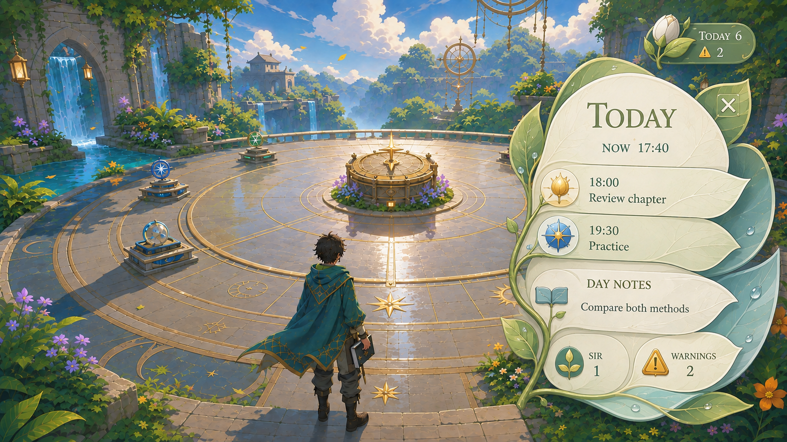

# Track World — Concept Draft

**Status:** Working draft; implementation authorized, nothing built yet; the concept decisions below are not finalized\
**Concept date:** 2026-09-05\
**Initial platform:** The user's current computer; phone and iPad versions deferred\
**Relationship to Track:** Proposed private game experience linked to the existing Track application



> This image is a visual-development reference, not a final production asset or an exact
> screen specification. It establishes the preferred simplified anime rendering, the
> Verdant Astral Clock Plaza, and the Living Botanical interface identity.

## 1. Concept in one sentence

Track World is a private, synchronized, third-person fantasy world that turns the user's
real Track information into explorable places, journeys, landmarks, environmental signals,
and gentle daily rituals while remaining relaxing, convenient, and safe for the underlying
data.

## 2. Product intent

The game is intended to make Track feel alive. It is not meant to be a detached game that
occasionally grants points for productivity, and it is not meant to disguise the current
website behind arbitrary fantasy decoration.

The experience should let the user:

- See important schedules, day notes, deadlines, warnings, and SIR reviews conveniently.
- Experience major goals as journeys rather than rows in a list.
- Experience milestones as meaningful destinations and permanent landmarks.
- Move through a beautiful personal world for enjoyment and relaxation.
- Open and edit personal notes anywhere through a carried notebook.
- Return to completed journeys and see the history of prior progress.
- Explore the world on the user's current computer while keeping its information connected
  to Track. Phone and iPad gameplay can be reconsidered later.

The world should strengthen the relationship with real goals without making the user feel
punished for resting, falling behind, or having a difficult period.

## 3. Experience principles

### 3.1 Track made alive

Real Track information is the substance of the world. Goals shape geography, milestones
shape landmarks, schedule data shapes the Clock Plaza, and reminders create world signals.
The world must not invent progress or pretend that familiar user-authored information is a
mystery waiting to be discovered.

### 3.2 Relaxing before demanding

The game should be enjoyable to inhabit even when the user does not want to complete
anything. Overdue work may be visible, but it must not damage the world, drain resources,
create guilt-driven failure states, or remove past achievements.

### 3.3 Convenient before diegetically pure

Physical locations give information meaning, but essential information must also be
available through the notification control and the carried notebook. The user should never
have to cross the world or complete a platforming sequence merely to discover that a
deadline exists.

### 3.4 Deliberate writes, effortless reads

Reading information should be immediate. Any action that changes real Track data should be
explicit and difficult to trigger accidentally. Ordinary movement, collisions, proximity,
weather, and platforming must never modify Track data.

### 3.5 One coherent world system

The sky must not change above an otherwise static environment. Time and climate should
propagate through the whole world: illumination, clouds, water, plants, surfaces, particles,
distant scenery, clothing, and atmosphere should feel governed by the same conditions.

## 4. Player perspective and movement

- The world is explored from a third-person perspective.
- The initial controls use keyboard and mouse on the user's computer.
- Movement should feel flexible, fluid, and satisfying in its own right.
- Platforming is a core pleasure and should blend naturally into the landscape.
- Routes should not be labeled or visibly segregated into an artificial easy path and hard
  path.
- Alternate paths should also feel like natural parts of the geography rather than detached
  challenge courses.
- Important information must remain accessible even when the surrounding terrain contains
  demanding movement.
- The notebook is normally visible in the character's right hand.
- The notebook stows automatically during climbing, vaulting, swimming, or any movement
  that naturally needs both hands, then returns without requiring inventory management.

Combat and survival systems are not part of the current concept. They were considered
potential overload. The concept should retain enough flexibility to revisit them later, but
they must not be assumed, designed around, or allowed to dominate the relaxing purpose.

## 5. World structure

### 5.1 Personal sanctuary

The sanctuary is the user's calm personal home. It should feel private, restorative, and
distinct from productivity infrastructure. It is not the schedule location.

The sanctuary may provide convenient access to important information and world travel, but
its identity should remain personal rather than becoming a calendar lobby.

### 5.2 Schedule location

The schedule has its own physical and thematic location. The current preferred direction is
the **Verdant Astral Clockgarden**, centered on a walkable **Clock Plaza**.

The Clockgarden must be clearly separate from the sanctuary even if the two are close enough
for convenient travel. It represents time, recurrence, planning, and the movement of the day
rather than rest or personal identity.

### 5.3 Goal regions

- Each major goal becomes a separately themed region or major area.
- Nested goals become branching paths inside that region.
- Milestones become destinations, structures, crossings, overlooks, or other memorable
  landmarks along the journey.
- Goal-related schedule information can appear as a smaller regional echo while retaining
  an authoritative representation in the schedule system.
- Goal regions may use distinct art direction, terrain, traversal character, and interface
  materials.
- Updated information may grow, redirect, or transform paths, but familiar landmarks should
  not move unpredictably.

### 5.4 Completed regions

Completed goal regions remain explorable. Completion transforms them rather than deleting
or closing them. They become part of the world's history and allow the user to revisit prior
journeys.

The treatment of archived goals and deliberately deleted goals is still undecided. They
must not be treated as automatically equivalent to completed goals.

### 5.5 Scale challenge

The world is described as small and personal, yet persistent completed regions could make it
grow indefinitely. The final structure remains open:

- A compact sanctuary world with natural gateways to separate goal regions.
- One continuously expanding continent.
- A fantasy archipelago or collection of connected landmasses.

Whichever structure is selected must preserve exploration and history without making daily
navigation exhausting or the world visually overcrowded.

## 6. Mapping Track concepts into the world

| Track concept | Current world interpretation | Interaction status |
| --- | --- | --- |
| Major goal | Separately themed region or major journey | View representation confirmed; structural editing excluded |
| Nested goal | Branching path within its parent region | Representation confirmed |
| Milestone | Meaningful destination or permanent landmark | Representation confirmed |
| Task / to-do | Small local sign of activity or progress | Exact representation and write access deferred |
| To-learn item | Learning-related marker or echo within its goal path | Exact representation and write access deferred |
| Schedule | Clock Plaza plus notification and notebook views | Read access confirmed; write access deferred |
| Calendar note | Timed or untimed schedule signal | Read access confirmed |
| Deadline | Distinct due signal with separate warning language | Read access confirmed; completion/editing deferred |
| SIR review | Time-sensitive memory/review presence | Important visibility confirmed; physical identity deferred |
| Notes widget | Notebook carried in the right hand | View and edit anywhere confirmed |
| Completed goal | Transformed region that remains explorable | Confirmed |

This mapping is conceptual. It does not replace the existing meanings, dates, ownership, or
relationships stored by Track.

## 7. Clock Plaza schedule experience

### 7.1 Physical representation

The Clock Plaza uses a circular, ground-level representation of the current day:

- A clear ring or set of rings establishes the day's time structure.
- An unmistakable marker shows the current local time.
- Scheduled activities occupy meaningful positions or spans around the ring.
- Timed notes appear at the relevant time.
- Untimed day notes have a separate central or all-day location; the world must not assign
  them a false time for visual convenience.
- Deadlines have a visually distinct due state.
- Deadline warnings remain distinct from the due moment.
- Exact titles, times, and details are available through the interface rather than relying
  entirely on environmental symbolism.
- The center provides a readable day-ledger or focal point without blocking free movement.

The Plaza is not the only way to learn what is happening. Its purpose is to embody time and
make visiting the schedule enjoyable; it must not become a mandatory obstacle to awareness.

### 7.2 Regional echoes

When an item belongs to a goal, its region may show a smaller echo through light, sound,
movement, a marker, or a local object. The Clock Plaza remains the complete schedule view,
while the echo connects the item to its journey.

An echo must not create a second conflicting truth. It reflects the same underlying item.

### 7.3 Complete Today view

The full contents of today are available from a compact notification button or bar. It
should not occupy substantial gameplay space while closed.

When opened:

- It provides an adaptive complete view rather than showing only an unexplained count.
- The computer layout prioritizes readable titles and enough visible rows, with scrolling
  when needed and full details immediately available.
- The world remains visible behind or beside the panel.
- Exact information is prioritized over decorative animation.

The open panel may take more space because opening it is deliberate; the closed state must
remain unobtrusive.

### 7.4 Evening transition

After **20:00 local time**:

- Unfinished items from today remain visible.
- The interface begins featuring tomorrow when tomorrow contains a day note, warning, or
  deadline.
- Tomorrow's information is presented as approaching, not as if it already belongs to today.
- The environment may gently signal the transition without forcing the panel open.

### 7.5 Midnight and overdue items

At midnight:

- An unticked item remains attached to its original date.
- It becomes visibly overdue or unfinished history.
- The game never silently carries it forward, changes its date, or implies that Track was
  rescheduled.
- The user must explicitly complete, edit, dismiss, or otherwise handle it through an
  authorized Track action.

## 8. Reminder behavior

When a scheduled time or important deadline arrives during play, the game uses three gentle
signals:

1. The compact notification control pulses.
2. A brief readable message appears and fades.
3. The Clock Plaza or relevant regional echo produces a recognizable visual and audible
   signal.

These signals reinforce each other. Environmental signals are never the only notification
channel, because weather, camera direction, distance, visual ability, or muted audio could
make them easy to miss.

Ordinary reminders should not pause the game or demand dismissal. The exact escalation rule
for genuinely urgent or overdue information remains open, but it must stay compatible with
the no-punishment principle.

## 9. Personal notebook

The notebook is both a world object and a convenience tool.

Confirmed behavior:

- It is carried in the character's right hand during ordinary movement.
- It can be opened anywhere using a dedicated button or keybind.
- Opening it places the character in a safe reading/writing state.
- Personal notes can be viewed and edited from anywhere.
- Notebook note changes synchronize with the Track notes widget, including Track edits
  made on other authorized devices.
- Schedule, deadline, SIR, and goal information can be viewed through the notebook.
- Those non-note sections are currently view-only.
- It stows automatically for movement requiring both hands and returns fluidly afterward.

The notebook must not require travel to the sanctuary or Clock Plaza before the user can
capture or edit a thought.

## 10. Two-way connection and action safety

The two-way link is intentionally narrow in the current draft.

### Confirmed write capability

- View and edit personal notebook notes in synchronization with Track.

### Explicitly excluded

- Structural goal editing inside the game. Creating, renaming, moving, nesting, or
  reorganizing the goal hierarchy remains in Track unless this decision is deliberately
  revisited later.

### Deferred capabilities

- Completing tasks or to-learn items.
- Completing or managing SIR reviews.
- Editing or rescheduling calendar entries and deadlines.
- Creating quick reminders or other Track items.

If task or to-learn completion is enabled later, its interaction contract is already
defined:

```text
Inspect the item → intentionally tick it → explicitly confirm
```

Completion cannot be caused by walking into an object, collecting something, finishing a
jump, pressing a general interaction button once, or accidentally clicking a small control.
A clear final result and a reasonable recovery/undo path should be considered before
completion writes are allowed.

## 11. Progress feedback

World change follows layered significance:

- An individual task may produce a small sign of life or local response.
- A milestone produces a memorable landmark or meaningful regional change.
- A completed major goal transforms its region.
- The transformed region remains explorable.

This hierarchy prevents every tiny completion from permanently cluttering the world while
still ensuring that small actions feel acknowledged.

The exact visual effects and progression rewards remain undecided. Game rewards must not
encourage meaningless Track activity, fake entries, or excessive fragmentation of tasks for
the purpose of farming game progress.

## 12. No-punishment model

Overdue and neglected items create **concern without punishment**:

- Clear reminders may appear.
- Environmental signals may communicate urgency.
- No region permanently decays.
- No earned landmark is removed.
- No resource is confiscated.
- No threatening encounter is created merely because the user fell behind.
- Unticking or correcting an item should restore its truthful state, not reconstruct a
  guessed state.

A temporary visual decline was discussed and rejected as unnecessarily complex and too
close to punishment.

## 13. Variety and exploration

The user already knows the information because it comes from their own application.
Exploration therefore means discovering different experiences and perspectives, not fake
informational surprises.

Confirmed sources of variety:

- Different goal regions with their own themes and traversal character.
- Real local time, climate, weather, and seasonal changes.
- Temporary world events that alter atmosphere or experience without punishment.
- Naturally varied platforming and routes.

Possible relaxing activities such as gardening, photography, gliding, climbing trials, or
other calm interactions remain a feasibility and value question. They should be considered
only if they make the world more enjoyable without creating a second obligation system or
distracting from Track.

## 14. Whole-world environmental fluidity

“Fluid environment” is a load-bearing creative requirement, not shorthand for changing the
skybox.

### Time of day

The movement of local time should affect:

- Sky color and cloud illumination.
- Direction, length, softness, and warmth of shadows.
- Light entering ruins, trees, shelters, and interiors.
- Water reflections and visibility.
- The behavior and appearance of glowing plants or celestial materials.
- Regional ambience and distant visibility.

### Wind

One coherent wind state should be perceptible across:

- Treetops, shrubs, grass, flowers, and vines.
- Hanging decorations and environmental objects.
- Waterfall spray, mist, leaves, petals, and particles.
- The character's hair, cape, clothing, and carried objects where appropriate.
- Distant foliage, so the foreground does not move against a frozen horizon.

### Rain and humidity

Rain and recent rain should influence:

- Wetness and drying patterns on stone, wood, soil, and plants.
- Water channels, pools, waterfalls, ripples, and runoff.
- Reflections and diffuse light.
- Mist, haze, spray, and distant visibility.
- Plant posture, color, and motion.
- Exterior interface edges, without compromising reading surfaces.

### Seasons and local climate

The world should reflect the user's local climate rather than automatically imposing a
generic four-season model. Seasonal character may affect vegetation, rainfall, water levels,
light, atmosphere, and regional materials.

The source of location/climate information, privacy treatment, manual overrides, and the
behavior when climate information is unavailable remain undecided.

### Gradual transitions

Environmental states should flow into one another. The user should not see a new sky placed
above unchanged lighting, dry surfaces, frozen foliage, or incompatible water. A transition
is successful only when the whole scene feels like it has entered the new condition.

Weather may alter the atmosphere and optional traversal experience, but it must not make
essential information inaccessible.

## 15. Art direction

### Confirmed rendering direction

- Stylized anime-inspired third-person 3D.
- Clean cel shading and readable silhouettes.
- Bright, expressive color with controlled contrast.
- Simplified materials and broader shapes.
- Medium-low environmental detail: alive and rich, but not hyperrealistic or covered in
  micro-ornament.
- Enough depth and material response to make the world feel inhabitable.
- No gritty photorealism.

The initial hyperrealistic concepts were rejected. A later anime pass was still judged a
little too detailed, so the preferred level was reduced modestly rather than flattened into
minimalism.

### Current Clockgarden direction

The schedule area's visual identity combines:

- Lush local vegetation.
- Pale simplified stone.
- Warm restrained gold or bronze time rings.
- Water channels and rain response.
- Celestial instruments and motifs used sparingly.
- A clear circular plaza with calm negative space.
- Surrounding terraces and geography that suggest fluid traversal.

### Other locations

Other goal regions and functional places are expected to have varied identities. The exact
fantasy world, lore, cultures, and regional aesthetics will be decided later.

Visual variety must not make the information system incoherent. Locations may change
materials, silhouettes, animation, and motifs, while retaining recognizable interaction
hierarchy, readable text, familiar controls, and consistent meanings for warnings and
completion.

## 16. Living Botanical interface identity

The selected interface direction for the current schedule experience is the **Living
Botanical Codex**.

### Visual language

- Organic, asymmetrical silhouettes rather than a generic rectangular dashboard.
- Layered leaves or petals that unfold into information surfaces.
- Individual leaf-like cards for schedule entries.
- A compact flower-bud or unfurled-leaf notification control.
- Sage, mint, soft cream, sky blue, and restrained warm gold.
- Simple seed, sun, book, bud, or related category symbols.
- Moderate spacing and limited ornament.
- An anime-fantasy character rather than realistic botanical illustration.

### Readability contract

- Text-bearing surfaces remain calm, opaque enough, and high contrast.
- Decorative vines, veins, droplets, and glow stay away from the text.
- Information is distinguished by shape and icon as well as color.
- The interface adapts to bright sky, night, rain, and complex scenery without becoming
  camouflaged.
- Weather and light may affect outer leaves, edges, reflections, or unfolding motion, while
  the reading surface stays stable.
- Computer interaction must support keyboard navigation and clear click targets. Essential
  controls and information must remain accessible without hover.

### Normal and expanded states

- The normal gameplay state is a small, unobtrusive botanical notification button/bar.
- The expanded Today state may occupy part of the screen because the user opened it
  deliberately.
- The expanded state should leave the character and important world context visible.
- A close action must be obvious.
- Presentation can adapt to computer window sizes without changing its botanical identity.

### Explored but not selected

An Astral Glass-and-Vellum interface was explored first. It used teal-and-gold celestial
filigree around a warm paper surface and offered strong separation from the environment.
The Living Botanical identity was selected because it felt more distinctive, organic, and
connected to the Verdant Clockgarden.

## 17. Privacy, synchronization, and devices

### Privacy

- The world is private and personal.
- Only the user should play it.
- Access is limited to authorized devices or the user's private identity.
- Public viewing and shared multiplayer are not part of the current concept.

### Synchronization

- The initial computer world reflects the user's current Track data. Track itself may
  still synchronize with other authorized devices, so mobile gameplay being deferred does
  not remove the need to handle competing Track edits safely.
- If game support expands to additional devices, the same personal world should remain
  consistent across them.
- Personal notebook notes must stay synchronized with the Track notes widget.
- Game presentation must never imply a successful data change before Track has safely
  accepted it.
- Conflict, offline, and recovery behavior are not yet designed and must be treated as a
  core data-safety problem rather than visual polish.

### Initial device target: the current computer

- Develop and test the first version on the user's existing Linux computer, using keyboard
  and mouse.
- The current reference hardware is an AMD Ryzen 5 5500U with integrated Radeon graphics
  and approximately 14 GiB of usable RAM reported by Linux. This is the initial test target,
  not a published minimum specification or a guarantee of frame rate.
- Fit visual density, rendering resolution, and effects to this computer. Measure a
  representative playable scene before committing to graphics quality or performance.
- The engine and browser-versus-native delivery remain open decisions.

### Deferred device work

- Phone and iPad versions are outside the initial scope and have no feature-parity
  commitment.
- Touch movement and camera controls, mobile notebook layouts and text entry, safe areas,
  mobile performance and battery tuning, and native mobile packaging are deferred.
- If these devices are revisited, the desired direction is the same world, history, and
  Track data with controls and information density adapted to each device.
- Mobile feasibility is not an acceptance gate for the first computer version.

## 18. Data and product safety guardrails

These rules should survive every later design revision:

1. Track remains the truthful source for goals, dates, notes, deadlines, reviews, and
   completion state.
2. The game never silently reschedules an item.
3. Evening previews never change tomorrow into today.
4. Midnight never moves an unfinished item to the new date.
5. Ordinary movement never changes Track data.
6. Platforming success or failure never completes, deletes, or delays a real item.
7. Destructive or meaningful writes require clear intent and confirmation appropriate to
   their risk.
8. Weather and world events never make critical information unreachable.
9. A block, signal, echo, notebook page, and Clock Plaza marker must not become conflicting
   copies of the same item.
10. Unknown, unavailable, or failed synchronization must be visible rather than disguised as
    success.
11. The game must not reward fake entries, meaningless repetitions, or excessive task
    fragmentation.
12. Completed history is preserved unless the user explicitly chooses deletion under a
    future deletion policy.
13. A beautiful interface is not successful if its information cannot be read quickly.
14. A functioning world is not successful if it makes existing Track data unreachable or
    ambiguous.

## 19. Key design challenges

### 19.1 Fun versus productive avoidance

The world should make returning to Track enjoyable without becoming a more attractive way
to avoid the learning or work represented by Track. Optional activities and rewards need a
clear relationship to rest, reflection, or meaningful progress.

### 19.2 Stable geography versus live data

Goals can be added, nested, reordered, completed, archived, or removed. The world must react
without turning familiar geography into an unpredictable filing system.

### 19.3 Small world versus permanent history

Keeping every completed journey explorable can make the world unbounded. The topology must
allow long-term growth while keeping the sanctuary and daily schedule convenient.

### 19.4 Regional variety versus interaction consistency

Different regions and interfaces should feel unique, but recurring actions must remain
recognizable. Style cannot force the user to relearn how to inspect, close, navigate, or
understand an urgent item in every biome.

### 19.5 Immersion versus information clarity

Environmental signals are atmospheric but can be missed. Precise interface information is
reliable but can feel pasted onto the game. The three-layer approach—world location,
environmental echo, and readable interface—must remain balanced.

### 19.6 Whole-world fluidity versus scope

Coherent local weather across sky, light, water, vegetation, particles, surfaces, audio, and
distant scenery is a defining feature, but it is also broader than a cosmetic day/night
cycle. The concept must not promise a static world with a changing backdrop.

### 19.7 Computer performance and future device support

The immediate challenge is a comfortable third-person experience and readable information
on the user's existing computer. Rendering choices must be checked on that hardware.
Phone and iPad controls, performance, and feature parity can be reconsidered later.

### 19.8 Data ownership and derived world state

The boundary between canonical Track data and game-specific state—position, discovered
routes, visual transformations, customization, and world history—is not yet defined. It must
be defined before implementation so synchronization cannot overwrite either side.

## 20. Explicitly rejected or deferred directions

### Rejected for the current concept

- Hyperrealistic graphics.
- Excessive environmental and interface micro-detail.
- A generic plain productivity dashboard pasted over the game.
- Artificially separated easy and hard routes.
- Platforming that blocks awareness of important information.
- Pretending the user's own Track data is unknown discoverable lore.
- Structural goal-tree editing inside the game.
- Automatically carrying unfinished items into a new date.
- Punitive decay, lost resources, or permanent damage caused by overdue work.
- Requiring a visit to a fixed location before personal notes can be edited.
- Combat or survival as the initial defining gameplay loop.

### Deferred rather than rejected

- Task, to-learn, deadline, schedule, and SIR writes from inside the world.
- Quick capture beyond editing personal notes.
- Optional relaxing side activities.
- Combat or survival as a later optional layer.
- Exact fantasy setting and lore.
- Player avatar identity and customization.
- Phone and iPad versions, including touch controls, mobile layouts, and feature parity.
- Exact world topology and fast travel.
- SIR's dedicated world location and visual metaphor.
- Styles for other functional locations and goal regions.
- Archived and deleted goal behavior.

## 21. Open decisions, prioritized

### Concept-critical

1. How multiple Track workspace slots map into one private world: separate worlds, regions,
   profiles, or another structure.
2. How canonical Track data is separated from game-only world state.
3. How the growing world remains small and convenient while completed regions remain
   explorable.
4. Which writes beyond personal notes are allowed in-world.
5. How conflicts, offline changes, and cross-device synchronization are communicated and
   recovered safely.

### Experience-defining

6. The SIR location and metaphor.
7. The exact relationship between ordinary tasks, to-learn items, physical objects, and
   layered world feedback.
8. The navigation and fast-travel relationship between sanctuary, Clockgarden, and goal
   regions.
9. The world progression or reward model that remains meaningful without encouraging grind.
10. How temporary world events affect movement without creating obligation.

### Art and content

11. The wider fantasy setting, history, cultures, and tone.
12. The sanctuary identity.
13. The visual and interface identity of each additional functional place.
14. The degree of regional art-direction variation.
15. The avatar's appearance, customization, and relationship to the notebook.

### Device and accessibility

16. Computer delivery: browser or native, and a practical graphics/performance target.
17. Keyboard and mouse movement, camera, platforming assistance, and notebook text entry.
18. Reduced-motion alternatives for environmental fluidity and interface unfolding.
19. Contrast and non-color signals across every weather and region.
20. Location/climate permission, privacy, fallback, and manual override behavior.

Phone and iPad support is deferred as described in Section 17.

## 22. Concept acceptance checks

The concept remains internally consistent only if future versions can answer yes to all of
the following:

- Can the first version be played comfortably with keyboard and mouse on the user's
  current computer?
- Can the user discover today's important information without traveling anywhere?
- Can the user open the notebook and edit personal notes from anywhere?
- Can the user distinguish a schedule item, day note, SIR review, warning, and deadline
  without relying only on color?
- After 20:00, are today's unfinished items still visible while tomorrow is previewed
  truthfully?
- After midnight, has no date changed automatically?
- Can an accidental movement or single stray click never complete a real task?
- Does completing a task feel acknowledged without permanently cluttering the world?
- Does completing a milestone or goal create a proportionately meaningful change?
- Does a completed goal region remain explorable?
- Can the user ignore the game for a difficult period without returning to lost progress or
  a damaged world?
- When weather changes, does the whole environment respond coherently rather than only the
  sky?
- Can every ornate information surface remain readable against every region and weather
  state?
- Do differently themed locations preserve familiar information behavior?
- Can the world grow for years without making daily navigation exhausting?
- Does the computer world reflect Track edits, including edits from other authorized
  devices, without hiding sync uncertainty?

## 23. Draft boundary

This document records the concept discussion in detail. It intentionally does **not**
contain:

- An engine or framework choice.
- A repository architecture.
- A network or synchronization implementation.
- A database schema.
- A code-level task plan.
- A committed budget or delivery schedule.

Those implementation commitments remain open. Building the game **is** authorized — see
`AGENTS.md` — but that authorization settles none of the choices listed above, and does not
authorize spending, installing, or any change to Track. Section 24 records the feasibility
review, budget constraints, and suggested checks to inform the remaining concept decisions.

## 24. Feasibility review and next-session notes

**Recorded:** 2026-09-05. Review recommendations below remain proposals unless explicitly
identified as user decisions. Implementation is authorized in general; these particular
choices are not settled by that, and none of them authorizes spending.

### Settled direction and budget constraint

- **Computer first:** the user chose to build for their current computer and put phone and
  iPad use aside. Section 17 is the device contract; mobile controls, layouts, packaging,
  and feature parity must not become requirements for the initial version.
- **Limited budget, especially subscriptions:** no exact spending ceiling was specified.
  Identify a concrete need before recommending a paid service or asset. No purchase,
  subscription, hardware upgrade, or paid cloud plan was authorized.
- The proposed financial target is **US$0 in additional mandatory monthly subscriptions**,
  using existing hardware and free tools/services within their limits. This is a planning
  target, not a quote for a finished game or a promise that custom artwork is free. It
  excludes hired development, custom art/animation, new hardware, and existing paid tools.
- The inspected Ryzen 5 5500U computer with integrated Radeon graphics and approximately
  14 GiB of usable RAM looks suitable for an initial prototype. This is an assessment from
  its hardware specifications, not a performance benchmark. No need for a new computer
  has been established. A suggested 30 fps starting target remains untested and undecided.
- The selected stylized anime appearance, Clockgarden, Living Botanical interface,
  enjoyable third-person movement, coherent environment, and no-punishment principles
  remain the creative direction. The cost review did not replace them with a different
  product concept.
- Notebook notes remain the only confirmed in-world write capability. Other Track views
  remain read-only under Section 10. Computer-only gameplay still needs safe handling of
  Track edits made from other tabs or devices.
- The engine, browser-versus-native delivery, world topology, and slot-to-world mapping
  remain undecided. Godot was researched as a candidate; it was not selected or installed.

### Cost findings to recheck before spending

- [Godot](https://godotengine.org/license/) has no required engine subscription.
  [Firebase](https://firebase.google.com/pricing) offers no-cost Hosting and Firestore quotas,
  and [Open-Meteo](https://open-meteo.com/en/terms) offers noncommercial weather access within
  limits and with attribution. Whether a built project stays within those limits must be
  measured. Weather needs cached/manual fallback behaviour.
- **Firestore and Cloud Storage are different products.**
  [Cloud Storage requires a billing-enabled Blaze plan](https://firebase.google.com/docs/storage/faqs-storage-changes-announced-sept-2024).
  This is usage-based billing, and
  [budget alerts do not cap charges](https://firebase.google.com/docs/hosting/usage-quotas-pricing).
  Do not assume a storage or hosting choice requires a paid subscription without checking
  the specific service and actual need.
- Native Apple mobile distribution was discussed at
  [US$99 per membership year](https://developer.apple.com/programs/enroll/), with
  [Mac/Xcode access also needed for Godot iOS builds](https://docs.godotengine.org/en/stable/tutorials/export/exporting_for_ios.html).
  It is outside the current computer scope.
- These service findings were checked during this conversation. Recheck prices and terms
  if a later implementation depends on them. No runtime AI service or multiplayer server
  has been identified as essential to the described private world.

### Important unresolved risks

1. **Notebook conflicts.** Current notes writes replace the notes array, while cloud sync
   uploads the whole database. Existing conflict handling is not automatic text merging.
   Two competing note edits need a recovery path preserving both versions and distinct
   local-save, pending-sync, synced, and conflict states. See `scripts/notes-widget.js`,
   `scripts/firebase-sync.js`, and [NOTES Proposal 4](../NOTES.md#proposal-4-add-revision-and-conflict-handling).
2. **World-state ownership.** Define compact game-only saves separately from canonical
   Track data. Do not place models, textures, or continuous movement/weather writes into
   Track's whole-database save path. Browser storage belongs to an origin; a separately
   hosted or native game needs an explicit integration rather than assumed access.
3. **Calendar truthfulness.** Section 7.5's broad "unticked" wording still needs revision:
   informational calendar notes and reference timetables are not automatically overdue
   tasks. An untimed note's default 08:00 block is not an authored note time. Deadline prep
   and due moments can occupy different days; caution days are individually chosen and may
   have gaps. Routine and SIR occurrence/completion rules differ. Reuse
   `scripts/calendar-core.js` rules and distinguish unique items from their multiple visual
   representations when counting or notifying. Also resolve whether tomorrow's SIR/tasks
   alone should trigger the 20:00 preview; the present wording names only notes, warnings,
   and deadlines.
4. **Stable geography and content production.** Arbitrary goal trees do not supply
   attractive terrain or enjoyable platforming. Nesting does not necessarily imply a work
   dependency or completion order. Reusable region/route modules and a hub with separately
   loaded regions are suggested budget options, not selected architecture. Places need
   stable slot/record identities, and remote edits must not move terrain beneath a player.
5. **Truthful history.** Ordinary completion toggles do not record a complete event history.
   Reopening, correcting, archiving, or deleting goals needs a rule reconciling current
   truth with persistent landmarks. Never invent a past completion date or deleted history.
6. **Weather, movement, and art effort.** Coordinated visual effects may satisfy the
   whole-world response requirement affordably; physical runoff, cloth, and plant
   simulation should not be assumed necessary. Climbing, vaulting, swimming, camera
   behaviour, and book stowing each add animation/interaction work. The concept image is
   not a usable 3D asset set or evidence of real-time performance.
7. **Reminder intensity and reading safety.** Many simultaneous gentle signals can still
   become stressful. Quiet/rest controls, grouping, and a catch-up summary are suggested.
   Background/locked-screen alerts are outside the current "during play" promise. Define
   what safely opening the notebook mid-jump or in water means without stopping real time.
8. **Other unresolved meanings.** Decide which Track calculation defines goal/milestone
   completion, which explicit relationships permit regional echoes, whether local time
   follows the device or a chosen home timezone, and what "private" promises. Live Firebase
   permissions and multi-device behaviour were not verified in this review.

### Suggested starting point when work resumes

First resolve the computer delivery choice and the smallest representative prototype.
The proposed test is one small scene on the current computer, using synthetic Track data,
to assess camera/movement, a coherent weather transition, a readable Today view, and notebook
interaction. Measure sustained performance before committing to a larger world or purchases.
Safe competing-note-edit recovery needs separate proof before enabling real notebook writes.

No game implementation, device benchmark, live-cloud test, installation, or deployment was
performed in this conversation. The work here was concept/source review, hardware inspection,
pricing research, and documentation. The next session should start from these open decisions
rather than treating the feasibility recommendations as approved implementation choices.
